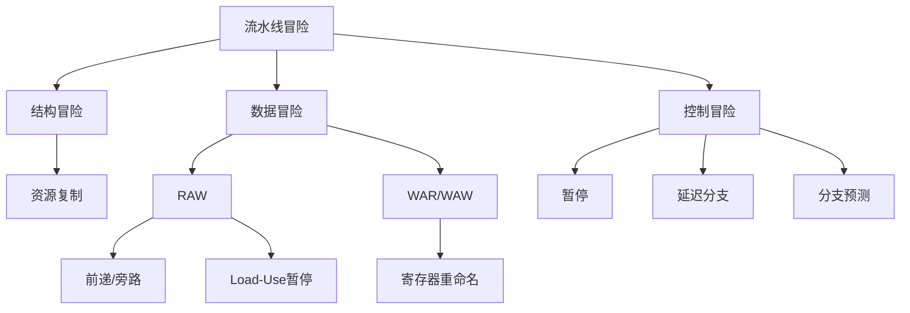

# 第二十章 流水线的冒险与处理

流水线中各种"冒险"（Hazard）会阻止下一条指令在预定时钟周期执行，降低流水线效率。本章详细讲解三类冒险的原因、检测和解决方案。**本章是考研高频考点**，特别是数据冒险和控制冒险。

<div data-component="PipelineTimelineVisualizer"></div>

---

## 20.1 流水线冒险概述

### 20.1.1 冒险的定义

**冒险**（Hazard）：流水线中阻止下一条指令在预定时钟周期执行的情况。

### 20.1.2 冒险的分类

| 类型 | 原因 | 解决方案 |
|------|------|---------|
| **结构冒险** | 多条指令同时需要同一硬件资源 | 资源复制 |
| **数据冒险** | 后续指令需要前面指令的结果 | 前递/暂停 |
| **控制冒险** | 分支指令改变程序执行顺序 | 分支预测/延迟分支 |

---

## 20.2 结构冒险（Structural Hazard）

### 20.2.1 定义

**结构冒险**：由于硬件资源不足，多条指令在同一时钟周期竞争同一资源。

### 20.2.2 典型场景

**场景1：单端口存储器同时取指和访存**

```
周期 | IF（取指）     | MEM（访存）
T3   | I4取指         | I1访存
```

如果指令存储器和数据存储器是同一个（冯·诺依曼结构），I4取指和I1访存会冲突。

**解决方案**：
- **哈佛结构**：分离指令存储器和数据存储器
- **分离Cache**：使用独立的指令Cache（I-Cache）和数据Cache（D-Cache）

**场景2：寄存器端口冲突**

同时读写同一寄存器（ID阶段读，WB阶段写）。

**解决方案**：增加寄存器端口（如双端口寄存器文件），或在时钟周期内分前后半周期操作。

### 20.2.3 结构冒险的消除原则

> 如果某些指令组合在某些时钟周期需要同一资源，可以通过**复制资源**来消除结构冒险。

---

## 20.3 数据冒险（Data Hazard）

### 20.3.1 数据冒险的类型

**RAW（Read After Write）— 写后读**：

后续指令需要读取前面指令还没写入的结果。

```
ADD R1, R2, R3    # 写R1
SUB R4, R1, R5    # 读R1 → RAW冒险！
```

这是**最常见**的数据冒险，也是真数据相关。

**WAR（Write After Read）— 读后写**：

后续指令要写入前面指令正在读取的寄存器。

```
ADD R1, R2, R3    # 读R2
SUB R2, R4, R5    # 写R2 → WAR冒险（在顺序流水线中不会发生）
```

在顺序执行的流水线中不会发生WAR冒险，但在乱序执行中可能发生。

**WAW（Write After Write）— 写后写**：

两条指令都要写入同一寄存器。

```
ADD R1, R2, R3    # 写R1
SUB R1, R4, R5    # 写R1 → WAW冒险（在顺序流水线中不会发生）
```

在顺序执行的流水线中不会发生WAW冒险，但在乱序执行中可能发生。

### 20.3.2 数据冒险的检测

**RAW冒险的检测条件**：

对于指令 $I_j$（在ID阶段）和指令 $I_i$（$i < j$，在后续阶段）：

如果 $I_j$ 的**源寄存器** == $I_i$ 的**目的寄存器**，且 $I_i$ 尚未写回，则存在RAW冒险。

**【例 20-1】** 分析以下指令序列中的数据冒险：

```
1. ADD R1, R2, R3    # 写R1
2. SUB R4, R1, R5    # 读R1 → RAW冒险（与指令1）
3. AND R6, R1, R7    # 读R1 → RAW冒险（与指令1）
4. OR  R8, R1, R9    # 读R1 → RAW冒险（与指令1）
```

### 20.3.3 解决方案一：暂停（Stall）

**方法**：插入气泡（Bubble），暂停后续指令的执行，直到数据可用。

```
指令  | T1  T2  T3  T4  T5  T6  T7  T8
ADD   | IF  ID  EX  MEM WB
SUB   |     IF  ID  **  **  EX  MEM WB
AND   |         IF  **  **  ID  EX  MEM WB
OR    |             **  **  IF  ID  EX  MEM WB
```

**表示方法**：`**` 表示暂停（气泡）

- 指令2在T3、T4暂停（等待指令1的EX结果）
- 指令3在T4、T5暂停
- 指令4在T5、T6暂停

**代价**：每条相关指令暂停2个周期，性能损失严重。

### 20.3.4 解决方案二：前递/旁路（Forwarding/Bypassing）

**核心思想**：将ALU的结果**直接旁路**到下一条指令的ALU输入，无需等待写回寄存器。

**前递路径**：

```
EX/MEM → EX    （指令1的EX结果直接送到指令2的EX输入）
MEM/WB → EX    （指令1的MEM结果直接送到后续指令的EX输入）
```

**【例 20-2】** 使用前递技术处理RAW冒险：

```
指令  | T1  T2  T3  T4  T5  T6  T7
ADD   | IF  ID  EX  MEM WB
SUB   |     IF  ID  EX  MEM WB
```

- 指令1在T3的EX阶段产生结果
- 指令2在T4的EX阶段需要该结果
- 通过EX/MEM → EX前递，指令2在T4可以直接使用指令1的结果
- **无需暂停！**

**前递的硬件实现**：

在EX阶段的输入端增加多路选择器（MUX）：
- 正常路径：从寄存器文件读取
- 前递路径1：从EX/MEM流水线寄存器读取
- 前递路径2：从MEM/WB流水线寄存器读取

前递控制逻辑检测：
- EX/MEM前递：如果 EX/MEM.目的寄存器 == ID/EX.源寄存器
- MEM/WB前递：如果 MEM/WB.目的寄存器 == ID/EX.源寄存器

<div data-component="ForwardingNetworkViz"></div>

### 20.3.5 Load-Use冒险

**问题**：即使有前递，Load指令的数据要到MEM阶段结束后才能使用。

```
LW   R1, 0(R2)    # R1在MEM阶段末尾才得到
ADD  R3, R1, R4   # R1在EX阶段就需要 → 前递无法解决！
```

```
指令  | T1  T2  T3  T4  T5  T6  T7  T8
LW    | IF  ID  EX  MEM WB
ADD   |     IF  ID  **  EX  MEM WB
```

**必须暂停1个时钟周期**（Load-Use Stall）。

**检测条件**：

如果当前指令（ID阶段）的源寄存器 == 前一条指令（EX阶段）的目的寄存器，且前一条指令是Load指令，则必须暂停1个周期。

**解决方案**：

1. **硬件暂停**：插入1个气泡
2. **编译器调度**：重排指令顺序，将不相关的指令插入Load和使用之间

**【例 20-3】** 编译器调度消除Load-Use冒险：

**调度前**（有冒险）：
```
LW   R1, 0(R2)    # Load R1
ADD  R3, R1, R4   # 使用R1 → Load-Use冒险，暂停1周期
```

**调度后**（无冒险）：
```
LW   R1, 0(R2)    # Load R1
OR   R6, R7, R8   # 不使用R1的指令（插入）
ADD  R3, R1, R4   # 使用R1 → 此时R1已可用，无需暂停
```

### 20.3.6 数据冒险综合处理

| 冒险类型 | 前一个指令类型 | 间隔指令数 | 解决方案 |
|----------|--------------|-----------|---------|
| RAW（EX结果） | ALU指令 | 0条 | EX/MEM前递 |
| RAW（MEM结果） | ALU指令 | 1条 | MEM/WB前递 |
| Load-Use | Load指令 | 0条 | 暂停1周期 + 前递 |
| RAW（无前递） | 任意 | 2条 | 暂停2周期 |

---

## 20.4 控制冒险（Control Hazard）

### 20.4.1 定义

**控制冒险**：由于分支指令改变程序执行顺序，导致流水线中预取的指令可能不是实际要执行的指令。

### 20.4.2 分支指令的影响

**分支指令在哪个阶段确定结果？**

| 方案 | 确定阶段 | 浪费周期 |
|------|---------|---------|
| 在EX阶段确定 | T3 | 2个周期 |
| 在ID阶段确定 | T2 | 1个周期 |
| 在IF阶段确定 | T1 | 0个周期（理想） |

**【例 20-4】** 分支指令在EX阶段确定结果：

```
指令  | T1  T2  T3  T4  T5  T6  T7
BEQ   | IF  ID  EX  MEM WB
I2    |     IF  ID  EX  MEM WB    ← 可能不该执行
I3    |         IF  ID  EX  MEM WB ← 可能不该执行
目标指令|             IF  ID  EX  MEM WB
```

如果分支跳转，I2和I3是不该执行的，浪费了2个周期。

### 20.4.3 解决方案一：暂停（Stall）

等待分支结果确定后再取下一条指令。

```
指令  | T1  T2  T3  T4  T5  T6
BEQ   | IF  ID  EX  MEM WB
      |     **  **  IF  ID  EX  ...
```

暂停2个周期（分支在EX阶段确定）。

**代价**：每个分支浪费2个周期，性能损失严重（分支指令占程序的15~25%）。

### 20.4.4 解决方案二：延迟分支（Delayed Branch）

**规则**：分支指令后的一条指令**总是被执行**（无论分支是否跳转）。

```
BEQ  R1, R2, LABEL
ADD  R3, R4, R5    ← 延迟槽，总是执行
LABEL:
SUB  R6, R7, R8
```

**编译器优化**：在延迟槽中填入有用的指令。

| 延迟槽内容 | 优化策略 |
|-----------|---------|
| 分支前的指令 | 将分支前的独立指令移入 |
| 分支目标的指令 | 将目标处的指令移入（分支不跳转时） |
| 分支后的指令 | 将分支后的独立指令移入（分支跳转时） |
| NOP | 无法优化时填入空操作 |

**适用场景**：RISC处理器（MIPS等），分支在ID阶段确定。

### 20.4.5 解决方案三：分支预测（Branch Prediction）

**静态分支预测**：

在编译时确定预测策略：

| 策略 | 预测 | 准确率 |
|------|------|--------|
| 总是预测不跳转 | 不跳转 | ~50% |
| 总是预测跳转 | 跳转 | ~50% |
| 后向跳转预测为跳转 | 循环 | ~60% |
| 前向跳转预测为不跳转 | 条件分支 | ~50% |

**动态分支预测**：

<div data-component="BranchPredictorDemo"></div>

在运行时根据历史信息预测。

**1位预测器**：

- 记录上次分支是否跳转
- 下次预测相同
- 问题：循环结尾连续错误2次

**2位饱和计数器**：

```
强不跳转(00) ←→ 弱不跳转(01) ←→ 弱跳转(10) ←→ 强跳转(11)
```

- 预测跳转且实际跳转：右移（向"强跳转"方向）
- 预测跳转但实际不跳转：左移（向"不跳转"方向）
- 预测不跳转且实际不跳转：左移（向"强不跳转"方向）
- 预测不跳转但实际跳转：右移（向"跳转"方向）

**预测规则**：
- 状态为 `10` 或 `11` → 预测跳转
- 状态为 `00` 或 `01` → 预测不跳转

**【例 20-5】** 2位预测器的状态变化（循环10次）：

初始状态：`00`（强不跳转）

| 迭代 | 状态 | 预测 | 实际 | 结果 | 新状态 |
|------|------|------|------|------|--------|
| 1 | 00 | 不跳转 | 跳转 | 错误 | 01 |
| 2 | 01 | 不跳转 | 跳转 | 错误 | 10 |
| 3 | 10 | 跳转 | 跳转 | 正确 | 11 |
| 4 | 11 | 跳转 | 跳转 | 正确 | 11 |
| ... | 11 | 跳转 | 跳转 | 正确 | 11 |
| 10 | 11 | 跳转 | 不跳转 | 错误 | 10 |
| 11 | 10 | 跳转 | 跳转 | 正确 | 11 |

准确率：8/10 = 80%（前2次错误，后面正确，最后一次错误）

**分支目标缓冲（BTB）**：

缓存分支指令的目标地址，预测时直接使用缓存的目标地址取指。

### 20.4.6 分支预测的性能分析

$$
\text{实际CPI} = \text{理想CPI} + \text{分支频率} \times \text{分支代价} \times (1 - \text{预测准确率})
$$

**【例 20-6】** 理想CPI=1，分支频率20%，预测准确率90%，分支代价2个周期。

$$
\text{实际CPI} = 1 + 0.20 \times 2 \times (1 - 0.90) = 1 + 0.04 = 1.04
$$

相比不使用预测：$1 + 0.20 \times 2 = 1.40$

性能提升：$1.40 / 1.04 = 1.35$ 倍

---

## 20.5 流水线冒险的综合案例

**【例 20-7】** 分析以下指令序列中的所有冒险和处理方式：

```
1. LW   R1, 0(R0)
2. ADD  R2, R1, R3    # Load-Use冒险
3. SUB  R4, R2, R5    # RAW冒险（与指令2）
4. BEQ  R4, R0, LABEL # 控制冒险
5. AND  R6, R4, R7
6. OR   R8, R6, R9
```

**详细分析**：

| 指令 | 冒险类型 | 原因 | 解决方案 |
|------|---------|------|---------|
| 1→2 | Load-Use | R1在MEM才可用 | 暂停1周期 + 前递 |
| 2→3 | RAW | R2在EX结果可用 | EX/MEM前递 |
| 3→4 | RAW | R4在EX结果可用 | EX/MEM前递 |
| 4→5 | 控制冒险 | 分支目标不确定 | 暂停/预测/延迟分支 |

**时空图**（使用前递+Load-Use暂停+分支预测）：

```
指令  | T1  T2  T3  T4  T5  T6  T7  T8  T9  T10
LW    | IF  ID  EX  MEM WB
ADD   |     IF  ID  **  EX  MEM WB
SUB   |         IF  **  ID  EX  MEM WB
BEQ   |             IF  ID  EX  MEM WB
AND   |                 IF  ID  EX  MEM WB
OR    |                     IF  ID  EX  MEM WB
```

---

## 20.6 本章总结

### 冒险分类与解决方案



### 关键公式

| 公式 | 含义 |
|------|------|
| $CPI_{实际} = CPI_{理想} + f_{分支} \times t_{分支} \times (1 - p_{预测})$ | 分支对CPI的影响 |
| Load-Use暂停1周期 | 最常见的数据冒险 |
| 2位预测器准确率~85% | 动态分支预测 |

---

## 20.7 复习建议

1. **数据冒险和控制冒险是考研高频考点**，必须熟练掌握。

2. **能够画出包含前递和暂停的流水线时空图**是必备技能。

3. **2位预测器的状态转换**是常见题型，需要能够手动推导。

4. **Load-Use冒险**是前递无法解决的典型情况，必须暂停1周期。

5. 本章与第19章（流水线基本原理）和第21章（流水线高级技术）紧密相关。

---

## 20.8 深入理解流水线冒险

### 20.8.1 结构冒险详解

**定义**：由于硬件资源不足，多条指令在同一时钟周期竞争同一资源。

**典型场景**：

**场景1：单端口存储器**

```
周期 | IF（取指）     | MEM（访存）
T3   | I4取指         | I1访存
```

如果指令存储器和数据存储器是同一个（冯·诺依曼结构），I4取指和I1访存会冲突。

**解决方案**：
- 哈佛结构：分离指令存储器和数据存储器
- 分离Cache：使用独立的指令Cache（I-Cache）和数据Cache（D-Cache）

**场景2：寄存器端口冲突**

同时读写同一寄存器（ID阶段读，WB阶段写）。

**解决方案**：
- 增加寄存器端口（如双端口寄存器文件）
- 在时钟周期内分前后半周期操作

### 20.8.2 数据冒险详解

**RAW冒险**（Read After Write）：

后续指令需要读取前面指令还没写入的结果。

```
ADD R1, R2, R3    # 写R1
SUB R4, R1, R5    # 读R1 → RAW冒险！
```

**检测条件**：

如果后续指令的源寄存器 == 前面指令的目的寄存器，且前面指令尚未写回，则存在RAW冒险。

**解决方案**：

**前递/旁路**（Forwarding/Bypassing）：

将ALU的结果直接旁路到下一条指令的ALU输入。

```
          EX/MEM    MEM/WB
             │         │
             ▼         ▼
ADD ──→ [EX] ──→ [MEM] ──→ [WB]
             │
             ▼ (前递)
SUB ──→ [EX] ──→ [MEM] ──→ [WB]
```

**Load-Use冒险**：

Load指令在MEM阶段才得到数据，但下一条指令在EX阶段就需要。

```
LW   R1, 0(R2)    # R1在MEM阶段才得到
ADD  R3, R1, R4   # R1在EX阶段就需要 → 前递无法解决！
```

**解决方案**：必须暂停1个时钟周期（Load-Use Stall）。

### 20.8.3 控制冒险详解

**定义**：由于分支指令改变程序执行顺序，导致流水线中预取的指令可能不是实际要执行的指令。

**分支指令的影响**：

分支指令在EX阶段确定结果时，会浪费2个时钟周期。

**解决方案**：

**一、暂停**：等待分支结果确定后再取下一条指令。

**二、延迟分支**：分支指令后的一条指令总是被执行（延迟槽）。

**三、分支预测**：

| 方法 | 预测策略 | 准确率 |
|------|---------|--------|
| 静态预测 | 总是预测不跳转 | ~50% |
| 1位预测器 | 上次跳转则预测跳转 | ~60% |
| 2位饱和计数器 | 连续两次错误才改变 | ~85% |

---

## 20.9 流水线冒险的综合案例

### 20.9.1 综合案例1

**题目**：分析以下指令序列中的所有冒险和处理方式：

```
1. LW   R1, 0(R0)
2. ADD  R2, R1, R3    # Load-Use冒险
3. SUB  R4, R2, R5    # RAW冒险（与指令2）
4. BEQ  R4, R0, LABEL # 控制冒险
5. AND  R6, R4, R7
6. OR   R8, R6, R9
```

**解答**：

| 指令 | 冒险类型 | 原因 | 解决方案 |
|------|---------|------|---------|
| 1→2 | Load-Use | R1在MEM才可用 | 暂停1周期 + 前递 |
| 2→3 | RAW | R2在EX结果可用 | EX/MEM前递 |
| 3→4 | RAW | R4在EX结果可用 | EX/MEM前递 |
| 4→5 | 控制冒险 | 分支目标不确定 | 暂停/预测/延迟分支 |

### 20.9.2 综合案例2

**题目**：计算以下程序在5级流水线上的执行时间（假设时钟周期100ns）：

```
1. ADD  R1, R2, R3
2. SUB  R4, R1, R5    # RAW冒险，前递解决
3. LW   R6, 0(R1)
4. ADD  R7, R6, R8    # Load-Use冒险，暂停1周期
5. BEQ  R7, R0, LABEL # 控制冒险，2位预测器85%准确率
6. AND  R9, R7, R10
```

**解答**：

理想执行时间 = $(5 + 6 - 1) \times 100 = 1000$ ns

Load-Use暂停 = 1 × 100 = 100 ns

控制冒险暂停 = 2 × 100 × (1 - 0.85) = 30 ns（假设分支频率20%）

实际执行时间 = 1000 + 100 + 30 = 1130 ns

---

## 20.10 本章考试重点

### 20.10.1 高频考点

| 考点 | 频率 | 难度 |
|------|------|------|
| 数据冒险检测 | ★★★★★ | ★★★ |
| 前递/旁路 | ★★★★★ | ★★★★ |
| Load-Use冒险 | ★★★★ | ★★★ |
| 分支预测 | ★★★★ | ★★★ |
| 控制冒险 | ★★★★ | ★★★ |

### 20.10.2 典型考题

**考题1**：分析指令序列中的数据冒险和处理方式。

**考题2**：画出包含前递和暂停的流水线时空图。

**考题3**：计算2位预测器的状态转换。

**考题4**：计算流水线的实际执行时间。

### 20.10.3 解题技巧

1. **数据冒险**：检查源寄存器和目的寄存器的匹配
2. **前递**：确定前递路径（EX/MEM或MEM/WB）
3. **分支预测**：记住2位预测器的状态转换规则
4. **执行时间**：理想时间 + 暂停时间

---

## 20.11 本章知识图谱

```
流水线冒险
├── 结构冒险
│   ├── 资源冲突
│   └── 解决：资源复制
├── 数据冒险
│   ├── RAW（写后读）
│   ├── WAR（读后写）
│   ├── WAW（写后写）
│   └── 解决：前递/旁路、Load-Use暂停
├── 控制冒险
│   ├── 分支指令
│   └── 解决：暂停、延迟分支、分支预测
└── 综合案例
    ├── 冒险检测
    ├── 处理方案
    └── 性能分析
```

---

## 20.12 前递/旁路网络的硬件实现

### 20.12.1 前递单元的整体结构

前递（Forwarding）硬件的核心任务是：**检测数据冒险发生的条件，并将结果从流水线寄存器直接旁路到ALU输入端**，避免不必要的暂停。

前递单元由两部分组成：

1. **冒险检测逻辑**：比较流水线寄存器中的寄存器编号
2. **前递控制MUX**：在ALU输入端选择正确的数据来源

### 20.12.2 ALU输入端的MUX结构

每个ALU输入端需要一个 **3:1 MUX**，数据来源如下：

| MUX选择信号 | 数据来源 | 说明 |
|-------------|---------|------|
| `00` | ID/EX 寄存器文件读出值 | 正常路径，无冒险 |
| `01` | EX/MEM.ALUResult | EX级冒险前递 |
| `10` | MEM/WB 寄存器写回数据 | MEM级冒险前递 |

```
                    ┌─────────────┐
  ID/EX.ReadData1 ──┤             │
                    │   3:1 MUX   ├──── ALU Input A
  EX/MEM.Result   ──┤  (ForwardA) │
                    │             │
  MEM/WB.Data     ──┤             │
                    └─────────────┘
                          ▲
                     ForwardA[1:0]

                    ┌─────────────┐
  ID/EX.ReadData2 ──┤             │
                    │   3:1 MUX   ├──── ALU Input B
  EX/MEM.Result   ──┤  (ForwardB) │
                    │             │
  MEM/WB.Data     ──┤             │
                    └─────────────┘
                          ▲
                     ForwardB[1:0]
```

> [!NOTE]
> 每个ALU操作数（A和B）各需要独立的3:1 MUX和独立的前递控制信号。因此整个前递单元需要生成 `ForwardA` 和 `ForwardB` 两组控制信号。

### 20.12.3 前递条件判定表

前递检测逻辑需要比较以下流水线寄存器中的字段：

| 流水线寄存器 | 关键字段 |
|-------------|---------|
| ID/EX | `Rs`、`Rt`（源寄存器编号） |
| EX/MEM | `Rd`（目的寄存器编号）、`RegWrite`（是否写寄存器） |
| MEM/WB | `Rd`（目的寄存器编号）、`RegWrite`（是否写寄存器） |

**EX级冒险（EX/MEM → EX）检测条件**：

$$
\text{EX\_Hazard} = (\text{EX/MEM.RegWrite} = 1) \wedge (\text{EX/MEM.Rd} \neq 0) \wedge (\text{EX/MEM.Rd} = \text{ID/EX.Rs})
$$

对ForwardA和ForwardB分别：

$$
\text{ForwardA} = \begin{cases} 01 & \text{if EX/MEM hazard on Rs} \\ 10 & \text{if MEM/WB hazard on Rs} \\ 00 & \text{otherwise} \end{cases}
$$

$$
\text{ForwardB} = \begin{cases} 01 & \text{if EX/MEM hazard on Rt} \\ 10 & \text{if MEM/WB hazard on Rt} \\ 00 & \text{otherwise} \end{cases}
$$

**MEM级冒险（MEM/WB → EX）检测条件**：

$$
\text{MEM\_Hazard} = (\text{MEM/WB.RegWrite} = 1) \wedge (\text{MEM/WB.Rd} \neq 0) \wedge (\text{MEM/WB.Rd} = \text{ID/EX.Rs})
$$

> [!TIP]
> 必须检查 `Rd ≠ 0`，因为 `$zero` 寄存器恒为0，写入 `$zero` 的结果不会产生有效数据，无需前递。

### 20.12.4 前递优先级

当EX级冒险和MEM级冒险**同时存在**时（针对同一源寄存器），**EX/MEM前递优先**。原因：EX/MEM中的指令比MEM/WB中的指令更"新"，其结果是程序语义上需要的最新值。

$$
\text{Priority: EX/MEM} > \text{MEM/WB}
$$

```
时间线：
  I1:  ADD  R1, ...     ──→ EX/MEM 阶段（结果在EX/MEM.Result）
  I2:  SUB  R1, ...     ──→ MEM/WB 阶段（结果在MEM/WB.Data）
  I3:  AND  R5, R1, ... ──→ EX 阶段（需要R1的最新值）

  I3应使用I1的结果（EX/MEM），而非I2的结果（MEM/WB）
```

### 20.12.5 前递逻辑伪代码

```python
# ForwardA（ALU输入A的前递控制）
if (EX/MEM.RegWrite == 1
    and EX/MEM.Rd != 0
    and EX/MEM.Rd == ID/EX.Rs):
    ForwardA = 01        # EX级前递
elif (MEM/WB.RegWrite == 1
      and MEM/WB.Rd != 0
      and MEM/WB.Rd == ID/EX.Rs):
    ForwardA = 10        # MEM级前递
else:
    ForwardA = 00        # 无前递，使用寄存器值

# ForwardB（ALU输入B的前递控制）
if (EX/MEM.RegWrite == 1
    and EX/MEM.Rd != 0
    and EX/MEM.Rd == ID/EX.Rt):
    ForwardB = 01        # EX级前递
elif (MEM/WB.RegWrite == 1
      and MEM/WB.Rd != 0
      and MEM/WB.Rd == ID/EX.Rt):
    ForwardB = 10        # MEM级前递
else:
    ForwardB = 00        # 无前递，使用寄存器值
```

### 20.12.6 前递路径的完整数据通路图

```
  ┌──────┐  ┌──────┐  ┌──────┐  ┌──────┐  ┌──────┐
  │  IF  │──│  ID  │──│  EX  │──│  MEM │──│  WB  │
  └──────┘  └──────┘  └──────┘  └──────┘  └──────┘
                 │          ▲          │
                 │          │          │
            ┌────┘    ┌─────┴─────┐    │
            │         │ 3:1 MUX   │    │
            │    ┌────┤ (ForwardA)│    │
            │    │    │ 3:1 MUX   │    │
            │    │    │ (ForwardB)│    │
            │    │    └─────┬─────┘    │
            │    │          │          │
            │    │    ┌─────┴─────┐    │
            │    │    │   ALU     │    │
            │    │    └─────┬─────┘    │
            │    │          │          │
            │    │    ┌─────┴─────┐    │
            │    └────│ EX/MEM    │────┘  ← EX级前递路径
            │         │ Pipeline  │
            │         │ Register  │
            │         └─────┬─────┘
            │               │
            └───────────────│────────────  ← MEM级前递路径
                            │
                      ┌─────┴─────┐
                      │ MEM/WB    │
                      │ Pipeline  │
                      │ Register  │
                      └───────────┘
```

> [!NOTE]
> 前递网络是**纯组合逻辑**，不涉及时序元件。它在同一个时钟周期内完成检测和数据旁路，不会增加时钟周期时间（前提是布线延迟可接受）。

---

## 20.13 冒险检测单元的电路设计

### 20.13.1 冒险检测单元的功能

<div data-component="HazardDetectionUnit"></div>

冒险检测单元（Hazard Detection Unit）位于流水线的 **ID 阶段**，其核心功能是：

1. 检测 **Load-Use 冒险**
2. 生成 **暂停信号**（Stall Signal），冻结IF/ID寄存器并插入气泡

### 20.13.2 Load-Use冒险检测逻辑

检测条件需要比较 ID/EX 阶段的指令（前一条，即Load指令）与 IF/ID 阶段的指令（当前指令）：

$$
\text{Stall} = \text{ID/EX.MemRead} \wedge \big((\text{ID/EX.Rt} = \text{IF/ID.Rs}) \vee (\text{ID/EX.Rt} = \text{IF/ID.Rt})\big)
$$

条件分解：

| 条件 | 含义 |
|------|------|
| `ID/EX.MemRead == 1` | 前一条指令是Load指令（需要从存储器读数据） |
| `ID/EX.Rt == IF/ID.Rs` | Load的目的寄存器 == 当前指令的源寄存器1 |
| `ID/EX.Rt == IF/ID.Rt` | Load的目的寄存器 == 当前指令的源寄存器2 |

### 20.13.3 暂停信号的生成与传播

当 `Stall = 1` 时，需要执行以下操作：

```
Stall = 1 时的信号行为：

  ┌──────────────────────────────────────────────────────┐
  │  PCWrite        = 0    ← 冻结PC，停止取新指令        │
  │  IF/ID.Write    = 0    ← 冻结IF/ID寄存器             │
  │  ID/EX.Zero     = 1    ← 将ID/EX清零（插入Bubble）   │
  └──────────────────────────────────────────────────────┘
```

### 20.13.4 冒险检测伪代码

```python
def hazard_detection(ID_EX, IF_ID):
    # Load-Use冒险检测
    if (ID_EX.MemRead == 1
        and (ID_EX.Rt == IF_ID.Rs or ID_EX.Rt == IF_ID.Rt)):
        PCWrite     = 0     # 冻结PC
        IF_ID_Write = 0     # 冻结IF/ID寄存器
        Stall_EX    = 1     # 在EX阶段插入气泡（清零ID/EX控制信号）
    else:
        PCWrite     = 1     # PC正常更新
        IF_ID_Write = 1     # IF/ID寄存器正常写入
        Stall_EX    = 0     # 正常执行
```

### 20.13.5 暂停对流水线寄存器的影响

| 流水线寄存器 | Stall时的行为 | 目的 |
|-------------|-------------|------|
| **PC** | 保持不变（PCWrite=0） | 停止取下一条指令 |
| **IF/ID** | 保持不变（IF/ID.Write=0） | 保持当前指令不变，下周期重新译码 |
| **ID/EX** | 控制信号全部清零 | 插入气泡（NOP），向后传播 |
| **EX/MEM** | 正常传递 | 不受影响 |
| **MEM/WB** | 正常传递 | 不受影响 |

### 20.13.6 暂停期间的控制信号表

| 控制信号 | 正常值（ADD指令） | Stall时（Bubble） | 说明 |
|---------|------------------|-------------------|------|
| RegDst | 1 | 0 | 无意义 |
| ALUSrc | 0 | 0 | 无意义 |
| MemtoReg | 0 | 0 | 无意义 |
| RegWrite | 1 | **0** | 不写寄存器 |
| MemRead | 0 | **0** | 不读存储器 |
| MemWrite | 0 | **0** | 不写存储器 |
| Branch | 0 | **0** | 不是分支 |
| ALUOp | ADD | 任意 | 无意义 |

> [!TIP]
> Stall时的关键操作是将 `RegWrite`、`MemRead`、`MemWrite`、`Branch` 清零，确保气泡指令不会产生任何副作用。其余信号可以是任意值。

### 20.13.7 暂停的流水线时空图

```
指令      | T1    T2    T3    T4    T5    T6    T7    T8
──────────┼──────────────────────────────────────────────
LW R1,0(R2)│ IF    ID    EX    MEM   WB
ADD R3,R1,R4│      IF    ID    ***   EX    MEM   WB
SUB R5,R3,R6│            IF    ***   ID    EX    MEM   WB
──────────┼──────────────────────────────────────────────
                PCWrite=0  PCWrite=1
                IF/ID冻结   恢复正常

*** = Stall（气泡）
- T3: 检测到Load-Use冒险，PC和IF/ID冻结
- T3: ID/EX插入Bubble（控制信号清零）
- T4: LW的MEM数据通过前递送到ADD的EX输入
- T4: ADD正常执行EX阶段
```

---

## 20.14 分支预测器的硬件结构

### 20.14.1 分支历史表（BHT）

**分支历史表**（Branch History Table, BHT）使用分支指令地址的低位作为索引，存储该分支的历史行为（是否跳转）。

```
  PC[9:2]  ──────┐
  (8位索引)      │
                 ▼
          ┌─────────────┐
          │    BHT      │
          │  256 表项    │
          │             │
          │ [0]  : 11   │  ← 2位饱和计数器
          │ [1]  : 01   │
          │ [2]  : 10   │
          │  ...        │
          │ [255]: 00   │
          └──────┬──────┘
                 │
                 ▼
          预测结果：跳转/不跳转
          (计数器MSB=1→跳转，MSB=0→不跳转)
```

**BHT的结构参数**：

| 参数 | 说明 | 典型值 |
|------|------|--------|
| 表项数 | $2^n$ 个表项 | 256 ~ 65536 |
| 索引位 | PC的 $[n+1:2]$ 位 | 8 ~ 16 位 |
| 每项位宽 | 2位饱和计数器 | 2 bit |
| 总容量 | 表项数 × 位宽 | 512 bit ~ 128 Kbit |

> [!NOTE]
> BHT只预测**是否跳转**，不提供**跳转目标地址**。如果预测跳转，还需要额外计算目标地址。

### 20.14.2 分支目标缓冲（BTB）

**分支目标缓冲**（Branch Target Buffer, BTB）是一个全相联或组相联的高速缓存，存储分支指令的**目标地址**。

```
  PC ──────┬────────────────────────────────────────┐
           │                                        │
           ▼                                        │
    ┌──────────────┐                                 │
    │  BTB (全相联) │                                 │
    │              │                                 │
    │ ┌──────────┬──────────┬──────────┐             │
    │ │ 分支PC   │ 目标地址  │ 预测位   │             │
    │ ├──────────┼──────────┼──────────┤             │
    │ │ 0x1000   │ 0x2000   │ 11       │             │
    │ │ 0x1020   │ 0x3000   │ 01       │             │
    │ │ 0x1040   │ 0x1060   │ 10       │             │
    │ └──────────┴──────────┴──────────┘             │
    │         │                                      │
    └─────────┼──────────────────────────────────────┘
              │
              ▼
     命中且预测跳转 → 用目标地址取指
     未命中        → 用PC+4取指
```

**BTB的比较与BHT**：

| 特性 | BHT | BTB |
|------|-----|-----|
| 存储内容 | 仅预测位（2 bit） | PC标签 + 目标地址 + 预测位 |
| 预测能力 | 是否跳转 | 是否跳转 + 跳转目标 |
| 硬件开销 | 小 | 大（需存储完整地址） |
| 查找方式 | 直接映射（按索引） | 全相联/组相联（需比较标签） |
| 适用场景 | 分支方向预测 | 分支方向 + 目标预测 |

### 20.14.3 分支目标计算硬件

对于条件分支指令，目标地址的计算需要专用加法器：

$$
\text{BranchTarget} = \text{PC} + 4 + (\text{SignExt}(\text{Offset}) \ll 2)
$$

```
  PC+4 ────────────┐
                   │
                   ▼
              ┌─────────┐
  Offset ──→  │ 符号扩展 │──→ 左移2位 ──→ ┌─────┐
              └─────────┘                 │ ADD ├──→ BranchTarget
                                          └─────┘
```

> [!TIP]
> 为了尽早确定分支目标，目标地址的加法运算通常在 **ID 阶段**完成，而非等待EX阶段。这样可以将分支代价从2个周期降低到1个周期。

### 20.14.4 组合预测器

**gshare预测器**：

将分支指令地址（PC）与全局分支历史寄存器（GHR）进行**异或**，用结果索引BHT。这使得不同分支共享历史信息，提高相关分支的预测准确率。

$$
\text{Index} = \text{PC}[n+1:2] \oplus \text{GHR}[n-1:0]
$$

```
  PC[9:2]  ────┐
               │  XOR
  GHR[7:0] ────┤───────→ BHT索引[7:0]
               │
          ┌────┴────┐
          │  256    │
          │  BHT    │
          └─────────┘
```

**锦标赛预测器（Tournament Predictor）**：

使用一个**选择器**（Chooser）在两个独立的预测器（局部预测器和全局预测器）之间动态选择更准确的那个。

```
  ┌──────────────┐
  │ 局部预测器    │──→ 局部预测结果 ──┐
  │ (Local Pred) │                   │
  └──────────────┘                   ▼
                               ┌──────────┐
  ┌──────────────┐             │  选择器   │──→ 最终预测
  │ 全局预测器    │──→ 全局预测结果│(Chooser) │
  │ (Global Pred)│             └──────────┘
  └──────────────┘                   ▲
                              根据历史选择
                              更准确的预测器
```

### 20.14.5 预测器性能比较

| 预测器类型 | 硬件开销 | 典型准确率 | 适用场景 |
|-----------|---------|-----------|---------|
| 静态预测（总不跳转） | 无 | ~50% | 简单处理器 |
| 1位预测器 | 1 bit/分支 | ~60% | 嵌入式处理器 |
| 2位饱和计数器 | 2 bit/分支 | ~85% | 通用处理器 |
| gshare | 2 bit/表项 + GHR | ~90% | 高性能处理器 |
| 锦标赛预测器 | 两个预测器 + 选择器 | ~93% | 现代高性能处理器 |

> [!NOTE]
> 现代处理器（如Intel Core系列）使用更复杂的预测器组合，准确率可达95%以上。但考研重点是**2位饱和计数器**，需要熟练掌握其状态转换。

---

## 20.15 流水线停顿的控制信号

### 20.15.1 暂停时受影响的控制信号

<div data-component="StallCycleCounter"></div>

当流水线检测到需要暂停时（如Load-Use冒险），必须将当前在ID阶段指令的控制信号**全部清零**，使其变成一个"气泡"（Bubble/NOP）。

| 控制信号 | 正常功能 | 暂停时的值 | 清零的原因 |
|---------|---------|-----------|-----------|
| `RegWrite` | 允许写寄存器 | **0** | 防止错误写入寄存器 |
| `MemRead` | 允许读存储器 | **0** | 防止错误读取存储器 |
| `MemWrite` | 允许写存储器 | **0** | 防止错误写入存储器 |
| `Branch` | 标记分支指令 | **0** | 防止错误修改PC |
| `RegDst` | 选择目的寄存器 | 0 | 无影响（RegWrite=0） |
| `ALUSrc` | 选择ALU输入B | 0 | 无影响 |
| `ALUOp` | ALU操作类型 | 0 | 无影响 |
| `MemtoReg` | 选择写回数据来源 | 0 | 无影响（RegWrite=0） |

### 20.15.2 插入NOP/Bubble的硬件机制

插入气泡的方法是将ID/EX流水线寄存器中的**控制信号字段清零**，而**数据字段保持不变**（或无所谓）。

```
正常传递（无暂停）：
  ID/EX寄存器 = { 控制信号, Rs, Rt, Rd, Imm, Funct, ... }
                 ↓ 正常传递到EX阶段

暂停（插入Bubble）：
  ID/EX寄存器 = { 00000000, X, X, X, X, X, ... }
                 ↓ 全零控制信号 = NOP效果
```

实现方式：在ID/EX寄存器的**写使能端**前加一个多路选择器：

```
  ID阶段控制信号 ────┐
                     │  MUX
  全零（00000000）───┤──────→ ID/EX.控制信号字段
                     ▲
                     │
                  Stall信号
                  (0=正常, 1=插入Bubble)
```

### 20.15.3 正常执行 vs 暂停的控制信号对比

以指令序列 `LW R1, 0(R2)` → `ADD R3, R1, R4` 为例：

**正常执行（无冒险时）**：

| 周期 | IF | ID | EX | MEM | WB |
|------|----|----|----|----|-----|
| T1 | LW | | | | |
| T2 | ADD | LW | | | |
| T3 | ? | ADD | LW | | |
| T4 | | ? | ADD | LW | |
| T5 | | | ? | ADD | LW |

**暂停执行（Load-Use冒险）**：

| 周期 | IF | ID | EX | MEM | WB |
|------|----|----|----|----|-----|
| T1 | LW | | | | |
| T2 | ADD | LW | | | |
| T3 | ADD(Bubble) | LW | | | ← Stall！IF/ID冻结，ID/EX插入Bubble |
| T4 | SUB | ADD | LW | | ← ADD重新执行ID，LW的MEM数据前递 |
| T5 | | SUB | ADD | LW | |

> [!TIP]
> Stall时IF/ID寄存器保持不变（ADD仍在IF/ID中），但ID/EX寄存器被清零（插入Bubble）。下一个周期ADD重新从ID阶段执行，此时Load的数据已可通过前递获得。

### 20.15.4 暂停信号传播路径

```
  ┌──────────┐     Stall      ┌──────────┐
  │ 冒险检测  │───────────────→│  PC      │ PCWrite=0
  │   单元    │───────────────→│  IF/ID   │ IF/ID.Write=0
  │          │───────────────→│  ID/EX   │ 控制信号MUX→全零
  └──────────┘                └──────────┘
                                 │
                                 ▼ Bubble向后传播
                            ┌──────────┐
                            │  EX/MEM  │ 传递NOP
                            │  MEM/WB  │ 传递NOP
                            └──────────┘
```

---

## 20.16 乱序执行的硬件支持

### 20.16.1 寄存器重命名

**WAR和WAW冒险**在顺序流水线中不会发生，但在**乱序执行**中可能发生。解决方法是**寄存器重命名**（Register Renaming）。

**原理**：将体系结构寄存器（如 `$t0`、`$t1`）映射到更多的**物理寄存器**，消除假相关。

**示例**：

原始代码（存在WAR冒险）：

```
ADD $t0, $t1, $t2    # 读$t0（原值）
SUB $t0, $t3, $t4    # 写$t0（新值）→ WAR冒险？
```

重命名后：

```
ADD P5, P1, P2       # 读P1（$t0的旧映射）
SUB P7, P3, P4       # 写P7（$t0的新映射）
```

两条指令使用不同的物理寄存器，完全消除WAR冒险。

### 20.16.2 保留站（Reservation Station）

**保留站**是乱序执行处理器中用于缓存等待操作数的指令的硬件结构。

```
  ┌──────────────────────────────────────────────┐
  │              保留站 (Reservation Station)      │
  │                                              │
  │ ┌────────┬──────┬──────┬──────┬─────────────┐│
  │ │ Op     │ Vj   │ Vk   │ Qj   │ Qk          ││
  │ ├────────┼──────┼──────┼──────┼─────────────┤│
  │ │ ADD    │ 5    │ 3    │ -    │ -           ││ ← 操作数已就绪
  │ │ SUB    │ -    │ 7    │ RS2  │ -           ││ ← 等待RS2的结果
  │ │ MUL    │ -    │ -    │ RS1  │ RS3         ││ ← 等待两个操作数
  │ └────────┴──────┴──────┴──────┴─────────────┘│
  │                                              │
  │ Vj/Vk = 操作数的实际值（已就绪）              │
  │ Qj/Qk = 产生操作数的保留站编号（未就绪）      │
  └──────────────────────────────────────────────┘
```

### 20.16.3 乱序执行对冒险处理的影响

| 冒险类型 | 顺序流水线 | 乱序处理器 |
|---------|-----------|-----------|
| RAW | 前递 + 暂停 | 保留站等待 + 前递 |
| WAR | 不会发生 | 寄存器重命名消除 |
| WAW | 不会发生 | 寄存器重命名消除 |
| 结构冒险 | 资源复制 | 功能单元独立调度 |
| 控制冒险 | 分支预测 | 分支预测 + 推测执行 |

> [!NOTE]
> 乱序执行处理器（如Tomasulo算法）通过保留站、公共数据总线（CDB）和寄存器重命名的配合，可以**动态调度**指令执行顺序，在保持程序正确性的前提下最大化指令级并行度（ILP）。

---

## 20.17 结构冒险的解决方案（资源复制）

### 20.17.1 双端口存储器（哈佛结构）

**问题**：在冯·诺依曼结构中，指令和数据共享同一个存储器。当IF阶段取指和MEM阶段访存同时发生时，产生结构冒险。

**解决方案**：采用**哈佛结构**，将指令存储器和数据存储器物理分离。

```
  冯·诺依曼结构（有结构冒险）：        哈佛结构（无结构冒险）：

  ┌──────────┐                      ┌──────────────┐
  │ CPU      │                      │ CPU          │
  │ IF ──→ MEM│                      │ IF ──→ I-Mem │──→ 指令存储器
  │ MEM──→ MEM│                      │ MEM──→ D-Mem │──→ 数据存储器
  └──────────┘                      └──────────────┘
       │
  ┌────┴─────┐
  │ 统一存储器 │ ← 冲突！
  └──────────┘
```

**实际实现**：现代处理器通常使用**分离Cache**（Split Cache）：

| 方案 | 指令路径 | 数据路径 | 冲突 |
|------|---------|---------|------|
| 统一Cache | I-Cache/D-Cache共享 | 同上 | 可能冲突 |
| 分离Cache | 独立I-Cache | 独立D-Cache | 无冲突 |
| 哈佛结构 | 独立指令存储器 | 独立数据存储器 | 无冲突 |

### 20.17.2 多端口寄存器文件

**问题**：在单个时钟周期内，ID阶段可能需要读2个寄存器，WB阶段可能需要写1个寄存器。如果寄存器文件端口不足，就会产生结构冒险。

**解决方案**：设计具有足够端口数的寄存器文件。

```
  3端口寄存器文件（2读1写）：

  ┌─────────────────────────┐
  │    Register File        │
  │                         │
  │  Read Port 1 ──→ Rs数据 │
  │  Read Port 2 ──→ Rt数据 │
  │  Write Port  ←── WB数据 │
  │                         │
  │  每个寄存器连接3条总线   │
  └─────────────────────────┘
```

**端口需求分析**：

| 操作 | 需要的端口 | 阶段 |
|------|-----------|------|
| 读Rs | 读端口1 | ID |
| 读Rt | 读端口2 | ID |
| 写Rd | 写端口1 | WB |

> [!TIP]
> 如果需要支持**同时写回两条指令**（如超标量处理器），则需要2个写端口，总共需要4个端口（2读2写）。

### 20.17.3 分离指令/数据Cache

| 参数 | 统一Cache | 分离Cache（I-Cache + D-Cache） |
|------|----------|-------------------------------|
| 带宽 | 单端口，可能冲突 | 双端口，无冲突 |
| 命中率 | 灵活分配空间 | 空间固定分配 |
| 硬件复杂度 | 低 | 中等 |
| 典型容量 | 32~64 KB | 各16~32 KB |

现代处理器普遍采用分离Cache设计，如ARM Cortex-A系列、Intel Core系列等。

### 20.17.4 多个功能单元

**问题**：如果流水线中多个指令同时需要使用ALU、乘法器等功能单元，也会产生结构冒险。

**解决方案**：复制功能单元。

```
  单ALU（可能冲突）：            双ALU（无冲突）：

  ┌──────────┐                 ┌──────────┐
  │ ADD ──→ ALU│               │ ADD ──→ ALU1│
  │ SUB ──→ ALU│ ← 冲突！      │ SUB ──→ ALU2│ ← 无冲突
  └──────────┘                 └──────────┘
```

### 20.17.5 资源复制的成本-收益分析

| 资源复制方案 | 硬件成本 | 性能收益 | 推荐场景 |
|-------------|---------|---------|---------|
| 哈佛结构/分离Cache | 中等 | 消除取指/访存冲突 | 所有现代处理器 |
| 多端口寄存器文件 | 较低 | 消除读写冲突 | 标配方案 |
| 多功能单元 | 高 | 支持指令级并行 | 超标量处理器 |
| 多发射取指 | 中等 | 提高取指带宽 | 超标量处理器 |

> [!NOTE]
> 资源复制是消除结构冒险的**根本方法**。在设计流水线时，应首先识别所有可能的资源冲突场景，然后通过合理的资源复制来消除。现代高性能处理器通常综合采用以上所有方案。
