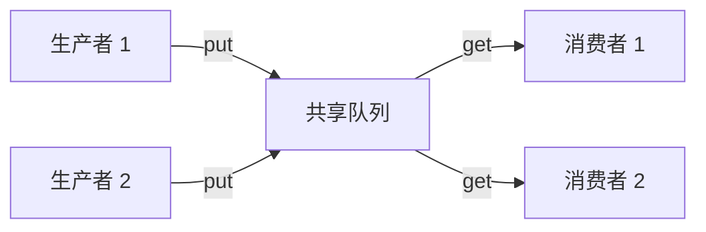
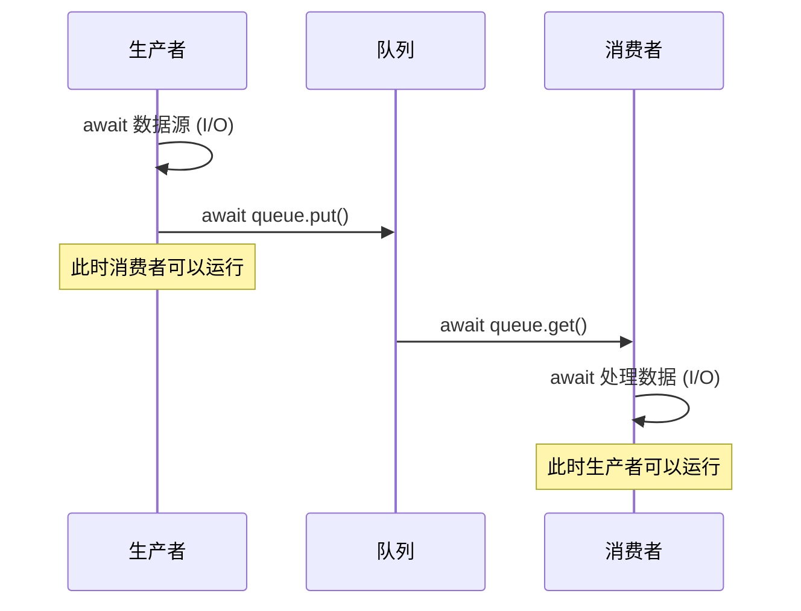
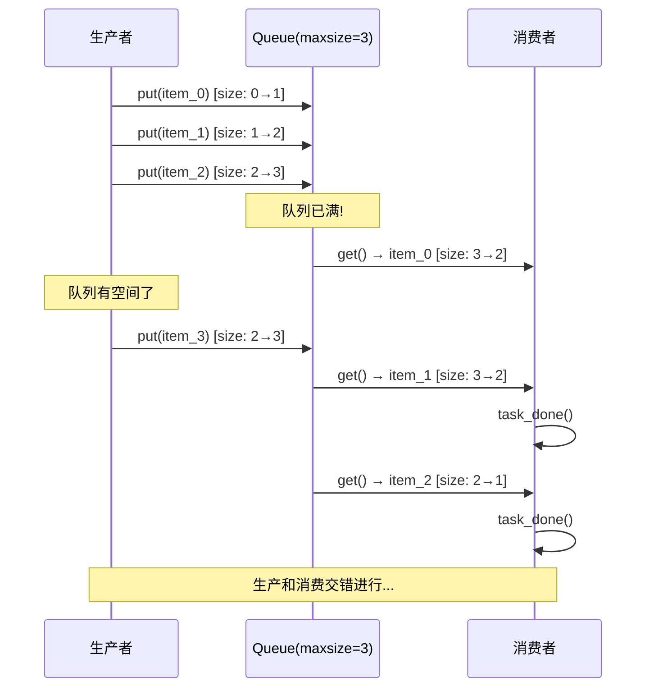
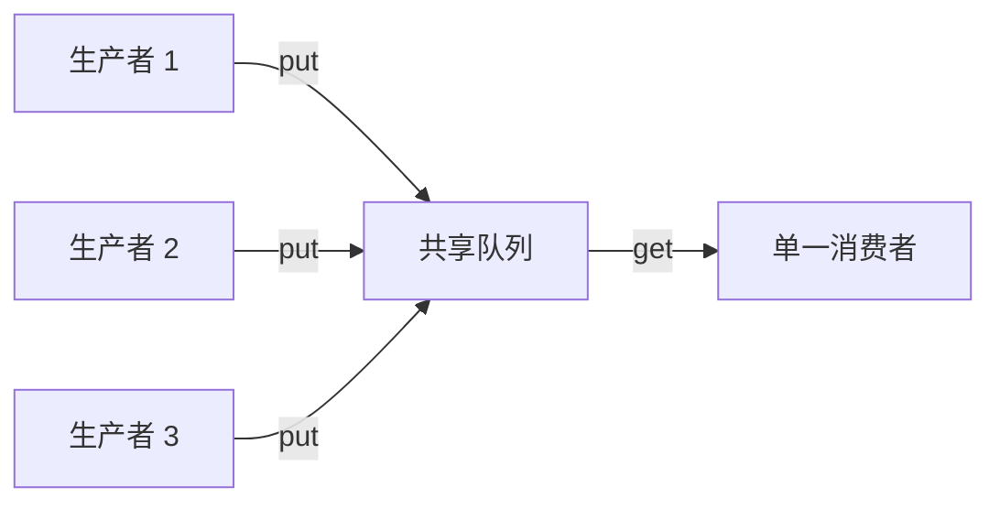
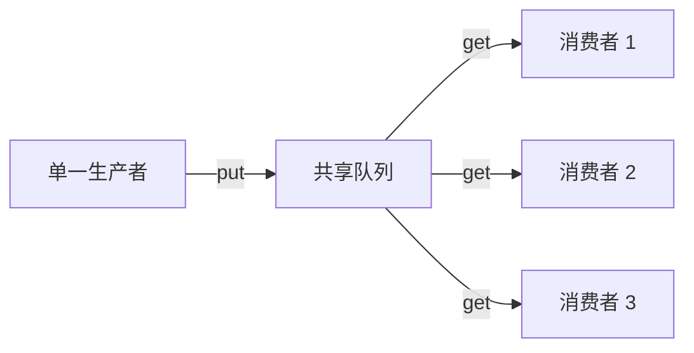
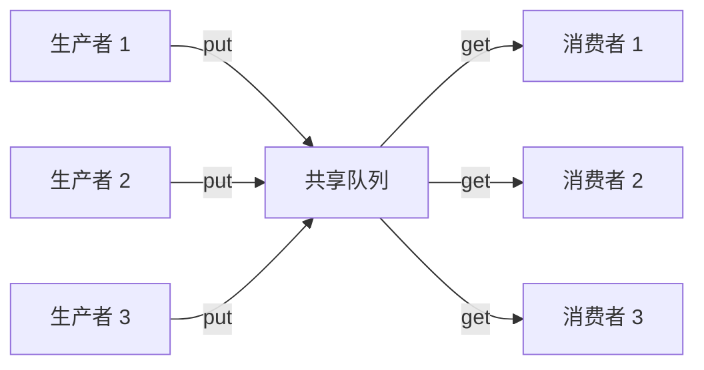

# 10. 异步生产者-消费者模式

> "The producer-consumer pattern is the backbone of concurrent systems — it transforms chaos into choreography."

生产者-消费者模式是并发编程中最经典、最实用的设计模式之一。在异步 Python 中，借助 `asyncio.Queue`，我们可以用极简的代码构建出高性能、可扩展的数据处理管道。本章将从基础概念出发，逐步深入到多生产者多消费者、背压控制、优雅停止、错误处理等实战话题，最终通过日志处理器和爬虫队列两个完整案例展示该模式的真实威力。

---

## 10.1 什么是生产者-消费者模式

<div data-component="ProducerConsumerDiagram"></div>

### 10.1.1 模式定义

生产者-消费者模式（Producer-Consumer Pattern）是一种**解耦数据生产与数据消费**的并发设计模式。它将系统划分为两类角色：

- **生产者（Producer）**：负责生成数据并将其放入共享缓冲区
- **消费者（Consumer）**：负责从共享缓冲区取出数据并处理

两者之间通过一个**有界的或无界的队列**进行通信，彼此不直接调用。



### 10.1.2 核心思想

该模式的核心思想可以用一句话概括：

> **生产者不需要知道谁在消费，消费者不需要知道谁在生产。**

这种解耦带来了三个关键好处：

| 好处 | 说明 |
|------|------|
| **关注点分离** | 生产逻辑和消费逻辑可以独立开发、测试、维护 |
| **速率解耦** | 生产者可以以不同于消费者的速度运行 |
| **弹性伸缩** | 可以独立调整生产者和消费者的数量 |

### 10.1.3 现实世界类比

生产者-消费者模式在现实生活中无处不在：

**餐厅厨房**：厨师（生产者）做好菜放在出餐窗口（队列），服务员（消费者）从窗口取菜送给客人。厨师不需要等服务员，服务员不需要等厨师。

**邮局系统**：寄件人（生产者）把信投入邮箱（队列），邮递员（消费者）从邮箱取出信件投递。寄件人投完信就可以离开，不需要等邮递员。

**工厂流水线**：每个工位既是上一道工序的消费者，又是下一道工序的生产者。通过传送带（队列）连接，实现高效的并行作业。

### 10.1.4 模式的基本结构

一个完整的生产者-消费者系统包含以下组件：

```python
import asyncio

async def basic_structure():
    # 1. 创建共享队列
    queue = asyncio.Queue()

    # 2. 生产者：生成数据并放入队列
    async def producer():
        for i in range(5):
            item = f"item_{i}"
            await queue.put(item)  # 队列满时会挂起
            print(f"生产: {item}")

    # 3. 消费者：从队列取出数据并处理
    async def consumer():
        while True:
            item = await queue.get()  # 队列空时会挂起
            print(f"消费: {item}")
            queue.task_done()  # 标记任务完成

    # 4. 启动生产者和消费者
    await asyncio.gather(producer(), consumer())

asyncio.run(basic_structure())
```

输出：
```
生产: item_0
消费: item_0
生产: item_1
消费: item_1
...
```

### 10.1.5 与其他模式的对比

| 模式 | 特点 | 适用场景 |
|------|------|----------|
| **生产者-消费者** | 通过队列解耦，异步通信 | 数据流处理、任务队列 |
| **观察者模式** | 事件驱动，一对多通知 | UI 事件、消息订阅 |
| **管道模式** | 线性处理链，数据逐级变换 | 数据转换流水线 |
| **发布-订阅** | 通过中间件广播，主题过滤 | 消息系统、事件总线 |

生产者-消费者模式的独特之处在于它的**缓冲能力**——队列可以在生产者和消费者之间起到"蓄水池"的作用，平滑处理速率差异。

### 10.1.6 同步版本 vs 异步版本

在传统多线程编程中，生产者-消费者通常使用 `queue.Queue` + `threading` 实现：

```python
# 同步版本（多线程）
import queue
import threading

def sync_producer_consumer():
    q = queue.Queue(maxsize=10)

    def producer():
        for i in range(20):
            q.put(i)  # 阻塞调用
            print(f"[线程] 生产: {i}")

    def consumer():
        while True:
            item = q.get()  # 阻塞调用
            print(f"[线程] 消费: {item}")
            q.task_done()

    t1 = threading.Thread(target=producer)
    t2 = threading.Thread(target=consumer, daemon=True)
    t1.start()
    t2.start()
    t1.join()
    q.join()
```

异步版本的优势：

- **无线程开销**：协程切换成本远低于线程
- **无锁设计**：`asyncio.Queue` 天然单线程安全，无需锁机制
- **更直观的控制流**：`await` 让异步代码读起来像同步代码
- **更高的并发度**：轻松管理成千上万的生产者和消费者

</div>
---

## 10.2 为什么适合异步

### 10.2.1 I/O 密集型场景的本质

生产者-消费者模式最常见的应用场景——网络请求、文件读写、数据库操作——几乎都是 I/O 密集型的。在这些场景中：

- **生产者**等待数据源（网络响应、文件读取、数据库查询）
- **消费者**等待处理结果（写入存储、发送网络请求、调用外部服务）

CPU 大部分时间都在等待 I/O，这正是 `asyncio` 的用武之地。



### 10.2.2 异步的优势：协作式调度

在异步模型中，当生产者等待 I/O 时，事件循环可以调度消费者运行，反之亦然。这种**协作式调度**意味着：

1. **零切换开销**：协程切换不需要操作系统介入
2. **无竞态条件**：单线程模型天然避免数据竞争
3. **精确控制**：开发者明确知道在哪里让出控制权

```python
import asyncio
import time

async def async_advantage_demo():
    """展示异步生产者-消费者如何协作运行"""
    queue = asyncio.Queue(maxsize=3)
    timestamps = []

    async def producer():
        for i in range(6):
            await asyncio.sleep(0.1)  # 模拟 I/O
            item = f"data_{i}"
            await queue.put(item)
            timestamps.append(f"[{time.perf_counter():.3f}] 生产: {item}")

    async def consumer():
        for _ in range(6):
            item = await queue.get()
            await asyncio.sleep(0.15)  # 模拟处理
            timestamps.append(f"[{time.perf_counter():.3f}] 消费: {item}")
            queue.task_done()

    start = time.perf_counter()
    await asyncio.gather(producer(), consumer())
    elapsed = time.perf_counter() - start

    for ts in timestamps:
        print(ts)
    print(f"\n总耗时: {elapsed:.3f}秒")
    print("注意: 生产和消费的时间戳是交错的，说明它们在并发运行")

asyncio.run(async_advantage_demo())
```

### 10.2.3 性能对比

让我们用一个具体的例子来对比同步和异步的性能差异：

```python
import asyncio
import aiohttp
import time

# 异步版本：10个URL的生产者-消费者
async def async_fetch(session, url):
    async with session.get(url) as resp:
        return await resp.text()

async def async_pipeline():
    urls = [f"https://httpbin.org/delay/{i % 3}" for i in range(10)]
    queue = asyncio.Queue()
    results = []

    async def producer():
        for url in urls:
            await queue.put(url)
        await queue.put(None)  # 哨兵值

    async def consumer():
        async with aiohttp.ClientSession() as session:
            while True:
                url = await queue.get()
                if url is None:
                    break
                data = await async_fetch(session, url)
                results.append(len(data))
                queue.task_done()

    start = time.perf_counter()
    await asyncio.gather(producer(), consumer())
    return time.perf_counter() - start
```

关键差异：

| 维度 | 同步（threading） | 异步（asyncio） |
|------|-------------------|-----------------|
| 线程开销 | 每个消费者一个线程 | 单线程，多协程 |
| 内存占用 | 线程栈 ~1MB/个 | 协程 ~几KB/个 |
| 上下文切换 | OS 调度，开销大 | 事件循环调度，开销极小 |
| 最大并发数 | 受限于线程数（通常数百） | 轻松达到数千甚至数万 |
| 数据安全 | 需要锁机制 | 单线程，无需锁 |

### 10.2.4 适合异步的场景特征

并非所有生产者-消费者场景都适合异步。适合的场景具有以下特征：

```
✅ 适合异步：
- I/O 密集型（网络请求、文件操作、数据库查询）
- 高并发（需要同时处理大量连接或请求）
- 生产和消费速率不匹配（需要缓冲）
- 需要精细的流程控制（背压、优先级、超时）

❌ 不适合异步：
- CPU 密集型计算（应使用 multiprocessing）
- 简单的顺序处理（无需并发）
- 极低延迟要求（协程切换仍有微小开销）
```

### 10.2.5 asyncio.Queue 的本质

`asyncio.Queue` 是专门为异步编程设计的队列，它的核心特性：

```python
import asyncio

async def queue_nature():
    q = asyncio.Queue(maxsize=2)

    # 1. put() 在队列满时会挂起（不是抛异常）
    await q.put("a")
    await q.put("b")
    # 第三次 put 会挂起，直到有空间

    # 2. get() 在队列空时会挂起（不是抛异常）
    item = await q.get()  # 立即返回 "a"

    # 3. 天然单线程安全，无需锁
    # 4. 支持 task_done() 和 join() 协议
    q.task_done()

    # 5. 可以检查队列状态
    print(f"队列大小: {q.qsize()}")
    print(f"是否为空: {q.empty()}")
    print(f"是否已满: {q.full()}")
```

---

## 10.3 基础实现 — asyncio.Queue

### 10.3.1 asyncio.Queue 的 API 详解

`asyncio.Queue` 提供了与 `queue.Queue` 类似的接口，但所有方法都是协程：

```python
import asyncio

class QueueAPIReference:
    """asyncio.Queue 完整 API 参考"""

    async def demo(self):
        # 创建队列
        q = asyncio.Queue()        # 无界队列
        q = asyncio.Queue(maxsize=5)  # 有界队列，最大容量5

        # === 核心方法 ===

        # put(item) - 放入元素，队列满时挂起
        await q.put("item")

        # get() - 取出元素，队列空时挂起
        item = await q.get()

        # task_done() - 标记一个任务已完成
        q.task_done()

        # join() - 阻塞直到所有 task_done() 调用次数等于 put() 次数
        await q.join()

        # === 非阻塞方法 ===

        # put_nowait(item) - 放入元素，队列满时抛 QueueFull
        try:
            q.put_nowait("item")
        except asyncio.QueueFull:
            print("队列已满")

        # get_nowait() - 取出元素，队列空时抛 QueueEmpty
        try:
            item = q.get_nowait()
        except asyncio.QueueEmpty:
            print("队列为空")

        # === 状态查询 ===

        q.qsize()   # 返回队列中的元素数量
        q.empty()   # 队列是否为空（注意：仅在某一时刻的状态）
        q.full()    # 队列是否已满（注意：仅在某一时刻的状态）

        # === 高级方法 ===

        # put_nowait / get_nowait 的超时版本不存在
        # 但可以用 asyncio.wait_for 包装
        try:
            await asyncio.wait_for(q.put("item"), timeout=5.0)
        except asyncio.TimeoutError:
            print("put 超时")
```

### 10.3.2 最简单的生产者-消费者

让我们从最简单的例子开始，逐步构建完整的生产者-消费者系统：

```python
import asyncio

async def simplest_example():
    """最简单的异步生产者-消费者"""
    queue = asyncio.Queue()

    async def producer(name: str, items: list):
        for item in items:
            await asyncio.sleep(0.1)  # 模拟生产耗时
            await queue.put(item)
            print(f"[{name}] 生产: {item}")
        print(f"[{name}] 生产完毕")

    async def consumer(name: str):
        while True:
            item = await queue.get()
            await asyncio.sleep(0.15)  # 模拟消费耗时
            print(f"[{name}] 消费: {item}")
            queue.task_done()

    # 启动一个生产者和一个消费者
    producer_task = asyncio.create_task(
        producer("P1", ["苹果", "香蕉", "橘子", "葡萄", "西瓜"])
    )
    consumer_task = asyncio.create_task(consumer("C1"))

    # 等待生产者完成
    await producer_task
    # 等待队列清空
    await queue.join()
    # 取消消费者（它会永远等待）
    consumer_task.cancel()
    try:
        await consumer_task
    except asyncio.CancelledError:
        pass

    print("所有任务完成")

asyncio.run(simplest_example())
```

输出示例：
```
[P1] 生产: 苹果
[C1] 消费: 苹果
[P1] 生产: 香蕉
[C1] 消费: 香蕉
[P1] 生产: 橘子
[C1] 消费: 橘子
[P1] 生产: 葡萄
[C1] 消费: 葡萄
[P1] 生产: 西瓜
[P1] 生产完毕
[C1] 消费: 西瓜
所有任务完成
```

### 10.3.3 生产者的几种写法

```python
import asyncio

async def producer_patterns():
    """生产者的不同写法"""
    queue = asyncio.Queue()

    # 写法1：生产有限数据，生产完毕后不发哨兵
    async def producer_finite(items):
        for item in items:
            await queue.put(item)
        # 配合 queue.join() 使用，不需要哨兵

    # 写法2：生产有限数据，发送哨兵值
    async def producer_with_sentinel(items, num_consumers):
        for item in items:
            await queue.put(item)
        # 每个消费者发一个哨兵
        for _ in range(num_consumers):
            await queue.put(None)

    # 写法3：持续生产，直到外部信号停止
    async def producer_continuous(stop_event: asyncio.Event):
        i = 0
        while not stop_event.is_set():
            await asyncio.sleep(0.1)
            await queue.put(f"item_{i}")
            i += 1

    # 写法4：从外部源生产
    async def producer_from_source(reader):
        while True:
            data = await reader.read(1024)
            if not data:
                break  # 数据源耗尽
            await queue.put(data)
```

### 10.3.4 消费者的几种写法

```python
import asyncio

async def consumer_patterns():
    """消费者的不同写法"""
    queue = asyncio.Queue()

    # 写法1：无限循环，等待哨兵值停止
    async def consumer_with_sentinel():
        while True:
            item = await queue.get()
            if item is None:  # 哨兵值
                break
            # 处理 item
            print(f"处理: {item}")
            queue.task_done()
        queue.task_done()  # 别忘了标记哨兵本身

    # 写法2：使用 queue.join() 配合
    async def consumer_with_join():
        while True:
            item = await queue.get()
            try:
                # 处理 item
                print(f"处理: {item}")
            finally:
                queue.task_done()  # 确保在 finally 中调用

    # 写法3：批量消费
    async def consumer_batch(batch_size: int = 10):
        while True:
            batch = []
            # 收集一个批次
            for _ in range(batch_size):
                try:
                    item = queue.get_nowait()
                    batch.append(item)
                except asyncio.QueueEmpty:
                    break

            if not batch:
                # 队列为空，等待一个元素
                item = await queue.get()
                batch.append(item)

            # 批量处理
            print(f"批量处理 {len(batch)} 个元素")
            for item in batch:
                queue.task_done()
```

### 10.3.5 完整的基础示例

```python
import asyncio
import random
from dataclasses import dataclass
from datetime import datetime

@dataclass
class Order:
    """订单数据"""
    order_id: int
    product: str
    quantity: int
    created_at: datetime = None

    def __post_init__(self):
        if self.created_at is None:
            self.created_at = datetime.now()

async def basic_producer_consumer():
    """完整的订单处理系统"""
    order_queue = asyncio.Queue(maxsize=10)
    processed_orders = []

    async def order_producer(num_orders: int):
        """订单生产者：模拟不断产生的订单"""
        products = ["键盘", "鼠标", "显示器", "耳机", "摄像头"]

        for i in range(num_orders):
            order = Order(
                order_id=i + 1,
                product=random.choice(products),
                quantity=random.randint(1, 10)
            )
            # 模拟订单到达的间隔
            await asyncio.sleep(random.uniform(0.05, 0.15))
            await order_queue.put(order)
            print(f"[生产] 订单 #{order.order_id}: "
                  f"{order.quantity}个{order.product}")

        print("[生产] 所有订单已生成")

    async def order_consumer(name: str):
        """订单消费者：处理订单"""
        while True:
            order = await order_queue.get()
            try:
                # 模拟订单处理
                await asyncio.sleep(random.uniform(0.1, 0.2))
                order.status = "已处理"
                processed_orders.append(order)
                print(f"[{name}] 处理完成: 订单 #{order.order_id}")
            finally:
                order_queue.task_done()

    # 创建任务
    num_orders = 15
    producer = asyncio.create_task(order_producer(num_orders))
    consumers = [
        asyncio.create_task(order_consumer(f"消费者-{i}"))
        for i in range(3)
    ]

    # 等待生产者完成
    await producer
    # 等待所有订单被处理
    await order_queue.join()

    # 取消消费者
    for c in consumers:
        c.cancel()
    await asyncio.gather(*consumers, return_exceptions=True)

    # 输出统计
    print(f"\n处理完成: {len(processed_orders)}/{num_orders} 个订单")

asyncio.run(basic_producer_consumer())
```

### 10.3.6 运行流程可视化

让我们用一个详细的时序图来展示基础生产者-消费者的运行流程：



---

## 10.4 多生产者单消费者

### 10.4.1 模式说明

多生产者单消费者（Multiple Producers, Single Consumer）是最常见的变体之一。典型场景包括：

- 多个数据源汇聚到一个处理器
- 多个传感器数据汇聚到一个分析引擎
- 多个 API 端点的数据汇聚到一个存储服务



### 10.4.2 基础实现

```python
import asyncio
import random
from dataclasses import dataclass

@dataclass
class SensorReading:
    sensor_id: str
    value: float
    timestamp: float

async def multi_producer_single_consumer():
    """多传感器（生产者）→ 单一分析器（消费者）"""
    reading_queue = asyncio.Queue()

    async def sensor_producer(sensor_id: str, interval: float):
        """传感器生产者：定期产生读数"""
        for _ in range(5):
            await asyncio.sleep(interval)
            reading = SensorReading(
                sensor_id=sensor_id,
                value=random.uniform(20.0, 30.0),
                timestamp=asyncio.get_event_loop().time()
            )
            await reading_queue.put(reading)
            print(f"[{sensor_id}] 产生读数: {reading.value:.2f}°C")

    async def analyzer_consumer():
        """分析器消费者：处理所有传感器的数据"""
        readings = {}
        count = 0
        total_expected = 15  # 3个传感器 × 5次读数

        while count < total_expected:
            reading = await reading_queue.get()
            count += 1

            if reading.sensor_id not in readings:
                readings[reading.sensor_id] = []
            readings[reading.sensor_id].append(reading.value)

            print(f"[分析器] 收到 {reading.sensor_id} 的数据，"
                  f"当前值: {reading.value:.2f}°C，"
                  f"累计: {count}/{total_expected}")
            reading_queue.task_done()

        # 输出统计
        print("\n=== 分析结果 ===")
        for sensor_id, values in readings.items():
            avg = sum(values) / len(values)
            print(f"{sensor_id}: 平均温度 {avg:.2f}°C "
                  f"(样本数: {len(values)})")

    # 启动3个传感器和1个分析器
    sensors = [
        asyncio.create_task(sensor_producer(f"传感器-{i}", 0.1 + i * 0.05))
        for i in range(3)
    ]
    analyzer = asyncio.create_task(analyzer_consumer())

    await asyncio.gather(*sensors)
    await reading_queue.join()

    print("\n所有传感器数据处理完毕")

asyncio.run(multi_producer_single_consumer())
```

### 10.4.3 生产者完成通知

当有多个生产者时，消费者需要知道所有生产者何时完成。有几种策略：

```python
import asyncio

async def producer_completion_strategies():
    """生产者完成通知的几种策略"""
    queue = asyncio.Queue()

    # 策略1：每个生产者发送哨兵值
    async def strategy_sentinel():
        NUM_PRODUCERS = 3

        async def producer(pid: int):
            for i in range(3):
                await queue.put(f"P{pid}-item{i}")
            await queue.put(None)  # 哨兵值

        async def consumer():
            done_count = 0
            while done_count < NUM_PRODUCERS:
                item = await queue.get()
                if item is None:
                    done_count += 1
                    print(f"收到完成信号 ({done_count}/{NUM_PRODUCERS})")
                else:
                    print(f"消费: {item}")
                queue.task_done()

        await asyncio.gather(
            *[producer(i) for i in range(NUM_PRODUCERS)],
            consumer()
        )

    # 策略2：使用 asyncio.Event
    async def strategy_event():
        all_done = asyncio.Event()
        items_received = []

        async def producer(pid: int):
            for i in range(3):
                await queue.put(f"P{pid}-item{i}")

        async def consumer():
            while not all_done.is_set() or not queue.empty():
                try:
                    item = await asyncio.wait_for(queue.get(), timeout=0.5)
                    items_received.append(item)
                    queue.task_done()
                except asyncio.TimeoutError:
                    continue
            print(f"消费者收到 {len(items_received)} 个元素")

        producers = [asyncio.create_task(producer(i)) for i in range(3)]
        consumer_task = asyncio.create_task(consumer())

        await asyncio.gather(*producers)
        all_done.set()
        await consumer_task

    # 策略3：使用 queue.join()
    async def strategy_join():
        async def producer(pid: int):
            for i in range(3):
                await queue.put(f"P{pid}-item{i}")

        async def consumer():
            while True:
                item = await queue.get()
                print(f"消费: {item}")
                queue.task_done()

        producers = [asyncio.create_task(producer(i)) for i in range(3)]
        consumer_task = asyncio.create_task(consumer())

        await asyncio.gather(*producers)
        await queue.join()  # 等待所有 put 的元素都被 task_done
        consumer_task.cancel()

    print("=== 策略1: 哨兵值 ===")
    await strategy_sentinel()
    print("\n=== 策略3: queue.join() ===")
    await strategy_join()

asyncio.run(producer_completion_strategies())
```

### 10.4.4 生产者优先级

有时不同生产者的数据有不同的优先级：

```python
import asyncio
import heapq

class PriorityProducerConsumer:
    """带优先级的生产者-消费者"""

    def __init__(self):
        self.queue = []
        self.event = asyncio.Event()

    async def put(self, item, priority: int):
        """priority 越小越优先"""
        heapq.heappush(self.queue, (priority, item))
        self.event.set()

    async def get(self):
        while not self.queue:
            self.event.clear()
            await self.event.wait()
        priority, item = heapq.heappop(self.queue)
        return priority, item

async def priority_demo():
    pq = PriorityProducerConsumer()

    async def high_priority_producer():
        """高优先级生产者"""
        for i in range(3):
            await asyncio.sleep(0.2)
            await pq.put(f"紧急任务-{i}", priority=0)
            print(f"[高优先级] 生产: 紧急任务-{i}")

    async def low_priority_producer():
        """低优先级生产者"""
        for i in range(5):
            await asyncio.sleep(0.1)
            await pq.put(f"普通任务-{i}", priority=10)
            print(f"[低优先级] 生产: 普通任务-{i}")

    async def consumer():
        """消费者：总是先处理高优先级"""
        total = 0
        while total < 8:  # 3 + 5
            priority, item = await pq.get()
            label = "🔴 高" if priority == 0 else "🟢 普通"
            print(f"[消费者] 处理: {item} ({label}优先级)")
            total += 1

    await asyncio.gather(
        high_priority_producer(),
        low_priority_producer(),
        consumer()
    )

asyncio.run(priority_demo())
```

### 10.4.5 实际场景：多数据源聚合

```python
import asyncio
import random

async def multi_source_aggregation():
    """多数据源聚合到单一处理器"""
    data_queue = asyncio.Queue()
    results = {"api_a": [], "api_b": [], "database": []}

    async def api_source_a():
        """API A 的数据源"""
        for i in range(5):
            await asyncio.sleep(random.uniform(0.05, 0.1))
            data = {"source": "api_a", "data": f"用户数据_{i}",
                    "timestamp": asyncio.get_event_loop().time()}
            await data_queue.put(data)

    async def api_source_b():
        """API B 的数据源"""
        for i in range(3):
            await asyncio.sleep(random.uniform(0.08, 0.15))
            data = {"source": "api_b", "data": f"订单数据_{i}",
                    "timestamp": asyncio.get_event_loop().time()}
            await data_queue.put(data)

    async def database_source():
        """数据库数据源"""
        for i in range(4):
            await asyncio.sleep(random.uniform(0.1, 0.2))
            data = {"source": "database", "data": f"历史记录_{i}",
                    "timestamp": asyncio.get_event_loop().time()}
            await data_queue.put(data)

    async def aggregator():
        """聚合处理器"""
        total_expected = 12  # 5 + 3 + 4
        received = 0

        while received < total_expected:
            data = await data_queue.get()
            source = data["source"]
            results[source].append(data["data"])
            received += 1
            print(f"[聚合器] 收到来自 {source} 的数据，"
                  f"进度: {received}/{total_expected}")
            data_queue.task_done()

        print("\n=== 聚合结果 ===")
        for source, items in results.items():
            print(f"{source}: {len(items)} 条数据")
            for item in items:
                print(f"  - {item}")

    sources = [
        asyncio.create_task(api_source_a()),
        asyncio.create_task(api_source_b()),
        asyncio.create_task(database_source()),
    ]
    aggregator_task = asyncio.create_task(aggregator())

    await asyncio.gather(*sources)
    await data_queue.join()

    print("\n所有数据源处理完毕")

asyncio.run(multi_source_aggregation())
```

---

## 10.5 单生产者多消费者

<div data-component="WorkQueueVisualizer"></div>

### 10.5.1 模式说明

单生产者多消费者（Single Producer, Multiple Consumers）适用于：

- 一个任务分发器将工作分配给多个工作者
- 一个文件读取器将数据块分发给多个处理器
- 一个 API 网关将请求路由到多个后端服务



### 10.5.2 基础实现

```python
import asyncio
import random
from dataclasses import dataclass

@dataclass
class Task:
    task_id: int
    description: str
    duration: float  # 模拟处理时间

async def single_producer_multi_consumer():
    """任务分发器 → 多个工作者"""
    task_queue = asyncio.Queue()
    completed_tasks = []

    async def task_dispatcher(num_tasks: int):
        """任务分发器（单一生产者）"""
        descriptions = ["数据清洗", "格式转换", "报告生成",
                       "邮件发送", "图片压缩"]

        for i in range(num_tasks):
            task = Task(
                task_id=i + 1,
                description=random.choice(descriptions),
                duration=random.uniform(0.1, 0.3)
            )
            await task_queue.put(task)
            print(f"[分发器] 分配任务 #{task.task_id}: {task.description}")

        print(f"[分发器] 所有 {num_tasks} 个任务已分配")

    async def worker(name: str):
        """工作者（消费者）"""
        while True:
            task = await task_queue.get()
            try:
                print(f"[{name}] 开始处理任务 #{task.task_id}: "
                      f"{task.description}")
                await asyncio.sleep(task.duration)
                task.status = "完成"
                completed_tasks.append(task)
                print(f"[{name}] 完成任务 #{task.task_id}")
            finally:
                task_queue.task_done()

    # 配置
    num_tasks = 10
    num_workers = 3

    # 创建任务
    dispatcher = asyncio.create_task(task_dispatcher(num_tasks))
    workers = [
        asyncio.create_task(worker(f"工作者-{i}"))
        for i in range(num_workers)
    ]

    # 等待分发器完成
    await dispatcher
    # 等待所有任务被处理
    await task_queue.join()

    # 停止工作者
    for w in workers:
        w.cancel()
    await asyncio.gather(*workers, return_exceptions=True)

    # 统计
    print(f"\n=== 执行统计 ===")
    print(f"总任务: {num_tasks}")
    print(f"完成任务: {len(completed_tasks)}")
    print(f"工作者数量: {num_workers}")

asyncio.run(single_producer_multi_consumer())
```

### 10.5.3 动态消费者池

在实际应用中，我们可能需要根据负载动态调整消费者数量：

```python
import asyncio
import time

class DynamicConsumerPool:
    """动态调整消费者数量的消费者池"""

    def __init__(self, min_consumers: int = 2, max_consumers: int = 10):
        self.queue = asyncio.Queue()
        self.min_consumers = min_consumers
        self.max_consumers = max_consumers
        self.consumers = []
        self.task_count = 0
        self.completed_count = 0

    async def start(self):
        """启动最小数量的消费者"""
        for i in range(self.min_consumers):
            self.consumers.append(
                asyncio.create_task(self._consumer(f"消费者-{i}"))
            )
        # 启动负载监控
        asyncio.create_task(self._load_monitor())

    async def _consumer(self, name: str):
        """消费者协程"""
        while True:
            item = await self.queue.get()
            try:
                await asyncio.sleep(0.1)  # 模拟处理
                self.completed_count += 1
            finally:
                self.queue.task_done()

    async def _load_monitor(self):
        """负载监控：根据队列深度调整消费者数量"""
        while True:
            await asyncio.sleep(0.5)
            queue_size = self.queue.qsize()
            current_consumers = len(self.consumers)

            # 队列积压过多，增加消费者
            if queue_size > current_consumers * 2 and \
               current_consumers < self.max_consumers:
                new_consumer = asyncio.create_task(
                    self._consumer(f"消费者-{current_consumers}")
                )
                self.consumers.append(new_consumer)
                print(f"[监控] 增加消费者至 {len(self.consumers)}")

            # 队列空闲过多，减少消费者
            elif queue_size == 0 and \
                 current_consumers > self.min_consumers:
                consumer = self.consumers.pop()
                consumer.cancel()
                print(f"[监控] 减少消费者至 {len(self.consumers)}")

    async def submit(self, item):
        """提交任务"""
        await self.queue.put(item)
        self.task_count += 1

    async def wait_completion(self):
        """等待所有任务完成"""
        await self.queue.join()
        # 清理所有消费者
        for c in self.consumers:
            c.cancel()
        await asyncio.gather(*self.consumers, return_exceptions=True)

async def dynamic_pool_demo():
    pool = DynamicConsumerPool(min_consumers=2, max_consumers=6)
    await pool.start()

    async def producer():
        """生产者：突发大量任务"""
        # 第一波：小批量
        for i in range(5):
            await pool.submit(f"任务-{i}")
        await asyncio.sleep(0.3)

        # 第二波：大批量（应该触发消费者扩展）
        print("\n[生产者] 开始提交大批量任务...")
        for i in range(5, 30):
            await pool.submit(f"任务-{i}")
            await asyncio.sleep(0.02)

    await producer()
    await pool.wait_completion()

    print(f"\n完成统计: {pool.completed_count}/{pool.task_count}")

asyncio.run(dynamic_pool_demo())
```

### 10.5.4 工作窃取（Work Stealing）

当某些消费者处理速度较快时，可以让它们"窃取"其他消费者的任务：

```python
import asyncio
import random

class WorkStealingQueue:
    """支持工作窃取的队列系统"""

    def __init__(self, num_workers: int):
        self.queues = [asyncio.Queue() for _ in range(num_workers)]
        self.num_workers = num_workers

    async def put(self, item, worker_id: int = None):
        """放入指定工作者的队列，默认轮询分配"""
        if worker_id is None:
            worker_id = hash(item) % self.num_workers
        await self.queues[worker_id].put(item)

    async def get(self, worker_id: int):
        """从自己的队列获取，如果为空则窃取其他工作者的任务"""
        # 首先尝试从自己的队列获取
        try:
            return self.queues[worker_id].get_nowait()
        except asyncio.QueueEmpty:
            pass

        # 尝试窃取
        for i in range(self.num_workers):
            if i != worker_id:
                try:
                    return self.queues[i].get_nowait()
                except asyncio.QueueEmpty:
                    continue

        # 所有队列都为空，等待自己的队列
        return await self.queues[worker_id].get()

async def work_stealing_demo():
    num_workers = 3
    ws_queue = WorkStealingQueue(num_workers)
    completed = {i: 0 for i in range(num_workers)}

    async def producer():
        for i in range(20):
            await ws_queue.put(f"任务-{i}")
        # 每个工作者放一个哨兵
        for i in range(num_workers):
            await ws_queue.put(None, worker_id=i)

    async def worker(worker_id: int):
        while True:
            item = await ws_queue.get(worker_id)
            if item is None:
                break
            await asyncio.sleep(random.uniform(0.05, 0.15))
            completed[worker_id] += 1

    await asyncio.gather(
        producer(),
        *[worker(i) for i in range(num_workers)]
    )

    print("=== 工作窃取统计 ===")
    total = sum(completed.values())
    for wid, count in completed.items():
        print(f"工作者-{wid}: 完成 {count} 个任务")
    print(f"总计: {total} 个任务")

asyncio.run(work_stealing_demo())
```
</div>

---

## 10.6 多生产者多消费者

<div data-component="MultiProducerConsumer"></div>

### 10.6.1 模式说明

多生产者多消费者（Multiple Producers, Multiple Consumers）是最通用的形式，适用于：

- Web 服务器：多个请求接收器 + 多个请求处理器
- 数据管道：多个数据源 + 多个处理器
- 分布式系统：多个任务提交者 + 多个任务执行者



### 10.6.2 标准实现

```python
import asyncio
import random
from dataclasses import dataclass, field
from typing import List

@dataclass
class WorkItem:
    id: int
    producer_id: str
    data: str
    processed_by: str = ""

async def multi_producer_multi_consumer():
    """多生产者多消费者的标准实现"""
    work_queue = asyncio.Queue(maxsize=10)
    results: List[WorkItem] = []
    item_counter = 0

    async def producer(producer_id: str, num_items: int):
        """生产者"""
        nonlocal item_counter
        for i in range(num_items):
            item_counter += 1
            item = WorkItem(
                id=item_counter,
                producer_id=producer_id,
                data=f"{producer_id}_data_{i}"
            )
            await work_queue.put(item)
            print(f"[{producer_id}] 生产 #{item.id}: {item.data}")
            await asyncio.sleep(random.uniform(0.05, 0.1))

    async def consumer(consumer_id: str):
        """消费者"""
        while True:
            item = await work_queue.get()
            try:
                item.processed_by = consumer_id
                await asyncio.sleep(random.uniform(0.1, 0.2))
                results.append(item)
                print(f"[{consumer_id}] 处理 #{item.id} "
                      f"(来自 {item.producer_id})")
            finally:
                work_queue.task_done()

    # 配置
    num_producers = 3
    num_consumers = 4
    items_per_producer = 5

    # 创建生产者和消费者
    producers = [
        asyncio.create_task(producer(f"生产者-{i}", items_per_producer))
        for i in range(num_producers)
    ]
    consumers = [
        asyncio.create_task(consumer(f"消费者-{i}"))
        for i in range(num_consumers)
    ]

    # 等待所有生产者完成
    await asyncio.gather(*producers)
    print("\n所有生产者已完成，等待消费者处理剩余任务...")

    # 等待队列清空
    await work_queue.join()

    # 停止消费者
    for c in consumers:
        c.cancel()
    await asyncio.gather(*consumers, return_exceptions=True)

    # 统计
    print(f"\n=== 处理统计 ===")
    print(f"总任务数: {len(results)}")
    consumer_stats = {}
    for item in results:
        consumer_stats[item.processed_by] = \
            consumer_stats.get(item.processed_by, 0) + 1
    for cid, count in sorted(consumer_stats.items()):
        print(f"{cid}: 处理了 {count} 个任务")

asyncio.run(multi_producer_multi_consumer())
```

### 10.6.3 多队列架构

在复杂系统中，可能需要多级队列：

```python
import asyncio
import random

async def multi_queue_pipeline():
    """多级队列处理管道"""

    # 三级队列
    raw_queue = asyncio.Queue()       # 原始数据
    validated_queue = asyncio.Queue()  # 已验证数据
    processed_queue = asyncio.Queue()  # 已处理数据

    # === 第一级：原始数据生产者 ===
    async def raw_data_producer(pid: str):
        for i in range(4):
            data = {"id": f"{pid}-{i}", "value": random.randint(1, 100)}
            await raw_queue.put(data)
            print(f"[{pid}] 产生原始数据: {data}")

    # === 第二级：数据验证者（既是消费者又是生产者） ===
    async def data_validator(vid: str):
        while True:
            data = await raw_queue.get()
            try:
                # 验证逻辑
                if data["value"] > 0:
                    await validated_queue.put(data)
                    print(f"[{vid}] 验证通过: {data['id']}")
                else:
                    print(f"[{vid}] 验证失败: {data['id']}")
            finally:
                raw_queue.task_done()

    # === 第三级：数据处理器（既是消费者又是生产者） ===
    async def data_processor(pid: str):
        while True:
            data = await validated_queue.get()
            try:
                # 处理逻辑
                result = {
                    "id": data["id"],
                    "original": data["value"],
                    "processed": data["value"] * 2
                }
                await processed_queue.put(result)
                print(f"[{pid}] 处理完成: {data['id']}")
            finally:
                validated_queue.task_done()

    # === 最终消费者 ===
    async def final_consumer():
        total_expected = 8  # 2个生产者 × 4个数据
        count = 0
        while count < total_expected:
            result = await processed_queue.get()
            count += 1
            print(f"[最终] 消费结果: {result}")
            processed_queue.task_done()

    # 启动所有组件
    await asyncio.gather(
        raw_data_producer("源A"),
        raw_data_producer("源B"),
        data_validator("验证器-1"),
        data_validator("验证器-2"),
        data_processor("处理器-1"),
        data_processor("处理器-2"),
        final_consumer()
    )

asyncio.run(multi_queue_pipeline())
```
</div>

---

## 10.7 背压处理 — 有界队列

<div data-component="BackpressureDemo"></div>

### 10.7.1 什么是背压

背压（Backpressure）是指当生产者速度超过消费者速度时，系统需要一种机制来"反压"生产者，防止资源耗尽。


没有背压处理的后果：
- **内存溢出**：无界队列不断增长
- **系统过载**：下游处理不过来
- **数据丢失**：被迫丢弃无法处理的数据

### 10.7.2 有界队列实现背压

`asyncio.Queue(maxsize=N)` 天然支持背压——当队列满时，`put()` 会挂起生产者：

```python
import asyncio
import time

async def backpressure_demo():
    """背压处理演示"""
    # 有界队列：最多容纳3个元素
    queue = asyncio.Queue(maxsize=3)
    stats = {"produced": 0, "consumed": 0, "blocked_time": 0}

    async def fast_producer():
        """快速生产者"""
        for i in range(10):
            start = time.perf_counter()
            await queue.put(i)  # 队列满时会在这里挂起
            blocked = time.perf_counter() - start

            stats["produced"] += 1
            stats["blocked_time"] += blocked

            if blocked > 0.01:
                print(f"[生产者] 被阻塞了 {blocked:.3f}秒 "
                      f"(队列大小: {queue.qsize()})")
            else:
                print(f"[生产者] 立即放入 #{i} "
                      f"(队列大小: {queue.qsize()})")

            # 生产速度很快
            await asyncio.sleep(0.05)

    async def slow_consumer():
        """慢速消费者"""
        while True:
            item = await queue.get()
            try:
                # 消费速度较慢
                await asyncio.sleep(0.2)
                stats["consumed"] += 1
                print(f"[消费者] 处理 #{item} "
                      f"(队列大小: {queue.qsize()})")
            finally:
                queue.task_done()

    producer_task = asyncio.create_task(fast_producer())
    consumer_task = asyncio.create_task(slow_consumer())

    await producer_task
    await queue.join()
    consumer_task.cancel()
    try:
        await consumer_task
    except asyncio.CancelledError:
        pass

    print(f"\n=== 背压统计 ===")
    print(f"生产: {stats['produced']} 个")
    print(f"消费: {stats['consumed']} 个")
    print(f"总阻塞时间: {stats['blocked_time']:.3f}秒")
    print(f"平均阻塞时间: {stats['blocked_time']/stats['produced']:.3f}秒")

asyncio.run(backpressure_demo())
```

### 10.7.3 背压策略

当生产者不能被阻塞时（比如来自外部请求），需要其他策略：

```python
import asyncio
from enum import Enum
from collections import deque

class BackpressureStrategy(Enum):
    BLOCK = "block"       # 阻塞等待（默认）
    DROP_OLDEST = "drop_oldest"  # 丢弃最旧的
    DROP_NEWEST = "drop_newest"  # 丢弃最新的
    REJECT = "reject"     # 拒绝新数据

class BackpressureQueue:
    """支持多种背压策略的队列"""

    def __init__(self, maxsize: int, strategy: BackpressureStrategy):
        self.maxsize = maxsize
        self.strategy = strategy
        self.queue = asyncio.Queue(maxsize=maxsize)
        self.dropped_count = 0
        self.rejected_count = 0

    async def put(self, item):
        if self.strategy == BackpressureStrategy.BLOCK:
            await self.queue.put(item)

        elif self.strategy == BackpressureStrategy.DROP_OLDEST:
            if self.queue.full():
                try:
                    self.queue.get_nowait()
                    self.dropped_count += 1
                except asyncio.QueueEmpty:
                    pass
            try:
                self.queue.put_nowait(item)
            except asyncio.QueueFull:
                self.dropped_count += 1

        elif self.strategy == BackpressureStrategy.DROP_NEWEST:
            if self.queue.full():
                self.dropped_count += 1
                return  # 直接丢弃新数据
            try:
                self.queue.put_nowait(item)
            except asyncio.QueueFull:
                self.dropped_count += 1

        elif self.strategy == BackpressureStrategy.REJECT:
            if self.queue.full():
                self.rejected_count += 1
                raise asyncio.QueueFull("队列已满，拒绝新数据")
            await self.queue.put(item)

    async def get(self):
        return await self.queue.get()

    def task_done(self):
        self.queue.task_done()

async def backpressure_strategies_demo():
    """演示不同背压策略"""
    for strategy in BackpressureStrategy:
        print(f"\n=== 策略: {strategy.value} ===")
        bp_queue = BackpressureQueue(maxsize=3, strategy=strategy)

        async def producer():
            for i in range(8):
                try:
                    await bp_queue.put(f"item-{i}")
                    print(f"  生产: item-{i}")
                except asyncio.QueueFull:
                    print(f"  拒绝: item-{i}")
                await asyncio.sleep(0.05)

        async def consumer():
            count = 0
            while count < 5:  # 只消费5个
                item = await bp_queue.get()
                count += 1
                print(f"  消费: {item}")
                bp_queue.task_done()
                await asyncio.sleep(0.1)

        await asyncio.gather(producer(), consumer())
        print(f"  丢弃: {bp_queue.dropped_count}, "
              f"拒绝: {bp_queue.rejected_count}")

asyncio.run(backpressure_strategies_demo())
```

### 10.7.4 自适应背压

根据系统负载动态调整背压策略：

```python
import asyncio
import time

class AdaptiveBackpressure:
    """自适应背压系统"""

    def __init__(self, maxsize: int = 100):
        self.queue = asyncio.Queue(maxsize=maxsize)
        self.maxsize = maxsize
        self.processing_times = []  # 记录最近的处理时间
        self.window_size = 10

    async def put(self, item):
        """根据系统状态决定是否接受数据"""
        # 计算当前负载
        load_factor = self.queue.qsize() / self.maxsize
        avg_processing_time = self._avg_processing_time()

        if load_factor > 0.9:
            # 负载过高：延迟等待
            print(f"  [自适应] 负载过高 ({load_factor:.1%})，等待...")
            await asyncio.sleep(0.5)  # 主动延迟
        elif load_factor > 0.7:
            # 负载较高：轻微延迟
            await asyncio.sleep(0.1)

        await self.queue.put(item)

    async def get(self):
        start = time.perf_counter()
        item = await self.queue.get()
        # 不在 get 时计时，而是在 task_done 时
        return item

    def record_processing_time(self, duration: float):
        """记录处理时间"""
        self.processing_times.append(duration)
        if len(self.processing_times) > self.window_size:
            self.processing_times.pop(0)

    def _avg_processing_time(self):
        if not self.processing_times:
            return 0
        return sum(self.processing_times) / len(self.processing_times)

async def adaptive_demo():
    bp = AdaptiveBackpressure(maxsize=10)

    async def producer():
        for i in range(20):
            await bp.put(f"任务-{i}")
            print(f"[生产] 任务-{i} (队列: {bp.queue.qsize()})")

    async def consumer():
        count = 0
        while count < 20:
            item = await bp.get()
            start = time.perf_counter()
            # 模拟可变的处理时间
            await asyncio.sleep(0.05 + (count % 3) * 0.05)
            duration = time.perf_counter() - start
            bp.record_processing_time(duration)
            bp.queue.task_done()
            count += 1
            print(f"[消费] {item} (处理时间: {duration:.3f}s)")

    await asyncio.gather(producer(), consumer())

asyncio.run(adaptive_demo())
```
</div>

---

## 10.8 优雅停止 — 哨兵值模式

<div data-component="GracefulShutdownDemo"></div>

### 10.8.1 为什么需要优雅停止

在生产环境中，我们需要能够优雅地停止生产者-消费者系统：

- 完成正在处理的任务
- 不接受新任务
- 释放资源
- 输出统计信息

强制停止（如 `task.cancel()`）可能导致：
- 数据丢失
- 资源泄漏
- 不一致的状态

### 10.8.2 哨兵值模式

哨兵值（Sentinel Value）是一个特殊的值，用于通知消费者"没有更多数据了"：

```python
import asyncio

# 定义哨兵值
SENTINEL = object()  # 使用 object() 确保唯一性

async def sentinel_pattern():
    """哨兵值模式演示"""
    queue = asyncio.Queue()

    async def producer():
        for i in range(5):
            await queue.put(f"data_{i}")
            await asyncio.sleep(0.1)
        # 发送哨兵值
        await queue.put(SENTINEL)
        print("[生产者] 已发送哨兵值")

    async def consumer():
        while True:
            item = await queue.get()
            if item is SENTINEL:
                print("[消费者] 收到哨兵值，准备退出")
                break
            print(f"[消费者] 处理: {item}")
            queue.task_done()
        queue.task_done()  # 标记哨兵值本身

    await asyncio.gather(producer(), consumer())

asyncio.run(sentinel_pattern())
```

### 10.8.3 多消费者的哨兵值

当有多个消费者时，每个消费者都需要收到哨兵值：

```python
import asyncio

SENTINEL = None  # 使用 None 作为哨兵值更简单

async def multi_consumer_sentinel():
    """多消费者的哨兵值模式"""
    queue = asyncio.Queue()
    num_consumers = 3
    results = []

    async def producer():
        for i in range(10):
            await queue.put(f"item-{i}")
            await asyncio.sleep(0.05)
        # 为每个消费者发送一个哨兵值
        for _ in range(num_consumers):
            await queue.put(SENTINEL)
        print(f"[生产者] 已发送 {num_consumers} 个哨兵值")

    async def consumer(cid: int):
        processed = 0
        while True:
            item = await queue.get()
            if item is SENTINEL:
                print(f"[消费者-{cid}] 收到哨兵值，已处理 {processed} 个")
                break
            results.append((cid, item))
            processed += 1
            await asyncio.sleep(0.1)
            queue.task_done()

    await asyncio.gather(
        producer(),
        *[consumer(i) for i in range(num_consumers)]
    )

    print(f"\n总处理: {len(results)} 个元素")

asyncio.run(multi_consumer_sentinel())
```

### 10.8.4 使用 asyncio.Event 的优雅停止

```python
import asyncio

async def event_based_shutdown():
    """使用 Event 实现优雅停止"""
    queue = asyncio.Queue()
    shutdown_event = asyncio.Event()
    stats = {"produced": 0, "consumed": 0}

    async def producer():
        i = 0
        while not shutdown_event.is_set():
            await queue.put(f"item-{i}")
            stats["produced"] += 1
            i += 1
            await asyncio.sleep(0.1)
        print(f"[生产者] 收到停止信号，共生产 {stats['produced']} 个")

    async def consumer():
        while not shutdown_event.is_set() or not queue.empty():
            try:
                item = await asyncio.wait_for(
                    queue.get(), timeout=0.5
                )
                stats["consumed"] += 1
                print(f"[消费者] 处理: {item}")
                queue.task_done()
            except asyncio.TimeoutError:
                continue
        print(f"[消费者] 处理完毕，共消费 {stats['consumed']} 个")

    async def controller():
        """控制器：运行2秒后停止系统"""
        await asyncio.sleep(2)
        print("\n[控制器] 发送停止信号...")
        shutdown_event.set()

    await asyncio.gather(
        producer(),
        consumer(),
        controller()
    )

    print(f"\n=== 最终统计 ===")
    print(f"生产: {stats['produced']}, 消费: {stats['consumed']}")
    print(f"队列剩余: {queue.qsize()}")

asyncio.run(event_based_shutdown())
```

### 10.8.5 优雅停止的完整模式

```python
import asyncio
from contextlib import asynccontextmanager
from dataclasses import dataclass, field
from typing import List, Callable, Any

@dataclass
class GracefulShutdownManager:
    """优雅停止管理器"""
    queue: asyncio.Queue = field(default_factory=asyncio.Queue)
    shutdown_event: asyncio.Event = field(default_factory=asyncio.Event)
    producers: List[asyncio.Task] = field(default_factory=list)
    consumers: List[asyncio.Task] = field(default_factory=list)
    on_shutdown_hooks: List[Callable] = field(default_factory=list)

    def add_shutdown_hook(self, hook: Callable):
        self.on_shutdown_hooks.append(hook)

    async def shutdown(self):
        """触发优雅停止"""
        print("[管理器] 开始优雅停止...")

        # 1. 通知生产者停止
        self.shutdown_event.set()

        # 2. 等待生产者完成
        if self.producers:
            await asyncio.gather(*self.producers, return_exceptions=True)
            print("[管理器] 所有生产者已停止")

        # 3. 等待队列清空
        await self.queue.join()
        print("[管理器] 队列已清空")

        # 4. 停止消费者
        for c in self.consumers:
            c.cancel()
        await asyncio.gather(*self.consumers, return_exceptions=True)
        print("[管理器] 所有消费者已停止")

        # 5. 执行清理钩子
        for hook in self.on_shutdown_hooks:
            await hook()
        print("[管理器] 优雅停止完成")

async def graceful_shutdown_demo():
    manager = GracefulShutdownManager()

    async def producer():
        i = 0
        while not manager.shutdown_event.is_set():
            await manager.queue.put(f"item-{i}")
            i += 1
            await asyncio.sleep(0.1)

    async def consumer(name: str):
        while True:
            item = await manager.queue.get()
            try:
                await asyncio.sleep(0.05)
            finally:
                manager.queue.task_done()

    # 注册清理钩子
    async def cleanup():
        print("[钩子] 执行清理工作...")

    manager.add_shutdown_hook(cleanup)

    # 启动
    manager.producers = [asyncio.create_task(producer())]
    manager.consumers = [
        asyncio.create_task(consumer(f"C-{i}"))
        for i in range(2)
    ]

    # 运行一段时间后停止
    await asyncio.sleep(1.5)
    await manager.shutdown()

asyncio.run(graceful_shutdown_demo())
```
</div>

---

## 10.9 使用 task_done() 和 join()

### 10.9.1 task_done() 的作用

`task_done()` 用于通知队列一个元素已经被处理完毕。它与 `join()` 配合使用，可以等待队列中的所有元素都被处理。

```python
import asyncio

async def task_done_basics():
    """task_done() 基础用法"""
    queue = asyncio.Queue()

    async def producer():
        for i in range(5):
            await queue.put(i)
        print(f"[生产者] 已放入 5 个元素")

    async def consumer():
        while True:
            item = await queue.get()
            await asyncio.sleep(0.1)
            print(f"[消费者] 处理完 {item}")
            queue.task_done()  # 必须调用！

    producer_task = asyncio.create_task(producer())
    consumer_task = asyncio.create_task(consumer())

    await producer_task
    await queue.join()  # 等待所有 task_done() 调用

    print("所有元素已处理完毕")
    consumer_task.cancel()

asyncio.run(task_done_basics())
```

### 10.9.2 join() 的工作原理

`join()` 会阻塞，直到队列的内部计数器归零。每次 `put()` 计数器加1，每次 `task_done()` 计数器减1。

```python
import asyncio

async def join_mechanism():
    """join() 机制演示"""
    queue = asyncio.Queue()

    print(f"初始状态 - 未完成任务: {queue._unfinished_tasks}")

    await queue.put("a")
    await queue.put("b")
    await queue.put("c")
    print(f"放入3个元素 - 未完成任务: {queue._unfinished_tasks}")

    queue.task_done()
    print(f"1次 task_done() - 未完成任务: {queue._unfinished_tasks}")

    queue.task_done()
    print(f"2次 task_done() - 未完成任务: {queue._unfinished_tasks}")

    queue.task_done()
    print(f"3次 task_done() - 未完成任务: {queue._unfinished_tasks}")

    # 现在 join() 会立即返回
    await queue.join()
    print("join() 返回 - 所有任务已完成")

asyncio.run(join_mechanism())
```

### 10.9.3 常见错误：忘记 task_done()

```python
import asyncio

async def missing_task_done():
    """忘记调用 task_done() 的后果"""
    queue = asyncio.Queue()

    async def producer():
        for i in range(3):
            await queue.put(i)

    async def consumer_bad():
        """错误的消费者：忘记 task_done()"""
        while True:
            item = await queue.get()
            print(f"处理: {item}")
            # 忘记 queue.task_done() ！

    async def consumer_good():
        """正确的消费者"""
        while True:
            item = await queue.get()
            try:
                print(f"处理: {item}")
            finally:
                queue.task_done()  # 确保在 finally 中调用

    producer_task = asyncio.create_task(producer())
    consumer_task = asyncio.create_task(consumer_bad())

    await producer_task

    # join() 永远不会返回！
    try:
        await asyncio.wait_for(queue.join(), timeout=2)
    except asyncio.TimeoutError:
        print("\njoin() 超时了！因为没有调用 task_done()")
        print(f"未完成任务数: {queue._unfinished_tasks}")

    consumer_task.cancel()

asyncio.run(missing_task_done())
```

### 10.9.4 正确的 task_done() 使用模式

```python
import asyncio

async def correct_task_done_pattern():
    """正确的 task_done() 使用模式"""
    queue = asyncio.Queue()
    results = []

    async def producer():
        for i in range(10):
            await queue.put(i)

    async def consumer():
        while True:
            item = await queue.get()
            try:
                # 模拟可能失败的处理
                if item == 5:
                    raise ValueError("处理失败")
                results.append(item * 2)
            except Exception as e:
                print(f"错误: {e}")
            finally:
                # 关键：在 finally 中调用 task_done()
                # 即使处理失败，也要标记完成
                queue.task_done()

    producer_task = asyncio.create_task(producer())
    consumer_task = asyncio.create_task(consumer())

    await producer_task
    await queue.join()

    consumer_task.cancel()
    print(f"结果: {results}")

asyncio.run(correct_task_done_pattern())
```

---

## 10.10 错误处理 — 生产者/消费者异常

### 10.10.1 生产者异常处理

```python
import asyncio

async def producer_exception_handling():
    """生产者异常处理"""
    queue = asyncio.Queue()
    errors = []

    async def flaky_producer():
        """可能出错的生产者"""
        for i in range(10):
            try:
                if i == 5:
                    raise ConnectionError("数据源连接失败")
                await queue.put(f"data_{i}")
                print(f"[生产者] 生产: data_{i}")
            except ConnectionError as e:
                errors.append(str(e))
                print(f"[生产者] 错误: {e}")
                await asyncio.sleep(0.5)  # 等待后重试
                await queue.put(f"data_{i}_retry")
                print(f"[生产者] 重试: data_{i}_retry")

    async def consumer():
        count = 0
        while count < 9:  # 预期9个（一个重试）
            item = await queue.get()
            print(f"[消费者] 消费: {item}")
            count += 1
            queue.task_done()

    await asyncio.gather(flaky_producer(), consumer())
    print(f"\n错误记录: {errors}")

asyncio.run(producer_exception_handling())
```

### 10.10.2 消费者异常处理

```python
import asyncio

async def consumer_exception_handling():
    """消费者异常处理"""
    queue = asyncio.Queue()
    failed_items = []

    async def producer():
        for i in range(10):
            await queue.put(i)

    async def resilient_consumer(name: str):
        """有弹性的消费者"""
        while True:
            item = await queue.get()
            try:
                # 模拟可能失败的处理
                if item % 3 == 0 and item > 0:
                    raise RuntimeError(f"处理 item {item} 时出错")
                print(f"[{name}] 成功处理: {item}")
            except RuntimeError as e:
                print(f"[{name}] 失败: {e}")
                failed_items.append(item)
                # 可以选择重试或将失败项放入另一个队列
            finally:
                queue.task_done()

    producer_task = asyncio.create_task(producer())
    consumers = [
        asyncio.create_task(resilient_consumer(f"C-{i}"))
        for i in range(2)
    ]

    await producer_task
    await queue.join()

    for c in consumers:
        c.cancel()
    await asyncio.gather(*consumers, return_exceptions=True)

    print(f"\n失败的项目: {failed_items}")

asyncio.run(consumer_exception_handling())
```

### 10.10.3 使用死信队列

当处理失败时，将消息放入死信队列（Dead Letter Queue）供后续处理：

```python
import asyncio
from dataclasses import dataclass
from typing import Any, Optional

@dataclass
class Message:
    id: int
    data: Any
    retry_count: int = 0
    error: Optional[str] = None

class DeadLetterQueue:
    """死信队列：处理失败的消息"""
    MAX_RETRIES = 3

    def __init__(self):
        self.main_queue = asyncio.Queue()
        self.dead_letter_queue = asyncio.Queue()
        self.retry_queue = asyncio.Queue()

    async def producer(self, num_items: int):
        for i in range(num_items):
            await self.main_queue.put(Message(id=i, data=f"data_{i}"))

    async def consumer(self, name: str):
        processed = []
        while True:
            msg = await self.main_queue.get()
            try:
                if msg.id in [3, 7]:  # 模拟处理失败
                    raise ValueError(f"无法处理消息 {msg.id}")

                processed.append(msg)
                print(f"[{name}] 处理成功: 消息 {msg.id}")

            except ValueError as e:
                msg.retry_count += 1
                msg.error = str(e)

                if msg.retry_count < self.MAX_RETRIES:
                    # 放入重试队列
                    await self.retry_queue.put(msg)
                    print(f"[{name}] 消息 {msg.id} 放入重试队列 "
                          f"(重试 {msg.retry_count}/{self.MAX_RETRIES})")
                else:
                    # 放入死信队列
                    await self.dead_letter_queue.put(msg)
                    print(f"[{name}] 消息 {msg.id} 进入死信队列")
            finally:
                self.main_queue.task_done()

        return processed

    async def retry_processor(self):
        """重试处理器"""
        while True:
            msg = await self.retry_queue.get()
            try:
                await asyncio.sleep(0.1)  # 等待后重试
                await self.main_queue.put(msg)
            finally:
                self.retry_queue.task_done()

    async def dead_letter_processor(self):
        """死信处理器：记录或告警"""
        messages = []
        while True:
            msg = await self.dead_letter_queue.get()
            try:
                messages.append(msg)
                print(f"[死信] 记录: 消息 {msg.id}, 错误: {msg.error}")
            finally:
                self.dead_letter_queue.task_done()
        return messages

async def dead_letter_demo():
    dlq = DeadLetterQueue()

    await dlq.producer(10)

    await asyncio.gather(
        dlq.consumer("C1"),
        dlq.consumer("C2"),
        dlq.retry_processor(),
        dlq.dead_letter_processor(),
        dlq.main_queue.join()
    )

asyncio.run(dead_letter_demo())
```

### 10.10.4 超时处理

```python
import asyncio

async def timeout_handling():
    """超时处理"""
    queue = asyncio.Queue()

    async def slow_producer():
        for i in range(5):
            await asyncio.sleep(0.5)
            await queue.put(f"item-{i}")

    async def consumer_with_timeout():
        """带超时的消费者"""
        processed = []
        while True:
            try:
                # 1秒超时
                item = await asyncio.wait_for(queue.get(), timeout=1.0)
                processed.append(item)
                print(f"[消费者] 处理: {item}")
                queue.task_done()
            except asyncio.TimeoutError:
                print("[消费者] 超时，退出")
                break
        return processed

    producer_task = asyncio.create_task(slow_producer())
    consumer_task = asyncio.create_task(consumer_with_timeout())

    results = await consumer_task
    producer_task.cancel()

    print(f"\n处理了 {len(results)} 个元素")

asyncio.run(timeout_handling())
```

---

## 10.11 实际应用：日志处理器

### 10.11.1 异步日志系统设计

让我们构建一个完整的异步日志处理系统：

```python
import asyncio
import json
from datetime import datetime
from enum import Enum
from dataclasses import dataclass, asdict
from typing import List, Optional

class LogLevel(Enum):
    DEBUG = "DEBUG"
    INFO = "INFO"
    WARNING = "WARNING"
    ERROR = "ERROR"
    CRITICAL = "CRITICAL"

@dataclass
class LogEntry:
    timestamp: str
    level: LogLevel
    source: str
    message: str
    metadata: Optional[dict] = None

    def to_json(self) -> str:
        data = asdict(self)
        data["level"] = self.level.value
        return json.dumps(data, ensure_ascii=False)

class AsyncLogProcessor:
    """异步日志处理器"""

    def __init__(self, buffer_size: int = 100):
        self.log_queue = asyncio.Queue(maxsize=buffer_size)
        self.alert_queue = asyncio.Queue()
        self.buffer: List[LogEntry] = []
        self.buffer_size = buffer_size
        self.stats = {
            "total": 0,
            "by_level": {level: 0 for level in LogLevel}
        }

    async def start(self, num_processors: int = 2):
        """启动日志处理系统"""
        processors = [
            asyncio.create_task(self._log_processor(f"处理器-{i}"))
            for i in range(num_processors)
        ]
        alert_handler = asyncio.create_task(self._alert_handler())
        buffer_flusher = asyncio.create_task(self._buffer_flusher())
        return processors + [alert_handler, buffer_flusher]

    async def log(self, level: LogLevel, source: str,
                  message: str, **metadata):
        """提交日志"""
        entry = LogEntry(
            timestamp=datetime.now().isoformat(),
            level=level,
            source=source,
            message=message,
            metadata=metadata if metadata else None
        )
        await self.log_queue.put(entry)

    async def _log_processor(self, name: str):
        """日志处理器"""
        while True:
            entry = await self.log_queue.get()
            try:
                self.stats["total"] += 1
                self.stats["by_level"][entry.level] += 1

                # 高级别日志发送到告警队列
                if entry.level in (LogLevel.ERROR, LogLevel.CRITICAL):
                    await self.alert_queue.put(entry)

                # 添加到缓冲区
                self.buffer.append(entry)

                # 缓冲区满时刷新
                if len(self.buffer) >= self.buffer_size:
                    await self._flush_buffer()

            finally:
                self.log_queue.task_done()

    async def _alert_handler(self):
        """告警处理器"""
        while True:
            entry = await self.alert_queue.get()
            try:
                print(f"🚨 告警: [{entry.level.value}] "
                      f"{entry.source}: {entry.message}")
            finally:
                self.alert_queue.task_done()

    async def _buffer_flusher(self):
        """定期刷新缓冲区"""
        while True:
            await asyncio.sleep(1)
            if self.buffer:
                await self._flush_buffer()

    async def _flush_buffer(self):
        """刷新缓冲区到存储"""
        if not self.buffer:
            return
        batch = self.buffer.copy()
        self.buffer.clear()
        # 模拟写入存储
        print(f"[存储] 写入 {len(batch)} 条日志")
        # 实际应用中这里会写入文件或数据库

    async def get_stats(self) -> dict:
        return self.stats.copy()

async def log_processor_demo():
    processor = AsyncLogProcessor(buffer_size=5)
    tasks = await processor.start(num_processors=2)

    # 模拟不同来源的日志
    async def app_logger():
        sources = ["WebServer", "Database", "Cache", "Auth"]
        for i in range(20):
            level = LogLevel.INFO if i % 5 != 0 else LogLevel.ERROR
            source = sources[i % len(sources)]
            await processor.log(
                level=level,
                source=source,
                message=f"消息 #{i}",
                request_id=f"req-{i}"
            )
            await asyncio.sleep(0.05)

    await app_logger()
    await processor.log_queue.join()
    await processor.alert_queue.join()

    stats = await processor.get_stats()
    print(f"\n=== 日志统计 ===")
    print(f"总计: {stats['total']}")
    for level, count in stats["by_level"].items():
        if count > 0:
            print(f"{level.value}: {count}")

    # 清理
    for t in tasks:
        t.cancel()
    await asyncio.gather(*tasks, return_exceptions=True)

asyncio.run(log_processor_demo())
```

---

## 10.12 实际应用：爬虫任务队列

### 10.12.1 异步爬虫架构

```python
import asyncio
from dataclasses import dataclass, field
from typing import Set, Optional
from urllib.parse import urljoin, urlparse

@dataclass
class CrawlTask:
    url: str
    depth: int = 0
    parent_url: Optional[str] = None

@dataclass
class CrawlResult:
    url: str
    status_code: int
    links: list
    content_length: int

class AsyncWebCrawler:
    """异步爬虫系统"""

    def __init__(self, max_concurrent: int = 5, max_depth: int = 2):
        self.task_queue = asyncio.Queue()
        self.result_queue = asyncio.Queue()
        self.visited: Set[str] = set()
        self.max_concurrent = max_concurrent
        self.max_depth = max_depth
        self.stats = {"crawled": 0, "errors": 0, "skipped": 0}

    async def start(self, seed_urls: list):
        """启动爬虫"""
        # 添加种子URL
        for url in seed_urls:
            await self.task_queue.put(CrawlTask(url=url))

        # 启动工作者
        workers = [
            asyncio.create_task(self._crawler(f"爬虫-{i}"))
            for i in range(self.max_concurrent)
        ]

        # 启动结果处理器
        result_processor = asyncio.create_task(self._result_processor())

        # 等待任务队列清空
        await self.task_queue.join()

        # 停止工作者
        for w in workers:
            w.cancel()
        await asyncio.gather(*workers, return_exceptions=True)

        # 停止结果处理器
        await self.result_queue.join()
        result_processor.cancel()

        return self.stats

    async def _crawler(self, name: str):
        """爬虫工作者"""
        while True:
            task = await self.task_queue.get()
            try:
                # 检查是否已访问
                if task.url in self.visited:
                    self.stats["skipped"] += 1
                    continue

                self.visited.add(task.url)
                print(f"[{name}] 爬取: {task.url} (深度: {task.depth})")

                # 模拟爬取
                result = await self._fetch_page(task)

                # 处理发现的链接
                if task.depth < self.max_depth:
                    for link in result.links:
                        if link not in self.visited:
                            await self.task_queue.put(
                                CrawlTask(
                                    url=link,
                                    depth=task.depth + 1,
                                    parent_url=task.url
                                )
                            )

                await self.result_queue.put(result)
                self.stats["crawled"] += 1

            except Exception as e:
                self.stats["errors"] += 1
                print(f"[{name}] 错误: {task.url} - {e}")
            finally:
                self.task_queue.task_done()

    async def _fetch_page(self, task: CrawlTask) -> CrawlResult:
        """模拟页面获取"""
        await asyncio.sleep(0.1)  # 模拟网络延迟

        # 模拟生成链接
        base = task.url.rstrip("/")
        links = [f"{base}/page{i}" for i in range(1, 4)]

        return CrawlResult(
            url=task.url,
            status_code=200,
            links=links,
            content_length=1024
        )

    async def _result_processor(self):
        """结果处理器"""
        results = []
        while True:
            result = await self.result_queue.get()
            try:
                results.append(result)
                print(f"[结果] {result.url}: "
                      f"状态={result.status_code}, "
                      f"链接数={len(result.links)}")
            finally:
                self.result_queue.task_done()

async def crawler_demo():
    crawler = AsyncWebCrawler(max_concurrent=3, max_depth=1)
    stats = await crawler.start(["https://example.com"])

    print(f"\n=== 爬虫统计 ===")
    print(f"已爬取: {stats['crawled']}")
    print(f"错误: {stats['errors']}")
    print(f"跳过: {stats['skipped']}")

asyncio.run(crawler_demo())
```

---

## 10.13 性能考量

### 10.13.1 队列大小的选择

```python
import asyncio
import time

async def queue_size_impact():
    """队列大小对性能的影响"""
    results = {}

    for maxsize in [1, 10, 100, 0]:  # 0 = 无界
        queue = asyncio.Queue(maxsize=maxsize)
        num_items = 1000

        async def producer():
            for i in range(num_items):
                await queue.put(i)

        async def consumer():
            for _ in range(num_items):
                await queue.get()
                queue.task_done()

        start = time.perf_counter()
        await asyncio.gather(producer(), consumer())
        elapsed = time.perf_counter() - start

        label = f"maxsize={maxsize}" if maxsize > 0 else "无界"
        results[label] = elapsed
        print(f"{label}: {elapsed:.3f}秒")

    return results

asyncio.run(queue_size_impact())
```

### 10.13.2 消费者数量的优化

```python
import asyncio
import time

async def consumer_count_optimization():
    """消费者数量对性能的影响"""
    num_items = 100
    results = {}

    for num_consumers in [1, 2, 5, 10, 20]:
        queue = asyncio.Queue()

        async def producer():
            for i in range(num_items):
                await queue.put(i)
            for _ in range(num_consumers):
                await queue.put(None)

        async def consumer():
            count = 0
            while True:
                item = await queue.get()
                if item is None:
                    break
                await asyncio.sleep(0.01)  # 模拟I/O
                count += 1
                queue.task_done()
            return count

        start = time.perf_counter()
        await asyncio.gather(
            producer(),
            *[consumer() for _ in range(num_consumers)]
        )
        elapsed = time.perf_counter() - start

        results[num_consumers] = elapsed
        print(f"{num_consumers} 个消费者: {elapsed:.3f}秒")

    # 找出最优
    best = min(results, key=results.get)
    print(f"\n最优消费者数量: {best}")

asyncio.run(consumer_count_optimization())
```

### 10.13.3 批量处理 vs 逐条处理

```python
import asyncio
import time

async def batch_vs_individual():
    """批量处理 vs 逐条处理的性能对比"""
    num_items = 1000

    # 逐条处理
    async def individual_processing():
        queue = asyncio.Queue()

        async def producer():
            for i in range(num_items):
                await queue.put(i)
            await queue.put(None)

        async def consumer():
            while True:
                item = await queue.get()
                if item is None:
                    break
                # 模拟处理
                _ = item * 2
                queue.task_done()

        start = time.perf_counter()
        await asyncio.gather(producer(), consumer())
        return time.perf_counter() - start

    # 批量处理
    async def batch_processing():
        queue = asyncio.Queue()

        async def producer():
            # 批量放入
            batch = list(range(num_items))
            await queue.put(batch)
            await queue.put(None)

        async def consumer():
            while True:
                batch = await queue.get()
                if batch is None:
                    break
                # 批量处理
                results = [x * 2 for x in batch]
                queue.task_done()

        start = time.perf_counter()
        await asyncio.gather(producer(), consumer())
        return time.perf_counter() - start

    t1 = await individual_processing()
    t2 = await batch_processing()

    print(f"逐条处理: {t1:.3f}秒")
    print(f"批量处理: {t2:.3f}秒")
    print(f"批量处理快了 {t1/t2:.1f}倍")

asyncio.run(batch_vs_individual())
```

---

## 10.14 常见误区

### 10.14.1 误区一：忘记调用 task_done()

```python
import asyncio

async def mistake_1():
    """误区1: 忘记 task_done()"""
    queue = asyncio.Queue()

    async def producer():
        for i in range(3):
            await queue.put(i)

    async def consumer_wrong():
        while True:
            item = await queue.get()
            print(f"处理: {item}")
            # 忘记 queue.task_done() ！

    async def consumer_right():
        while True:
            item = await queue.get()
            try:
                print(f"处理: {item}")
            finally:
                queue.task_done()  # 永远在 finally 中调用

    print("错误的消费者会导致 join() 永远阻塞")
    print("正确做法：在 finally 块中调用 task_done()")

asyncio.run(mistake_1())
```

### 10.14.2 误区二：在队列满时使用 put_nowait()

```python
import asyncio

async def mistake_2():
    """误区2: 不处理 QueueFull 异常"""
    queue = asyncio.Queue(maxsize=2)

    async def wrong_way():
        for i in range(5):
            try:
                queue.put_nowait(i)  # 队列满时会抛异常
            except asyncio.QueueFull:
                print(f"队列已满，丢失: {i}")

    async def right_way():
        for i in range(5):
            await queue.put(i)  # 队列满时会等待

    print("错误做法：使用 put_nowait() 但不处理 QueueFull")
    print("正确做法：使用 await queue.put() 让协程等待")

asyncio.run(mistake_2())
```

### 10.14.3 误区三：不使用有界队列

```python
import asyncio

async def mistake_3():
    """误区3: 使用无界队列导致内存溢出"""
    # 危险：无界队列
    dangerous_queue = asyncio.Queue()

    # 安全：有界队列
    safe_queue = asyncio.Queue(maxsize=1000)

    print("错误做法：使用无界队列，生产者速度远超消费者")
    print("正确做法：设置合理的 maxsize，让背压机制工作")

asyncio.run(mistake_3())
```

### 10.14.4 误区四：不处理消费者异常

```python
import asyncio

async def mistake_4():
    """误区4: 消费者异常导致任务丢失"""
    queue = asyncio.Queue()
    failed_items = []

    async def producer():
        for i in range(10):
            await queue.put(i)

    async def consumer_wrong():
        while True:
            item = await queue.get()
            # 如果这里抛异常，task_done() 不会被调用
            result = 10 / item  # ZeroDivisionError!
            queue.task_done()

    async def consumer_right():
        while True:
            item = await queue.get()
            try:
                result = 10 / item
            except ZeroDivisionError:
                failed_items.append(item)
            finally:
                queue.task_done()  # 确保调用

    print("错误做法：不捕获异常，导致 task_done() 不被调用")
    print("正确做法：使用 try/except/finally 确保 task_done()")

asyncio.run(mistake_4())
```

### 10.14.5 误区五：多个消费者竞争同一个资源

```python
import asyncio

async def mistake_5():
    """误区5: 共享状态的竞态条件"""
    # 虽然 asyncio 是单线程的，但在 await 之间状态可能改变
    shared_counter = 0
    queue = asyncio.Queue()

    async def producer():
        for i in range(100):
            await queue.put(i)

    async def consumer_wrong():
        global shared_counter
        while True:
            item = await queue.get()
            # 在 await 之前读取，处理后写入
            # 但其他消费者可能在 await 期间修改了 shared_counter
            temp = shared_counter
            await asyncio.sleep(0.001)  # 让出控制权
            shared_counter = temp + 1
            queue.task_done()

    print("虽然 asyncio 是单线程，但 await 点会导致状态不一致")
    print("正确做法：使用原子操作或队列传递结果")

asyncio.run(mistake_5())
```

### 10.14.6 误区六：不正确地取消消费者

```python
import asyncio

async def mistake_6():
    """误区6: 取消消费者时的注意事项"""
    queue = asyncio.Queue()
    processed = []

    async def producer():
        for i in range(10):
            await queue.put(i)
        await queue.join()

    async def consumer():
        while True:
            item = await queue.get()
            try:
                await asyncio.sleep(0.1)
                processed.append(item)
            finally:
                queue.task_done()

    producer_task = asyncio.create_task(producer())
    consumer_task = asyncio.create_task(consumer())

    await producer_task

    # 错误做法：直接取消
    # consumer_task.cancel()

    # 正确做法：等待队列清空后再取消
    await queue.join()
    consumer_task.cancel()
    try:
        await consumer_task
    except asyncio.CancelledError:
        pass

    print(f"处理了 {len(processed)} 个元素")

asyncio.run(mistake_6())
```

---

## 本章小结

本章深入探讨了异步生产者-消费者模式，这是 Python 异步编程中最重要、最实用的设计模式之一。

**核心概念回顾：**

1. **模式本质**：通过队列解耦数据的生产和消费，实现关注点分离和速率解耦
2. **asyncio.Queue**：异步队列是该模式的核心，提供了 `put()`、`get()`、`task_done()`、`join()` 等关键方法
3. **多种拓扑**：多生产者单消费者、单生产者多消费者、多生产者多消费者，适用于不同场景
4. **背压控制**：通过有界队列实现背压，防止系统过载
5. **优雅停止**：使用哨兵值、Event、join() 等机制实现系统的优雅关闭
6. **错误处理**：使用 try/finally 确保 task_done() 被调用，使用死信队列处理失败消息

**关键要点：**

- `await queue.put()` 在队列满时会挂起，天然支持背压
- `await queue.get()` 在队列空时会挂起，避免忙等待
- `task_done()` 必须在 `finally` 块中调用，确保 join() 能正常工作
- 有界队列（`maxsize`）是生产环境的推荐选择
- 消费者数量应根据任务类型和系统资源进行调优

**最佳实践：**

```python
# 标准的生产者-消费者模板
async def producer_consumer_template():
    queue = asyncio.Queue(maxsize=100)  # 有界队列

    async def producer():
        for item in data_source:
            await queue.put(item)

    async def consumer():
        while True:
            item = await queue.get()
            try:
                await process(item)
            finally:
                queue.task_done()

    # 启动
    producer_task = asyncio.create_task(producer())
    consumers = [asyncio.create_task(consumer()) for _ in range(N)]

    # 等待完成
    await producer_task
    await queue.join()

    # 清理
    for c in consumers:
        c.cancel()
```

---

## 思考题

1. **基础理解**：为什么 `task_done()` 必须在 `finally` 块中调用？如果不在 `finally` 中调用，会导致什么问题？

2. **背压设计**：在什么场景下应该使用"丢弃最新消息"策略而不是"阻塞等待"策略？请举例说明。

3. **架构设计**：如果要设计一个支持优先级的异步消息队列，你会如何实现？考虑高优先级消息需要被优先处理的场景。

4. **性能优化**：在一个生产者速度是消费者10倍的系统中，你有哪些策略来平衡处理速率？比较各种策略的优缺点。

5. **错误处理**：设计一个带有重试机制的消费者，要求：
   - 失败的消息最多重试3次
   - 每次重试间隔递增（指数退避）
   - 超过重试次数的消息进入死信队列

6. **实际应用**：如果要实现一个异步爬虫系统，需要考虑哪些因素？如何防止重复爬取、如何控制爬取速度、如何处理各种异常？

7. **扩展思考**：`asyncio.Queue` 是进程内的队列，如果需要跨进程或跨机器的生产者-消费者系统，你会选择什么技术方案？（提示：考虑 Redis、RabbitMQ、Kafka 等）

8. **设计权衡**：在"多消费者竞争同一队列"和"每个消费者有独立队列（预分配）"之间，你会如何选择？分析两种方案的适用场景。

9. **优雅停止**：解释为什么在优雅停止时需要先停止生产者，等待队列清空，最后再停止消费者？如果顺序颠倒会导致什么问题？

10. **综合设计**：设计一个异步日志收集系统，要求：
    - 支持多个日志源（生产者）
    - 支持多个日志处理器（消费者）
    - 支持日志级别过滤
    - 支持批量写入以提高性能
    - 实现优雅停止和错误恢复机制
