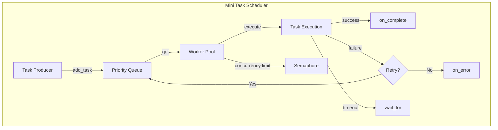

# 第13章：Mini Async Task Scheduler — 从零构建异步任务调度器

> "The best way to understand a system is to build it yourself." — 本章我们将从零开始，用 asyncio 构建一个功能完整的异步任务调度器。

在前面的章节中，我们学习了 asyncio 的各种基础组件：协程、Task、Future、Queue、Semaphore 等。本章将把这些知识整合起来，构建一个**实际可用的异步任务调度器**——Mini Async Task Scheduler。

这个项目涵盖：
- 优先级队列调度
- 并发限制
- 超时处理
- 指数退避重试
- 任务状态追踪
- 回调机制
- 优雅关闭

---

## 13.1 项目目标

### 13.1.1 为什么需要任务调度器？

在实际的异步应用中，我们经常面临以下挑战：

```
问题场景：
┌─────────────────────────────────────────────────────────┐
│  1. 有大量任务需要执行（爬虫、API调用、数据处理）          │
│  2. 不能同时执行太多（避免资源耗尽或被限流）              │
│  3. 任务有不同的优先级（紧急任务优先）                    │
│  4. 任务可能失败（需要重试机制）                          │
│  5. 任务可能卡住（需要超时处理）                          │
│  6. 需要追踪任务状态（监控和调试）                        │
│  7. 需要优雅关闭（不丢失任务）                            │
└─────────────────────────────────────────────────────────┘
```

### 13.1.2 设计目标

```python
# 我们希望最终能这样使用：
scheduler = TaskScheduler(max_workers=5)

# 添加任务（带优先级、超时、重试）
await scheduler.add_task(
    name="fetch_api",
    coro=fetch_data(url),
    priority=1,
    timeout=30,
    max_retries=3
)

# 启动调度器
await scheduler.start()

# 优雅关闭
await scheduler.shutdown()
```

### 13.1.3 架构概览



**SchedulerArchitectureDiagram**

```tsx
import { useState, useEffect, useRef } from "react";

interface Task {
  id: number;
  name: string;
  priority: number;
  status: "pending" | "running" | "done" | "failed" | "retrying";
  attempts: number;
  maxRetries: number;
  duration: number;
  color: string;
}

const PRIORITY_COLORS: Record<number, string> = {
  1: "#ef4444",
  2: "#f97316",
  3: "#eab308",
  4: "#22c55e",
  5: "#3b82f6",
};

const STATUS_LABELS: Record<string, string> = {
  pending: "等待中",
  running: "运行中",
  done: "已完成",
  failed: "失败",
  retrying: "重试中",
};

export default function SchedulerArchitectureDiagram() {
  const [tasks, setTasks] = useState<Task[]>([]);
  const [workers, setWorkers] = useState<{ id: number; task: Task | null; busy: boolean }[]>([]);
  const [queue, setQueue] = useState<Task[]>([]);
  const [stats, setStats] = useState({ total: 0, done: 0, failed: 0, pending: 0, running: 0 });
  const [isRunning, setIsRunning] = useState(false);
  const [log, setLog] = useState<string[]>([]);
  const timerRef = useRef<ReturnType<typeof setInterval> | null>(null);
  const taskCounter = useRef(0);
  const maxWorkers = 3;

  const addTask = () => {
    const names = ["fetch_user", "send_email", "process_image", "sync_db", "generate_report", "upload_file", "parse_csv", "notify_slack"];
    const priority = Math.floor(Math.random() * 5) + 1;
    const task: Task = {
      id: ++taskCounter.current,
      name: names[Math.floor(Math.random() * names.length)],
      priority,
      status: "pending",
      attempts: 0,
      maxRetries: 2,
      duration: 0,
      color: PRIORITY_COLORS[priority],
    };
    setTasks((prev) => [...prev, task]);
    setQueue((prev) => [...prev, task].sort((a, b) => a.priority - b.priority));
    setStats((s) => ({ ...s, total: s.total + 1, pending: s.pending + 1 }));
    setLog((l) => [`[+] 添加任务 #${task.id} "${task.name}" (优先级: ${task.priority})`, ...l].slice(0, 20));
  };

  const startScheduler = () => {
    if (isRunning) return;
    setIsRunning(true);
    const w = Array.from({ length: maxWorkers }, (_, i) => ({ id: i, task: null, busy: false }));
    setWorkers(w);
    setLog((l) => [`[启动] 调度器启动 (${maxWorkers} workers)`, ...l].slice(0, 20));
  };

  const stopScheduler = () => {
    setIsRunning(false);
    if (timerRef.current) clearInterval(timerRef.current);
    setLog((l) => ["[停止] 调度器关闭", ...l].slice(0, 20));
  };

  const resetAll = () => {
    stopScheduler();
    setTasks([]);
    setQueue([]);
    setWorkers([]);
    setStats({ total: 0, done: 0, failed: 0, pending: 0, running: 0 });
    setLog([]);
    taskCounter.current = 0;
  };

  useEffect(() => {
    if (!isRunning) return;

    timerRef.current = setInterval(() => {
      setQueue((prevQueue) => {
        setWorkers((prevWorkers) => {
          const newWorkers = [...prevWorkers];
          let newQueue = [...prevQueue];

          // 完成运行中的任务
          newWorkers.forEach((w) => {
            if (w.busy && w.task) {
              w.task.duration += 100;
              if (w.task.duration >= 1500 + Math.random() * 1000) {
                const success = Math.random() > 0.25;
                if (success) {
                  w.task.status = "done";
                  setStats((s) => ({ ...s, done: s.done + 1, running: s.running - 1 }));
                  setLog((l) => [`[完成] 任务 #${w.task!.id} "${w.task!.name}" 成功`, ...l].slice(0, 20));
                  setTasks((t) => t.map((tk) => (tk.id === w.task!.id ? { ...w.task! } : tk)));
                  w.task = null;
                  w.busy = false;
                } else if (w.task.attempts < w.task.maxRetries) {
                  w.task.attempts += 1;
                  w.task.status = "retrying";
                  setLog((l) => [`[重试] 任务 #${w.task!.id} "${w.task!.name}" 第${w.task!.attempts}次重试`, ...l].slice(0, 20));
                  setTasks((t) => t.map((tk) => (tk.id === w.task!.id ? { ...w.task! } : tk)));
                  const retryTask = { ...w.task, status: "pending" as const, duration: 0 };
                  newQueue.push(retryTask);
                  newQueue.sort((a, b) => a.priority - b.priority);
                  setStats((s) => ({ ...s, running: s.running - 1, pending: s.pending + 1 }));
                  w.task = null;
                  w.busy = false;
                } else {
                  w.task.status = "failed";
                  setStats((s) => ({ ...s, failed: s.failed + 1, running: s.running - 1 }));
                  setLog((l) => [`[失败] 任务 #${w.task!.id} "${w.task!.name}" 最终失败`, ...l].slice(0, 20));
                  setTasks((t) => t.map((tk) => (tk.id === w.task!.id ? { ...w.task! } : tk)));
                  w.task = null;
                  w.busy = false;
                }
              }
            }
          });

          // 分配新任务
          newWorkers.forEach((w) => {
            if (!w.busy && newQueue.length > 0) {
              const task = newQueue.shift()!;
              task.status = "running";
              task.attempts += 1;
              task.duration = 0;
              w.task = { ...task };
              w.busy = true;
              setStats((s) => ({ ...s, pending: s.pending - 1, running: s.running + 1 }));
              setTasks((t) => t.map((tk) => (tk.id === task.id ? { ...task } : tk)));
              setLog((l) => [`[执行] Worker-${w.id} 开始任务 #${task.id} "${task.name}"`, ...l].slice(0, 20));
            }
          });

          return newWorkers;
        });
        return prevQueue;
      });
    }, 100);

    return () => {
      if (timerRef.current) clearInterval(timerRef.current);
    };
  }, [isRunning]);

  return (
    <div style={{ padding: 20, fontFamily: "monospace", background: "#0f172a", borderRadius: 12, color: "#e2e8f0" }}>
      <h3 style={{ margin: "0 0 16px", color: "#38bdf8", fontSize: 16 }}>Mini Task Scheduler 架构</h3>

      <div style={{ display: "flex", gap: 8, marginBottom: 16, flexWrap: "wrap" }}>
        <button onClick={addTask} style={{ padding: "6px 14px", background: "#3b82f6", color: "#fff", border: "none", borderRadius: 6, cursor: "pointer", fontSize: 13 }}>
          + 添加任务
        </button>
        <button onClick={startScheduler} disabled={isRunning} style={{ padding: "6px 14px", background: isRunning ? "#475569" : "#22c55e", color: "#fff", border: "none", borderRadius: 6, cursor: isRunning ? "default" : "pointer", fontSize: 13 }}>
          启动调度器
        </button>
        <button onClick={stopScheduler} disabled={!isRunning} style={{ padding: "6px 14px", background: !isRunning ? "#475569" : "#ef4444", color: "#fff", border: "none", borderRadius: 6, cursor: !isRunning ? "default" : "pointer", fontSize: 13 }}>
          停止
        </button>
        <button onClick={resetAll} style={{ padding: "6px 14px", background: "#6366f1", color: "#fff", border: "none", borderRadius: 6, cursor: "pointer", fontSize: 13 }}>
          重置
        </button>

      {/* Stats */}
      <div style={{ display: "grid", gridTemplateColumns: "repeat(5, 1fr)", gap: 8, marginBottom: 16 }}>
        {[
          { label: "总计", value: stats.total, color: "#94a3b8" },
          { label: "等待", value: stats.pending, color: "#eab308" },
          { label: "运行", value: stats.running, color: "#3b82f6" },
          { label: "完成", value: stats.done, color: "#22c55e" },
          { label: "失败", value: stats.failed, color: "#ef4444" },
        ].map((s) => (
          <div key={s.label} style={{ background: "#1e293b", padding: 10, borderRadius: 8, textAlign: "center" }}>
            <div style={{ fontSize: 22, fontWeight: 700, color: s.color }}>{s.value}</div>
            <div style={{ fontSize: 11, color: "#64748b" }}>{s.label}</div>
        ))}

      {/* Architecture Flow */}
      <div style={{ display: "flex", gap: 12, marginBottom: 16, alignItems: "flex-start", flexWrap: "wrap" }}>
        {/* Priority Queue */}
        <div style={{ flex: "1 1 200px", background: "#1e293b", borderRadius: 8, padding: 12 }}>
          <div style={{ fontSize: 13, fontWeight: 600, color: "#f59e0b", marginBottom: 8 }}>优先级队列 ({queue.length})</div>
          <div style={{ display: "flex", flexDirection: "column", gap: 4, maxHeight: 160, overflow: "auto" }}>
            {queue.length === 0 && <div style={{ fontSize: 12, color: "#475569" }}>空</div>}
            {queue.slice(0, 8).map((t, i) => (
              <div key={`${t.id}-${i}`} style={{ fontSize: 11, padding: "4px 8px", background: "#0f172a", borderRadius: 4, borderLeft: `3px solid ${t.color}`, display: "flex", justifyContent: "space-between" }}>
                <span>#{t.id} {t.name}</span>
                <span style={{ color: t.color }}>P{t.priority}</span>
            ))}

        {/* Workers */}
        <div style={{ flex: "1 1 300px", background: "#1e293b", borderRadius: 8, padding: 12 }}>
          <div style={{ fontSize: 13, fontWeight: 600, color: "#38bdf8", marginBottom: 8 }}>Worker Pool ({maxWorkers})</div>
          <div style={{ display: "flex", flexDirection: "column", gap: 6 }}>
            {workers.map((w) => (
              <div key={w.id} style={{ display: "flex", alignItems: "center", gap: 8, fontSize: 12, padding: "6px 8px", background: "#0f172a", borderRadius: 4 }}>
                <span style={{ color: w.busy ? "#22c55e" : "#475569", fontSize: 10 }}>{w.busy ? "●" : "○"}</span>
                <span style={{ color: "#94a3b8" }}>Worker-{w.id}</span>
                {w.task ? (
                  <span style={{ flex: 1, textAlign: "right" }}>
                    <span style={{ color: w.task.color }}>#{w.task.id}</span> {w.task.name}
                    <span style={{ marginLeft: 6, color: "#64748b" }}>{(w.task.duration / 1000).toFixed(1)}s</span>
                  </span>
                ) : (
                  <span style={{ flex: 1, textAlign: "right", color: "#334155" }}>idle</span>
                )}
            ))}

        {/* Results */}
        <div style={{ flex: "1 1 200px", background: "#1e293b", borderRadius: 8, padding: 12 }}>
          <div style={{ fontSize: 13, fontWeight: 600, color: "#a78bfa", marginBottom: 8 }}>已完成任务</div>
          <div style={{ display: "flex", flexDirection: "column", gap: 4, maxHeight: 160, overflow: "auto" }}>
            {tasks.filter((t) => t.status === "done" || t.status === "failed").length === 0 && (
              <div style={{ fontSize: 12, color: "#475569" }}>暂无</div>
            )}
            {tasks
              .filter((t) => t.status === "done" || t.status === "failed")
              .slice(-8)
              .reverse()
              .map((t) => (
                <div key={t.id} style={{ fontSize: 11, padding: "4px 8px", background: "#0f172a", borderRadius: 4, borderLeft: `3px solid ${t.status === "done" ? "#22c55e" : "#ef4444"}`, display: "flex", justifyContent: "space-between" }}>
                  <span>#{t.id} {t.name}</span>
                  <span style={{ color: t.status === "done" ? "#22c55e" : "#ef4444" }}>{t.status === "done" ? "✓" : "✗"} {t.attempts}次</span>
              ))}

      {/* Log */}
      <div style={{ background: "#1e293b", borderRadius: 8, padding: 12, maxHeight: 140, overflow: "auto" }}>
        <div style={{ fontSize: 13, fontWeight: 600, color: "#64748b", marginBottom: 6 }}>调度日志</div>
        {log.length === 0 && <div style={{ fontSize: 12, color: "#334155" }}>暂无日志</div>}
        {log.map((l, i) => (
          <div key={i} style={{ fontSize: 11, color: l.includes("[完成]") ? "#22c55e" : l.includes("[失败]") ? "#ef4444" : l.includes("[重试]") ? "#f97316" : l.includes("[执行]") ? "#3b82f6" : "#94a3b8", lineHeight: 1.6 }}>
            {l}
        ))}
  );
}
```

---

## 13.2 需求分析

### 13.2.1 功能需求

在编写代码之前，先明确调度器需要满足的需求：

| 需求 | 描述 | 优先级 |
|------|------|--------|
| 任务提交 | 支持异步提交协程任务 | P0 |
| 优先级调度 | 高优先级任务优先执行 | P0 |
| 并发限制 | 限制同时执行的任务数量 | P0 |
| 超时处理 | 单个任务可设置超时 | P1 |
| 重试机制 | 失败任务支持自动重试 | P1 |
| 状态追踪 | 实时追踪每个任务的状态 | P1 |
| 回调机制 | 任务完成/失败时触发回调 | P2 |
| 优雅关闭 | 等待运行中任务完成 | P0 |
| 指标统计 | 记录执行统计信息 | P2 |

### 13.2.2 非功能需求

```python
# 性能要求
- 任务提交延迟 < 1ms
- 支持 1000+ 并发任务
- 内存占用可控（队列有界）

# 可靠性要求
- 不丢失任务（即使在关闭时）
- 重试时使用指数退避
- 异常不能崩溃整个调度器

# 可观测性要求
- 任务状态可查询
- 执行日志可追踪
- 统计指标可收集
```

### 13.2.3 接口设计

```python
class TaskScheduler:
    """异步任务调度器核心接口"""

    def __init__(self, max_workers: int = 10):
        """初始化调度器"""
        ...

    async def add_task(
        self,
        name: str,
        coro: Coroutine,
        priority: int = 5,
        timeout: float | None = None,
        max_retries: int = 0,
        on_complete: Callable | None = None,
        on_error: Callable | None = None,
    ) -> str:
        """添加任务到调度器，返回任务ID"""
        ...

    async def start(self) -> None:
        """启动调度器"""
        ...

    async def shutdown(self, wait: bool = True) -> None:
        """关闭调度器"""
        ...

    def get_task_status(self, task_id: str) -> TaskStatus:
        """查询任务状态"""
        ...

    def get_stats(self) -> SchedulerStats:
        """获取调度器统计信息"""
        ...
```

### 13.2.4 技术选型

```python
# 核心组件选型
任务队列    → asyncio.PriorityQueue  # 优先级支持
并发控制    → asyncio.Semaphore       # 限制并发数
超时处理    → asyncio.wait_for        # 单任务超时
状态存储    → dict[str, Task]         # 内存存储
回调执行    → 直接 await              # 异步回调
关闭信号    → asyncio.Event           # 优雅关闭
```

---

## 13.3 基础架构

<div data-component="SchedulerArchitectureDiagram"></div>

### 13.3.1 项目结构

```
mini_scheduler/
├── __init__.py
├── scheduler.py      # 调度器核心
├── task.py           # 任务定义
├── worker.py         # Worker 实现
├── exceptions.py     # 自定义异常
└── demo.py           # 演示脚本
```

### 13.3.2 自定义异常

```python
# exceptions.py
"""调度器相关异常定义"""


class SchedulerError(Exception):
    """调度器基础异常"""
    pass


class TaskTimeoutError(SchedulerError):
    """任务超时异常"""

    def __init__(self, task_name: str, timeout: float):
        self.task_name = task_name
        self.timeout = timeout
        super().__init__(f"任务 '{task_name}' 超时 ({timeout}s)")


class TaskFailedError(SchedulerError):
    """任务失败异常（重试耗尽后抛出）"""

    def __init__(self, task_name: str, attempts: int, last_error: Exception):
        self.task_name = task_name
        self.attempts = attempts
        self.last_error = last_error
        super().__init__(
            f"任务 '{task_name}' 失败 (尝试 {attempts} 次): {last_error}"
        )


class SchedulerNotRunningError(SchedulerError):
    """调度器未运行异常"""

    def __init__(self):
        super().__init__("调度器未运行，请先调用 start()")


class SchedulerAlreadyRunningError(SchedulerError):
    """调度器已运行异常"""

    def __init__(self):
        super().__init__("调度器已在运行中")
```

### 13.3.3 基本骨架

```python
# scheduler.py
"""Mini Async Task Scheduler 核心实现"""

import asyncio
import logging
import uuid
from dataclasses import dataclass, field
from datetime import datetime, timezone
from enum import Enum
from typing import Any, Callable, Coroutine

from .exceptions import (
    SchedulerAlreadyRunningError,
    SchedulerNotRunningError,
    TaskFailedError,
    TaskTimeoutError,
)

logger = logging.getLogger(__name__)


class TaskState(Enum):
    """任务状态枚举"""
    PENDING = "pending"       # 等待执行
    RUNNING = "running"       # 正在执行
    DONE = "done"             # 执行成功
    FAILED = "failed"         # 执行失败
    RETRYING = "retrying"     # 重试中
    CANCELLED = "cancelled"   # 已取消


class TaskScheduler:
    """异步任务调度器"""

    def __init__(self, max_workers: int = 10):
        self.max_workers = max_workers
        self._running = False
        self._queue: asyncio.PriorityQueue = asyncio.PriorityQueue()
        self._tasks: dict[str, "Task"] = {}
        self._workers: list[asyncio.Task] = []
        self._semaphore: asyncio.Semaphore | None = None
        self._shutdown_event = asyncio.Event()
        self._stats = SchedulerStats()

    async def start(self) -> None:
        """启动调度器"""
        if self._running:
            raise SchedulerAlreadyRunningError()

        self._running = True
        self._shutdown_event.clear()
        self._semaphore = asyncio.Semaphore(self.max_workers)

        # 创建 worker 协程
        for i in range(self.max_workers):
            worker = asyncio.create_task(
                self._worker(f"worker-{i}"),
                name=f"worker-{i}"
            )
            self._workers.append(worker)

        logger.info(f"调度器已启动，{self.max_workers} 个 worker")

    async def shutdown(self, wait: bool = True) -> None:
        """关闭调度器"""
        if not self._running:
            return

        self._running = False
        self._shutdown_event.set()

        if wait:
            # 等待所有 worker 完成当前任务
            await asyncio.gather(*self._workers, return_exceptions=True)

        logger.info("调度器已关闭")
```

**TaskPriorityDemo**

```tsx
import { useState } from "react";

interface PriorityTask {
  id: number;
  name: string;
  priority: number;
  selected: boolean;
}

const PRIORITY_LABELS: Record<number, { label: string; color: string }> = {
  1: { label: "CRITICAL", color: "#ef4444" },
  2: { label: "HIGH", color: "#f97316" },
  3: { label: "MEDIUM", color: "#eab308" },
  4: { label: "LOW", color: "#22c55e" },
  5: { label: "TRIVIAL", color: "#6b7280" },
};

export default function TaskPriorityDemo() {
  const [tasks, setTasks] = useState<PriorityTask[]>([
    { id: 1, name: "数据库备份", priority: 1, selected: false },
    { id: 2, name: "发送通知邮件", priority: 3, selected: false },
    { id: 3, name: "生成日报", priority: 4, selected: false },
    { id: 4, name: "处理支付回调", priority: 1, selected: false },
    { id: 5, name: "同步用户数据", priority: 2, selected: false },
    { id: 6, name: "清理临时文件", priority: 5, selected: false },
    { id: 7, name: "更新缓存", priority: 3, selected: false },
    { id: 8, name: "记录访问日志", priority: 4, selected: false },
  ]);
  const [newName, setNewName] = useState("");
  const [newPriority, setNewPriority] = useState(3);
  const [sortByPriority, setSortByPriority] = useState(false);

  const addTask = () => {
    if (!newName.trim()) return;
    setTasks((prev) => [
      ...prev,
      { id: Date.now(), name: newName, priority: newPriority, selected: false },
    ]);
    setNewName("");
  };

  const removeSelected = () => {
    setTasks((prev) => prev.filter((t) => !t.selected));
  };

  const toggleSelect = (id: number) => {
    setTasks((prev) => prev.map((t) => (t.id === id ? { ...t, selected: !t.selected } : t)));
  };

  const displayed = sortByPriority ? [...tasks].sort((a, b) => a.priority - b.priority) : tasks;
  const executionOrder = [...tasks].sort((a, b) => a.priority - b.priority);

  return (
    <div style={{ padding: 20, fontFamily: "monospace", background: "#0f172a", borderRadius: 12, color: "#e2e8f0" }}>
      <h3 style={{ margin: "0 0 16px", color: "#38bdf8", fontSize: 16 }}>任务优先级演示</h3>

      {/* Add task */}
      <div style={{ display: "flex", gap: 8, marginBottom: 16, flexWrap: "wrap" }}>
        <input
          value={newName}
          onChange={(e) => setNewName(e.target.value)}
          placeholder="任务名称"
          onKeyDown={(e) => e.key === "Enter" && addTask()}
          style={{ flex: 1, minWidth: 150, padding: "6px 10px", background: "#1e293b", border: "1px solid #334155", borderRadius: 6, color: "#e2e8f0", fontSize: 13, fontFamily: "monospace" }}
        />
        <select
          value={newPriority}
          onChange={(e) => setNewPriority(Number(e.target.value))}
          style={{ padding: "6px 10px", background: "#1e293b", border: "1px solid #334155", borderRadius: 6, color: "#e2e8f0", fontSize: 13, fontFamily: "monospace" }}
        >
          {Object.entries(PRIORITY_LABELS).map(([k, v]) => (
            <option key={k} value={k}>P{k} - {v.label}</option>
          ))}
        </select>
        <button onClick={addTask} style={{ padding: "6px 14px", background: "#3b82f6", color: "#fff", border: "none", borderRadius: 6, cursor: "pointer", fontSize: 13 }}>
          添加
        </button>
      </div>

      {/* Controls */}
      <div style={{ display: "flex", gap: 8, marginBottom: 12 }}>
        <button onClick={() => setSortByPriority(!sortByPriority)} style={{ padding: "4px 10px", background: sortByPriority ? "#22c55e" : "#334155", color: "#fff", border: "none", borderRadius: 4, cursor: "pointer", fontSize: 12 }}>
          {sortByPriority ? "已排序 ✓" : "按优先级排序"}
        </button>
        <button onClick={removeSelected} style={{ padding: "4px 10px", background: "#ef4444", color: "#fff", border: "none", borderRadius: 4, cursor: "pointer", fontSize: 12 }}>
          删除选中
        </button>

      {/* Task list */}
      <div style={{ display: "grid", gap: 6, marginBottom: 16 }}>
        {displayed.map((t) => (
          <div
            key={t.id}
            onClick={() => toggleSelect(t.id)}
            style={{
              display: "flex",
              alignItems: "center",
              gap: 10,
              padding: "8px 12px",
              background: t.selected ? "#1e3a5f" : "#1e293b",
              borderRadius: 6,
              cursor: "pointer",
              borderLeft: `4px solid ${PRIORITY_LABELS[t.priority].color}`,
            }}
          >
            <span style={{ fontSize: 12, color: t.selected ? "#38bdf8" : "#475569" }}>{t.selected ? "☑" : "☐"}</span>
            <span style={{ flex: 1, fontSize: 13 }}>{t.name}</span>
            <span
              style={{
                fontSize: 11,
                padding: "2px 8px",
                borderRadius: 10,
                background: PRIORITY_LABELS[t.priority].color + "22",
                color: PRIORITY_LABELS[t.priority].color,
                fontWeight: 600,
              }}
            >
              P{t.priority} {PRIORITY_LABELS[t.priority].label}
            </span>
        ))}

      {/* Execution order */}
      <div style={{ background: "#1e293b", borderRadius: 8, padding: 12 }}>
        <div style={{ fontSize: 13, fontWeight: 600, color: "#a78bfa", marginBottom: 8 }}>执行顺序（优先级队列出队顺序）</div>
        <div style={{ display: "flex", gap: 6, flexWrap: "wrap" }}>
          {executionOrder.map((t, i) => (
            <span key={t.id} style={{ fontSize: 11, padding: "4px 8px", background: "#0f172a", borderRadius: 4, borderLeft: `3px solid ${PRIORITY_LABELS[t.priority].color}` }}>
              {i + 1}. {t.name}
            </span>
          ))}
  );
}
```

---

## 13.4 任务定义

### 13.4.1 Task 数据类

```python
# task.py
"""任务定义"""

import asyncio
import uuid
from dataclasses import dataclass, field
from datetime import datetime, timezone
from typing import Any, Callable, Coroutine

from .scheduler import TaskState


@dataclass
class Task:
    """表示一个可调度的任务"""

    # 基本信息
    name: str
    coro: Coroutine
    task_id: str = field(default_factory=lambda: uuid.uuid4().hex[:8])

    # 调度参数
    priority: int = 5                    # 1=最高, 5=最低
    timeout: float | None = None         # 超时秒数
    max_retries: int = 0                 # 最大重试次数

    # 状态信息
    state: TaskState = TaskState.PENDING
    attempts: int = 0                    # 已尝试次数
    created_at: datetime = field(
        default_factory=lambda: datetime.now(timezone.utc)
    )
    started_at: datetime | None = None
    completed_at: datetime | None = None

    # 结果信息
    result: Any = None
    error: Exception | None = None

    # 回调
    on_complete: Callable | None = field(default=None, repr=False)
    on_error: Callable | None = field(default=None, repr=False)

    # 内部
    _sequence: int = field(default=0, repr=False)  # 用于队列排序

    def __lt__(self, other: "Task") -> bool:
        """优先级比较（用于 PriorityQueue）

        PriorityQueue 使用 __lt__ 来决定出队顺序。
        priority 值越小优先级越高。
        """
        if self.priority != other.priority:
            return self.priority < other.priority
        return self._sequence < other._sequence  # 同优先级按 FIFO

    @property
    def elapsed(self) -> float | None:
        """计算已执行时间（秒）"""
        if self.started_at is None:
            return None
        end = self.completed_at or datetime.now(timezone.utc)
        return (end - self.started_at).total_seconds()

    @property
    def is_terminal(self) -> bool:
        """是否为终态"""
        return self.state in (TaskState.DONE, TaskState.FAILED, TaskState.CANCELLED)

    @property
    def can_retry(self) -> bool:
        """是否可以重试"""
        return self.attempts < self.max_retries

    def mark_running(self) -> None:
        """标记为运行中"""
        self.state = TaskState.RUNNING
        self.started_at = datetime.now(timezone.utc)
        self.attempts += 1

    def mark_done(self, result: Any = None) -> None:
        """标记为完成"""
        self.state = TaskState.DONE
        self.result = result
        self.completed_at = datetime.now(timezone.utc)

    def mark_failed(self, error: Exception) -> None:
        """标记为失败"""
        self.state = TaskState.FAILED
        self.error = error
        self.completed_at = datetime.now(timezone.utc)

    def mark_retrying(self) -> None:
        """标记为重试中"""
        self.state = TaskState.RETRYING

    def mark_cancelled(self) -> None:
        """标记为取消"""
        self.state = TaskState.CANCELLED
        self.completed_at = datetime.now(timezone.utc)

    def to_dict(self) -> dict:
        """转换为字典（用于序列化）"""
        return {
            "task_id": self.task_id,
            "name": self.name,
            "priority": self.priority,
            "state": self.state.value,
            "attempts": self.attempts,
            "max_retries": self.max_retries,
            "timeout": self.timeout,
            "created_at": self.created_at.isoformat(),
            "started_at": self.started_at.isoformat() if self.started_at else None,
            "completed_at": self.completed_at.isoformat() if self.completed_at else None,
            "elapsed": self.elapsed,
            "error": str(self.error) if self.error else None,
        }

    def __str__(self) -> str:
        return (
            f"Task({self.name!r}, id={self.task_id}, "
            f"priority={self.priority}, state={self.state.value})"
        )
```

### 13.4.2 任务优先级常量

```python
# 定义优先级常量
class Priority:
    """任务优先级常量"""
    CRITICAL = 1    # 紧急：支付回调、告警处理
    HIGH = 2        # 高：用户请求、实时数据
    MEDIUM = 3      # 中：后台任务、数据同步
    LOW = 4         # 低：统计分析、日志处理
    TRIVIAL = 5     # 最低：清理任务、非紧急维护

    @classmethod
    def label(cls, level: int) -> str:
        """获取优先级标签"""
        labels = {
            1: "CRITICAL",
            2: "HIGH",
            3: "MEDIUM",
            4: "LOW",
            5: "TRIVIAL",
        }
        return labels.get(level, "UNKNOWN")
```

### 13.4.3 SchedulerStats 统计类

```python
@dataclass
class SchedulerStats:
    """调度器统计信息"""

    total_submitted: int = 0     # 总提交数
    total_completed: int = 0     # 总完成数
    total_failed: int = 0        # 总失败数
    total_cancelled: int = 0     # 总取消数
    total_retries: int = 0       # 总重试次数

    @property
    def success_rate(self) -> float:
        """成功率"""
        total = self.total_completed + self.total_failed
        if total == 0:
            return 0.0
        return self.total_completed / total

    @property
    def active_tasks(self) -> int:
        """活跃任务数"""
        return self.total_submitted - self.total_completed - self.total_failed - self.total_cancelled

    def to_dict(self) -> dict:
        return {
            "submitted": self.total_submitted,
            "completed": self.total_completed,
            "failed": self.total_failed,
            "cancelled": self.total_cancelled,
            "retries": self.total_retries,
            "success_rate": f"{self.success_rate:.1%}",
            "active": self.active_tasks,
        }
```

---

## 13.5 添加任务

### 13.5.1 add_task 方法

```python
# scheduler.py (继续)

class TaskScheduler:
    """异步任务调度器"""

    _sequence_counter: int = 0

    async def add_task(
        self,
        name: str,
        coro: Coroutine,
        priority: int = Priority.MEDIUM,
        timeout: float | None = None,
        max_retries: int = 0,
        on_complete: Callable | None = None,
        on_error: Callable | None = None,
    ) -> str:
        """添加任务到调度器

        Args:
            name: 任务名称
            coro: 要执行的协程
            priority: 优先级 (1=最高, 5=最低)
            timeout: 超时秒数
            max_retries: 最大重试次数
            on_complete: 完成回调
            on_error: 失败回调

        Returns:
            任务ID
        """
        if not self._running:
            raise SchedulerNotRunningError()

        # 生成序列号（用于同优先级的 FIFO 排序）
        TaskScheduler._sequence_counter += 1

        task = Task(
            name=name,
            coro=coro,
            priority=priority,
            timeout=timeout,
            max_retries=max_retries,
            on_complete=on_complete,
            on_error=on_error,
            _sequence=TaskScheduler._sequence_counter,
        )

        # 存储任务引用
        self._tasks[task.task_id] = task

        # 放入优先级队列
        await self._queue.put(task)

        # 更新统计
        self._stats.total_submitted += 1

        logger.info(f"任务已添加: {task}")
        return task.task_id
```

### 13.5.2 便捷的同步添加方法

```python
    def add_task_nowait(
        self,
        name: str,
        coro: Coroutine,
        priority: int = Priority.MEDIUM,
        timeout: float | None = None,
        max_retries: int = 0,
    ) -> str:
        """同步添加任务（不等待）

        注意：需要在事件循环中调用
        """
        if not self._running:
            raise SchedulerNotRunningError()

        TaskScheduler._sequence_counter += 1

        task = Task(
            name=name,
            coro=coro,
            priority=priority,
            timeout=timeout,
            max_retries=max_retries,
            _sequence=TaskScheduler._sequence_counter,
        )

        self._tasks[task.task_id] = task
        self._queue.put_nowait(task)
        self._stats.total_submitted += 1

        logger.info(f"任务已添加 (nowait): {task}")
        return task.task_id
```

### 13.5.3 批量添加

```python
    async def add_tasks(
        self,
        tasks: list[dict],
    ) -> list[str]:
        """批量添加任务

        Args:
            tasks: 任务配置列表，每个字典包含 add_task 的参数

        Returns:
            任务ID列表

        Example:
            await scheduler.add_tasks([
                {"name": "task1", "coro": coro1, "priority": 1},
                {"name": "task2", "coro": coro2, "timeout": 30},
            ])
        """
        task_ids = []
        for task_config in tasks:
            task_id = await self.add_task(**task_config)
            task_ids.append(task_id)
        return task_ids
```

---

## 13.6 执行任务

### 13.6.1 Worker 协程

Worker 是调度器的核心执行单元。每个 Worker 不断从队列中取任务并执行。

```python
    async def _worker(self, worker_name: str) -> None:
        """Worker 协程：不断从队列取任务执行

        Args:
            worker_name: Worker 名称（用于日志）
        """
        logger.debug(f"{worker_name} 已启动")

        while self._running:
            try:
                # 从队列取任务（带超时，避免关闭时卡住）
                try:
                    task = await asyncio.wait_for(
                        self._queue.get(),
                        timeout=1.0
                    )
                except asyncio.TimeoutError:
                    continue

                # 检查是否已取消
                if task.state == TaskState.CANCELLED:
                    self._queue.task_done()
                    continue

                # 执行任务
                await self._execute_task(task, worker_name)

                # 标记队列任务完成
                self._queue.task_done()

            except asyncio.CancelledError:
                logger.debug(f"{worker_name} 被取消")
                break
            except Exception as e:
                logger.error(f"{worker_name} 异常: {e}", exc_info=True)

        logger.debug(f"{worker_name} 已退出")
```

### 13.6.2 任务执行逻辑

```python
    async def _execute_task(self, task: Task, worker_name: str) -> None:
        """执行单个任务

        包含：超时处理、重试逻辑、回调执行
        """
        task.mark_running()
        logger.info(f"{worker_name} 开始执行: {task}")

        try:
            # 执行协程（带超时）
            if task.timeout:
                result = await asyncio.wait_for(task.coro, timeout=task.timeout)
            else:
                result = await task.coro

            # 成功
            task.mark_done(result)
            self._stats.total_completed += 1
            logger.info(f"{worker_name} 完成: {task.name} (耗时 {task.elapsed:.2f}s)")

            # 执行成功回调
            if task.on_complete:
                await self._safe_callback(task.on_complete, task)

        except asyncio.TimeoutError:
            # 超时处理
            error = TaskTimeoutError(task.name, task.timeout)
            await self._handle_task_failure(task, error, worker_name)

        except asyncio.CancelledError:
            # 取消传播
            task.mark_cancelled()
            self._stats.total_cancelled += 1
            raise

        except Exception as e:
            # 其他异常
            await self._handle_task_failure(task, e, worker_name)
```

### 13.6.3 失败处理

```python
    async def _handle_task_failure(
        self,
        task: Task,
        error: Exception,
        worker_name: str,
    ) -> None:
        """处理任务失败（含重试逻辑）"""
        logger.warning(
            f"{worker_name} 任务失败: {task.name} "
            f"(尝试 {task.attempts}/{task.max_retries + 1}): {error}"
        )

        if task.can_retry:
            # 可以重试
            task.mark_retrying()
            self._stats.total_retries += 1

            # 计算退避时间
            backoff = self._calculate_backoff(task.attempts)
            logger.info(
                f"{worker_name} 任务 {task.name} 将在 {backoff:.1f}s 后重试"
            )

            # 延迟后重新入队
            await asyncio.sleep(backoff)

            # 重新创建协程（重要！已执行的协程不能重用）
            # 注意：这需要调用者提供工厂函数，见后续改进
            task.state = TaskState.PENDING
            await self._queue.put(task)

        else:
            # 不可重试，标记失败
            task.mark_failed(error)
            self._stats.total_failed += 1
            logger.error(
                f"{worker_name} 任务最终失败: {task.name} "
                f"(已尝试 {task.attempts} 次)"
            )

            # 执行失败回调
            if task.on_error:
                await self._safe_callback(task.on_error, task, error)
```

### 13.6.4 协程重用问题

已执行过的协程不能直接重用。解决方案是使用**协程工厂函数**：

```python
# 使用工厂函数而非协程对象
# ❌ 错误：协程执行一次后就不能再用了
await scheduler.add_task("task1", coro=fetch_data(url))

# ✅ 正确：传入工厂函数
await scheduler.add_task(
    "task1",
    coro_factory=lambda: fetch_data(url),  # 每次调用创建新协程
)

# 或者用 functools.partial
from functools import partial
await scheduler.add_task(
    "task1",
    coro_factory=partial(fetch_data, url),
)
```

改进 Task 类以支持工厂函数：

```python
@dataclass
class Task:
    """支持协程工厂的任务类"""

    name: str
    coro_factory: Callable[..., Coroutine]  # 协程工厂函数
    task_id: str = field(default_factory=lambda: uuid.uuid4().hex[:8])
    priority: int = 5
    timeout: float | None = None
    max_retries: int = 0
    # ... 其他字段 ...

    def create_coroutine(self) -> Coroutine:
        """创建新的协程实例（每次重试都调用）"""
        return self.coro_factory()
```

---

## 13.7 并发限制

<div data-component="ConcurrencyLimitDemo"></div>

### 13.7.1 Semaphore 集成

并发限制是任务调度器的关键功能。我们使用 `asyncio.Semaphore` 来控制同时执行的任务数量。

**ConcurrencyLimitDemo**

```tsx
import { useState, useEffect, useRef, useCallback } from "react";

interface DemoTask {
  id: number;
  name: string;
  duration: number;
  status: "pending" | "running" | "done";
  workerId: number | null;
  startTime: number | null;
  endTime: number | null;
  color: string;
}

const COLORS = ["#3b82f6", "#22c55e", "#f97316", "#a78bfa", "#ec4899", "#14b8a6", "#f59e0b", "#6366f1"];

export default function ConcurrencyLimitDemo() {
  const [maxConcurrent, setMaxConcurrent] = useState(3);
  const [tasks, setTasks] = useState<DemoTask[]>([]);
  const [isRunning, setIsRunning] = useState(false);
  const [time, setTime] = useState(0);
  const timerRef = useRef<ReturnType<typeof setInterval> | null>(null);
  const taskIdRef = useRef(0);

  const generateTasks = useCallback(() => {
    const names = ["API-A", "API-B", "API-C", "API-D", "API-E", "API-F", "API-G", "API-H", "API-I", "API-J", "API-K", "API-L"];
    return names.map((name, i) => ({
      id: ++taskIdRef.current,
      name,
      duration: 1000 + Math.random() * 3000,
      status: "pending" as const,
      workerId: null,
      startTime: null,
      endTime: null,
      color: COLORS[i % COLORS.length],
    }));
  }, []);

  const startDemo = () => {
    const newTasks = generateTasks();
    setTasks(newTasks);
    setIsRunning(true);
    setTime(0);
  };

  const stopDemo = () => {
    setIsRunning(false);
    if (timerRef.current) clearInterval(timerRef.current);
  };

  useEffect(() => {
    if (!isRunning) return;

    timerRef.current = setInterval(() => {
      setTime((t) => t + 50);
      setTasks((prev) => {
        const now = Date.now();
        let updated = prev.map((t) => {
          if (t.status === "running" && t.startTime && now - t.startTime >= t.duration) {
            return { ...t, status: "done" as const, endTime: now };
          }
          return t;
        });

        const runningCount = updated.filter((t) => t.status === "running").length;
        const availableWorkers = maxConcurrent - runningCount;

        if (availableWorkers > 0) {
          const pending = updated.filter((t) => t.status === "pending");
          const toStart = pending.slice(0, availableWorkers);
          const toStartIds = new Set(toStart.map((t) => t.id));

          updated = updated.map((t) => {
            if (toStartIds.has(t.id)) {
              const workerIdx = updated.filter((x) => x.status === "running").length;
              return { ...t, status: "running" as const, workerId: workerIdx, startTime: now };
            }
            return t;
          });
        }

        return updated;
      });
    }, 50);

    return () => {
      if (timerRef.current) clearInterval(timerRef.current);
    };
  }, [isRunning, maxConcurrent]);

  const allDone = tasks.length > 0 && tasks.every((t) => t.status === "done");

  useEffect(() => {
    if (allDone && timerRef.current) {
      clearInterval(timerRef.current);
    }
  }, [allDone]);

  const runningCount = tasks.filter((t) => t.status === "running").length;
  const doneCount = tasks.filter((t) => t.status === "done").length;

  // Gantt chart
  const maxTime = time || 1;
  const taskHeight = 28;
  const chartHeight = tasks.length * (taskHeight + 4) + 30;

  return (
    <div style={{ padding: 20, fontFamily: "monospace", background: "#0f172a", borderRadius: 12, color: "#e2e8f0" }}>
      <h3 style={{ margin: "0 0 16px", color: "#38bdf8", fontSize: 16 }}>并发限制演示 — Semaphore(max_workers={maxConcurrent})</h3>

      <div style={{ display: "flex", gap: 12, alignItems: "center", marginBottom: 16, flexWrap: "wrap" }}>
        <div style={{ display: "flex", alignItems: "center", gap: 8 }}>
          <span style={{ fontSize: 13, color: "#94a3b8" }}>并发上限:</span>
          <input
            type="range"
            min={1}
            max={6}
            value={maxConcurrent}
            onChange={(e) => setMaxConcurrent(Number(e.target.value))}
            disabled={isRunning}
            style={{ width: 120 }}
          />
          <span style={{ fontSize: 15, fontWeight: 700, color: "#38bdf8", minWidth: 20 }}>{maxConcurrent}</span>
        </div>
        <button onClick={startDemo} style={{ padding: "6px 14px", background: "#3b82f6", color: "#fff", border: "none", borderRadius: 6, cursor: "pointer", fontSize: 13 }}>
          {allDone ? "重新运行" : "开始"}
        </button>
        <button onClick={stopDemo} disabled={!isRunning} style={{ padding: "6px 14px", background: !isRunning ? "#475569" : "#ef4444", color: "#fff", border: "none", borderRadius: 6, cursor: !isRunning ? "default" : "pointer", fontSize: 13 }}>
          停止
        </button>

      {/* Status bar */}
      <div style={{ display: "flex", gap: 16, marginBottom: 16, fontSize: 13 }}>
        <span>运行中: <span style={{ color: "#3b82f6", fontWeight: 700 }}>{runningCount}</span>/{maxConcurrent}</span>
        <span>已完成: <span style={{ color: "#22c55e", fontWeight: 700 }}>{doneCount}</span>/{tasks.length}</span>
        <span>耗时: <span style={{ color: "#f59e0b", fontWeight: 700 }}>{(time / 1000).toFixed(1)}s</span></span>

      {/* Semaphore visualization */}
      <div style={{ display: "flex", gap: 4, marginBottom: 12 }}>
        {Array.from({ length: maxConcurrent }).map((_, i) => (
          <div
            key={i}
            style={{
              flex: 1,
              height: 20,
              borderRadius: 4,
              background: i < runningCount ? "#3b82f6" : "#1e293b",
              border: "1px solid #334155",
              display: "flex",
              alignItems: "center",
              justifyContent: "center",
              fontSize: 10,
              color: i < runningCount ? "#fff" : "#475569",
            }}
          >
            {i < runningCount ? `W${i}` : "空闲"}
        ))}

      {/* Gantt chart */}
      {tasks.length > 0 && (
        <div style={{ background: "#1e293b", borderRadius: 8, padding: 12, overflow: "auto" }}>
          <svg width="100%" height={chartHeight} viewBox={`0 0 600 ${chartHeight}`}>
            {/* Time axis */}
            <text x={50} y={14} fill="#64748b" fontSize={10}>{(0).toFixed(0)}s</text>
            <text x={300} y={14} fill="#64748b" fontSize={10}>{(maxTime / 2000).toFixed(0)}s</text>
            <text x={550} y={14} fill="#64748b" fontSize={10}>{(maxTime / 1000).toFixed(0)}s</text>

            {tasks.map((task, i) => {
              const y = 24 + i * (taskHeight + 4);
              const startX = task.startTime ? 50 + ((task.startTime - (tasks[0]?.startTime || Date.now())) / maxTime) * 500 : 50;
              const endX = task.endTime
                ? 50 + ((task.endTime - (tasks[0]?.startTime || Date.now())) / maxTime) * 500
                : task.startTime
                  ? 50 + ((Date.now() - (tasks[0]?.startTime || Date.now())) / maxTime) * 500
                  : startX;
              const barWidth = Math.max(endX - startX, task.status === "running" ? 4 : 0);

              return (
                <g key={task.id}>
                  <text x={4} y={y + 18} fill="#94a3b8" fontSize={11}>{task.name}</text>
                  <rect x={50} y={y + 4} width={500} height={taskHeight - 4} rx={3} fill="#0f172a" />
                  {(task.status === "running" || task.status === "done") && (
                    <rect
                      x={startX}
                      y={y + 4}
                      width={Math.max(barWidth, 2)}
                      height={taskHeight - 4}
                      rx={3}
                      fill={task.status === "done" ? "#22c55e" : task.color}
                      opacity={task.status === "done" ? 0.8 : 1}
                    />
                  )}
                  {task.status === "pending" && (
                    <text x={60} y={y + 18} fill="#475569" fontSize={10}>等待中...</text>
                  )}
                </g>
              );
            })}
          </svg>
      )}

      {allDone && (
        <div style={{ marginTop: 12, padding: 10, background: "#166534", borderRadius: 8, fontSize: 13, color: "#bbf7d0" }}>
          ✓ 所有任务完成！总耗时 {(time / 1000).toFixed(1)}s。
          {maxConcurrent < tasks.length && (
            <span> 无并发限制时最短需要 {Math.ceil(tasks.reduce((s, t) => s + t.duration, 0) / 1000)}s，使用 Semaphore({maxConcurrent}) 后并行执行。</span>
          )}
      )}
  );
}
```

### 13.7.2 Semaphore 工作原理

```python
# 使用 Semaphore 控制并发

class TaskScheduler:
    def __init__(self, max_workers: int = 10):
        self.max_workers = max_workers
        self._semaphore: asyncio.Semaphore | None = None

    async def start(self) -> None:
        # 创建信号量（限制并发数）
        self._semaphore = asyncio.Semaphore(self.max_workers)
        # ...

    async def _execute_with_semaphore(self, task: Task, worker_name: str) -> None:
        """使用信号量控制并发执行"""
        async with self._semaphore:  # 获取信号量（可能等待）
            await self._execute_task(task, worker_name)
        # 退出时自动释放信号量
```

### 13.7.3 动态调整并发数

```python
    async def resize(self, new_max_workers: int) -> None:
        """动态调整并发数

        注意：只能增加并发数，减少需要特殊处理
        """
        if new_max_workers < 1:
            raise ValueError("并发数必须 >= 1")

        if new_max_workers > self.max_workers:
            # 增加：创建新的 worker
            for i in range(self.max_workers, new_max_workers):
                worker = asyncio.create_task(
                    self._worker(f"worker-{i}"),
                    name=f"worker-{i}"
                )
                self._workers.append(worker)

            old_max = self.max_workers
            self.max_workers = new_max_workers
            logger.info(f"并发数已增加: {old_max} → {new_max_workers}")

        elif new_max_workers < self.max_workers:
            # 减少：取消多余的 worker
            to_remove = self.max_workers - new_max_workers
            for _ in range(to_remove):
                worker = self._workers.pop()
                worker.cancel()

            self.max_workers = new_max_workers
            logger.info(f"并发数已减少: → {new_max_workers}")
```

---

## 13.8 超时处理

### 13.8.1 per-task 超时

每个任务可以设置独立的超时时间：

```python
    async def _execute_task(self, task: Task, worker_name: str) -> None:
        """执行单个任务（带超时）"""
        task.mark_running()

        try:
            if task.timeout:
                # 有超时限制
                result = await asyncio.wait_for(
                    task.create_coroutine(),
                    timeout=task.timeout
                )
            else:
                # 无超时限制
                result = await task.create_coroutine()

            task.mark_done(result)
            self._stats.total_completed += 1

        except asyncio.TimeoutError:
            error = TaskTimeoutError(task.name, task.timeout)
            await self._handle_task_failure(task, error, worker_name)

        except Exception as e:
            await self._handle_task_failure(task, e, worker_name)
```

### 13.8.2 超时后取消

```python
    async def _execute_with_cancellation(
        self,
        task: Task,
        worker_name: str,
    ) -> None:
        """执行任务，超时后尝试取消"""
        task.mark_running()

        # 创建任务
        coro = task.create_coroutine()
        inner_task = asyncio.create_task(coro)

        try:
            if task.timeout:
                result = await asyncio.wait_for(
                    asyncio.shield(inner_task),  # shield 防止外部取消传播
                    timeout=task.timeout
                )
            else:
                result = await inner_task

            task.mark_done(result)

        except asyncio.TimeoutError:
            # 超时：尝试取消内部任务
            inner_task.cancel()
            try:
                await inner_task
            except asyncio.CancelledError:
                pass

            error = TaskTimeoutError(task.name, task.timeout)
            await self._handle_task_failure(task, error, worker_name)

        except Exception as e:
            inner_task.cancel()
            await self._handle_task_failure(task, e, worker_name)
```

### 13.8.3 超时级别

```python
# 三级超时策略

class TimeoutStrategy:
    """超时策略"""

    # 任务级别：单个任务的超时
    TASK_TIMEOUT = "task"

    # 批次级别：一批任务的总超时
    BATCH_TIMEOUT = "batch"

    # 调度器级别：整个调度器的超时
    SCHEDULER_TIMEOUT = "scheduler"


async def execute_with_batch_timeout(
    scheduler: TaskScheduler,
    tasks: list[dict],
    batch_timeout: float,
) -> list[Task]:
    """带批次超时的任务执行"""
    task_ids = []
    for task_config in tasks:
        task_id = await scheduler.add_task(**task_config)
        task_ids.append(task_id)

    try:
        # 等待所有任务完成，但有批次超时
        await asyncio.wait_for(
            scheduler.wait_for_tasks(task_ids),
            timeout=batch_timeout
        )
    except asyncio.TimeoutError:
        # 批次超时：取消剩余任务
        for task_id in task_ids:
            scheduler.cancel_task(task_id)

    return [scheduler.get_task(tid) for tid in task_ids]
```

---

## 13.9 重试机制

<div data-component="RetryMechanismDemo"></div>

### 13.9.1 指数退避

**RetryMechanismDemo**

```tsx
import { useState, useEffect, useRef } from "react";

interface RetryAttempt {
  attempt: number;
  delay: number;
  status: "waiting" | "running" | "success" | "failed" | "skipped";
  startTime: number | null;
  endTime: number | null;
  error: string | null;
}

export default function RetryMechanismDemo() {
  const [maxRetries, setMaxRetries] = useState(4);
  const [baseDelay, setBaseDelay] = useState(1);
  const [maxDelay, setMaxDelay] = useState(30);
  const [jitter, setJitter] = useState(true);
  const [failureRate, setFailureRate] = useState(0.6);
  const [attempts, setAttempts] = useState<RetryAttempt[]>([]);
  const [isRunning, setIsRunning] = useState(false);
  const [currentAttempt, setCurrentAttempt] = useState(0);
  const [countdown, setCountdown] = useState(0);
  const timerRef = useRef<ReturnType<typeof setInterval> | null>(null);
  const countdownRef = useRef<ReturnType<typeof setInterval> | null>(null);

  const calculateBackoff = (attempt: number): number => {
    let delay = Math.min(baseDelay * Math.pow(2, attempt), maxDelay);
    if (jitter) {
      delay = delay * (0.5 + Math.random() * 0.5);
    }
    return Math.round(delay * 10) / 10;
  };

  const startDemo = () => {
    const newAttempts: RetryAttempt[] = Array.from({ length: maxRetries + 1 }, (_, i) => ({
      attempt: i,
      delay: i === 0 ? 0 : calculateBackoff(i - 1),
      status: "waiting",
      startTime: null,
      endTime: null,
      error: null,
    }));
    setAttempts(newAttempts);
    setIsRunning(true);
    setCurrentAttempt(0);
    setCountdown(0);
  };

  const stopDemo = () => {
    setIsRunning(false);
    if (timerRef.current) clearInterval(timerRef.current);
    if (countdownRef.current) clearInterval(countdownRef.current);
  };

  useEffect(() => {
    if (!isRunning) return;

    const runAttempt = (idx: number) => {
      if (idx >= attempts.length) {
        setIsRunning(false);
        return;
      }

      // Update to running
      setAttempts((prev) =>
        prev.map((a, i) =>
          i === idx ? { ...a, status: "running" as const, startTime: Date.now() } : a
        )
      );

      // Simulate execution
      const execTime = 500 + Math.random() * 500;
      setTimeout(() => {
        const success = idx === attempts.length - 1 || Math.random() > failureRate;

        setAttempts((prev) =>
          prev.map((a, i) => {
            if (i === idx) {
              return {
                ...a,
                status: success ? "success" : "failed",
                endTime: Date.now(),
                error: success ? null : ["连接超时", "服务器500", "网络错误", "限流429"][Math.floor(Math.random() * 4)],
              };
            }
            return a;
          })
        );

        if (success) {
          setIsRunning(false);
        } else if (idx < attempts.length - 1) {
          // Start countdown for next attempt
          const delay = attempts[idx + 1].delay;
          let remaining = delay;
          setCountdown(remaining);

          countdownRef.current = setInterval(() => {
            remaining -= 0.1;
            setCountdown(Math.max(0, Math.round(remaining * 10) / 10));
            if (remaining <= 0) {
              if (countdownRef.current) clearInterval(countdownRef.current);
              runAttempt(idx + 1);
            }
          }, 100);
        } else {
          setIsRunning(false);
        }
      }, execTime);
    };

    runAttempt(0);
    // We intentionally only want this to run once when isRunning becomes true
    // eslint-disable-next-line react-hooks/exhaustive-deps
  }, [isRunning]);

  const backoffData = Array.from({ length: maxRetries }, (_, i) => ({
    attempt: i + 1,
    delay: calculateBackoff(i),
  }));

  return (
    <div style={{ padding: 20, fontFamily: "monospace", background: "#0f172a", borderRadius: 12, color: "#e2e8f0" }}>
      <h3 style={{ margin: "0 0 16px", color: "#38bdf8", fontSize: 16 }}>重试机制 — 指数退避演示</h3>

      {/* Controls */}
      <div style={{ display: "grid", gridTemplateColumns: "repeat(auto-fill, minmax(200px, 1fr))", gap: 12, marginBottom: 16 }}>
        <div>
          <label style={{ fontSize: 12, color: "#94a3b8", display: "block", marginBottom: 4 }}>最大重试次数: {maxRetries}</label>
          <input type="range" min={1} max={8} value={maxRetries} onChange={(e) => setMaxRetries(Number(e.target.value))} style={{ width: "100%" }} />
        </div>
        <div>
          <label style={{ fontSize: 12, color: "#94a3b8", display: "block", marginBottom: 4 }}>基础延迟: {baseDelay}s</label>
          <input type="range" min={0.5} max={5} step={0.5} value={baseDelay} onChange={(e) => setBaseDelay(Number(e.target.value))} style={{ width: "100%" }} />
        <div>
          <label style={{ fontSize: 12, color: "#94a3b8", display: "block", marginBottom: 4 }}>最大延迟: {maxDelay}s</label>
          <input type="range" min={5} max={60} value={maxDelay} onChange={(e) => setMaxDelay(Number(e.target.value))} style={{ width: "100%" }} />
        <div>
          <label style={{ fontSize: 12, color: "#94a3b8", display: "block", marginBottom: 4 }}>失败率: {(failureRate * 100).toFixed(0)}%</label>
          <input type="range" min={0.1} max={0.9} step={0.1} value={failureRate} onChange={(e) => setFailureRate(Number(e.target.value))} style={{ width: "100%" }} />

      <div style={{ display: "flex", gap: 8, marginBottom: 16 }}>
        <button onClick={startDemo} disabled={isRunning} style={{ padding: "6px 14px", background: isRunning ? "#475569" : "#3b82f6", color: "#fff", border: "none", borderRadius: 6, cursor: isRunning ? "default" : "pointer", fontSize: 13 }}>
          开始模拟
        </button>
        <button onClick={stopDemo} disabled={!isRunning} style={{ padding: "6px 14px", background: !isRunning ? "#475569" : "#ef4444", color: "#fff", border: "none", borderRadius: 6, cursor: !isRunning ? "default" : "pointer", fontSize: 13 }}>
          停止
        </button>
        <label style={{ display: "flex", alignItems: "center", gap: 6, fontSize: 13, color: "#94a3b8" }}>
          <input type="checkbox" checked={jitter} onChange={(e) => setJitter(e.target.checked)} />
          Jitter (随机抖动)
        </label>

      {/* Backoff formula */}
      <div style={{ background: "#1e293b", borderRadius: 8, padding: 12, marginBottom: 16, fontSize: 13 }}>
        <div style={{ color: "#a78bfa", fontWeight: 600, marginBottom: 6 }}>指数退避公式</div>
        <code style={{ color: "#22d3ee" }}>
          delay = min(base_delay × 2^attempt, max_delay){jitter ? " × random(0.5, 1.0)" : ""}
        </code>

      {/* Attempt timeline */}
      {attempts.length > 0 && (
        <div style={{ display: "flex", flexDirection: "column", gap: 8, marginBottom: 16 }}>
          {attempts.map((a, i) => (
            <div key={i} style={{ display: "flex", alignItems: "center", gap: 12, padding: "8px 12px", background: "#1e293b", borderRadius: 6, borderLeft: `4px solid ${a.status === "success" ? "#22c55e" : a.status === "failed" ? "#ef4444" : a.status === "running" ? "#3b82f6" : "#475569"}` }}>
              <span style={{ fontSize: 13, fontWeight: 600, minWidth: 70 }}>
                {i === 0 ? "初始请求" : `重试 #${i}`}
              </span>
              <span style={{ fontSize: 12, color: "#94a3b8", minWidth: 80 }}>
                {a.status === "success" ? "✓ 成功" : a.status === "failed" ? "✗ 失败" : a.status === "running" ? "⟳ 执行中..." : "⏳ 等待"}
              </span>
              {a.error && <span style={{ fontSize: 12, color: "#ef4444" }}>{a.error}</span>}
              {a.status === "failed" && i < attempts.length - 1 && (
                <span style={{ fontSize: 12, color: "#f59e0b", marginLeft: "auto" }}>
                  退避 {attempts[i + 1].delay}s
                </span>
              )}
              {a.status === "running" && countdown > 0 && i > 0 && (
                <span style={{ fontSize: 12, color: "#f59e0b", marginLeft: "auto" }}>
                  倒计时: {countdown.toFixed(1)}s
                </span>
              )}
          ))}
      )}

      {/* Backoff visualization */}
      <div style={{ background: "#1e293b", borderRadius: 8, padding: 12 }}>
        <div style={{ fontSize: 13, fontWeight: 600, color: "#a78bfa", marginBottom: 8 }}>退避时间预览</div>
        <div style={{ display: "flex", alignItems: "flex-end", gap: 6, height: 100 }}>
          {backoffData.map((d) => {
            const maxH = 80;
            const h = Math.min((d.delay / maxDelay) * maxH, maxH);
            return (
              <div key={d.attempt} style={{ display: "flex", flexDirection: "column", alignItems: "center", flex: 1 }}>
                <span style={{ fontSize: 10, color: "#94a3b8", marginBottom: 4 }}>{d.delay}s</span>
                <div style={{ width: "100%", height: h, background: "#3b82f6", borderRadius: 4, minHeight: 8 }} />
                <span style={{ fontSize: 10, color: "#64748b", marginTop: 4 }}>#{d.attempt}</span>
            );
          })}
  );
}
```

### 13.9.2 指数退避实现

```python
import random

def calculate_backoff(
    attempt: int,
    base_delay: float = 1.0,
    max_delay: float = 60.0,
    jitter: bool = True,
) -> float:
    """计算指数退避时间

    Args:
        attempt: 当前重试次数（从0开始）
        base_delay: 基础延迟秒数
        max_delay: 最大延迟秒数
        jitter: 是否添加随机抖动

    Returns:
        退避时间（秒）

    算法：
        delay = min(base_delay * 2^attempt, max_delay)
        if jitter:
            delay = delay * random.uniform(0.5, 1.0)
    """
    delay = min(base_delay * (2 ** attempt), max_delay)

    if jitter:
        # 添加抖动，防止雷鸣群（thundering herd）
        delay = delay * random.uniform(0.5, 1.0)

    return delay


# 退避时间示例
for i in range(6):
    delay = calculate_backoff(i, base_delay=1.0, max_delay=30.0, jitter=False)
    print(f"第{i}次重试: {delay:.1f}s")

# 输出：
# 第0次重试: 1.0s
# 第1次重试: 2.0s
# 第2次重试: 4.0s
# 第3次重试: 8.0s
# 第4次重试: 16.0s
# 第5次重试: 30.0s  (达到上限)
```

### 13.9.3 集成到调度器

```python
class TaskScheduler:
    def __init__(
        self,
        max_workers: int = 10,
        retry_base_delay: float = 1.0,
        retry_max_delay: float = 60.0,
        retry_jitter: bool = True,
    ):
        self.max_workers = max_workers
        self.retry_base_delay = retry_base_delay
        self.retry_max_delay = retry_max_delay
        self.retry_jitter = retry_jitter

    def _calculate_backoff(self, attempt: int) -> float:
        """计算重试退避时间"""
        return calculate_backoff(
            attempt,
            base_delay=self.retry_base_delay,
            max_delay=self.retry_max_delay,
            jitter=self.retry_jitter,
        )

    async def _handle_task_failure(
        self,
        task: Task,
        error: Exception,
        worker_name: str,
    ) -> None:
        """处理任务失败（含指数退避重试）"""
        if task.can_retry:
            task.mark_retrying()
            self._stats.total_retries += 1

            backoff = self._calculate_backoff(task.attempts)
            logger.info(
                f"任务 {task.name} 失败，{backoff:.1f}s 后进行第 "
                f"{task.attempts + 1} 次重试"
            )

            await asyncio.sleep(backoff)

            # 重置为 pending 并重新入队
            task.state = TaskState.PENDING
            await self._queue.put(task)
        else:
            task.mark_failed(error)
            self._stats.total_failed += 1

            if task.on_error:
                await self._safe_callback(task.on_error, task, error)
```

### 13.9.4 自定义重试策略

```python
from typing import Protocol

class RetryPolicy(Protocol):
    """重试策略协议"""

    def should_retry(self, task: Task, error: Exception) -> bool:
        """是否应该重试"""
        ...

    def get_delay(self, attempt: int) -> float:
        """获取重试延迟"""
        ...


class ExponentialBackoffPolicy:
    """指数退避策略"""

    def __init__(
        self,
        max_retries: int = 3,
        base_delay: float = 1.0,
        max_delay: float = 60.0,
        jitter: bool = True,
        retryable_errors: tuple[type[Exception], ...] | None = None,
    ):
        self.max_retries = max_retries
        self.base_delay = base_delay
        self.max_delay = max_delay
        self.jitter = jitter
        self.retryable_errors = retryable_errors

    def should_retry(self, task: Task, error: Exception) -> bool:
        """判断是否应该重试"""
        if task.attempts >= self.max_retries:
            return False

        # 如果指定了可重试的异常类型
        if self.retryable_errors:
            return isinstance(error, self.retryable_errors)

        return True

    def get_delay(self, attempt: int) -> float:
        """计算退避时间"""
        delay = min(self.base_delay * (2 ** attempt), self.max_delay)
        if self.jitter:
            delay *= random.uniform(0.5, 1.0)
        return delay


class FixedDelayPolicy:
    """固定延迟策略"""

    def __init__(self, max_retries: int = 3, delay: float = 1.0):
        self.max_retries = max_retries
        self.delay = delay

    def should_retry(self, task: Task, error: Exception) -> bool:
        return task.attempts < self.max_retries

    def get_delay(self, attempt: int) -> float:
        return self.delay
```

---

## 13.10 优先级队列

<div data-component="TaskPriorityDemo"></div>

### 13.10.1 PriorityQueue 原理

```python
# asyncio.PriorityQueue 基于 heapq 实现

import asyncio
import heapq

# PriorityQueue 内部维护一个最小堆
# 元素必须支持 __lt__ 比较

class SimplePriorityQueue:
    """简化版优先级队列（展示原理）"""

    def __init__(self):
        self._heap: list[tuple[int, int, Any]] = []
        self._counter = 0

    def put(self, item: Any, priority: int) -> None:
        """添加元素"""
        # (priority, counter, item) — counter 保证同优先级 FIFO
        heapq.heappush(self._heap, (priority, self._counter, item))
        self._counter += 1

    def get(self) -> Any:
        """取出最高优先级元素"""
        priority, _, item = heapq.heappop(self._heap)
        return item

    def __len__(self) -> int:
        return len(self._heap)
```

### 13.10.2 Task 的比较

```python
# Task 的 __lt__ 方法决定了优先级排序

@dataclass
class Task:
    priority: int = 5
    _sequence: int = 0

    def __lt__(self, other: "Task") -> bool:
        """比较规则：
        1. priority 值越小优先级越高
        2. 同优先级按 _sequence（提交顺序）排
        """
        if self.priority != other.priority:
            return self.priority < other.priority
        return self._sequence < other._sequence


# 示例
task_a = Task(name="低优先级", priority=5, _sequence=1)
task_b = Task(name="高优先级", priority=1, _sequence=2)

print(task_b < task_a)  # True（高优先级排在前面）
```

### 13.10.3 优先级队列与普通队列对比

```python
# 普通队列：FIFO
q = asyncio.Queue()
await q.put("task1")
await q.put("task2")
await q.put("task3")
# 出队顺序: task1, task2, task3

# 优先级队列：按优先级出队
pq = asyncio.PriorityQueue()
await pq.put(Task(name="低", priority=5))
await pq.put(Task(name="高", priority=1))
await pq.put(Task(name="中", priority=3))
# 出队顺序: 高(1), 中(3), 低(5)
```

### 13.10.4 优先级反转问题

```python
# 优先级反转：低优先级任务持有资源，高优先级任务等待

# 解决方案1：优先级继承
# 当高优先级任务等待低优先级任务的资源时，
# 临时提升低优先级任务的优先级

# 解决方案2：使用单独的高优先级通道
class TaskScheduler:
    def __init__(self):
        self._urgent_queue = asyncio.Queue()      # 紧急任务通道
        self._normal_queue = asyncio.PriorityQueue()  # 普通任务队列

    async def _worker(self, name: str) -> None:
        while self._running:
            # 优先检查紧急队列
            try:
                task = self._urgent_queue.get_nowait()
            except asyncio.QueueEmpty:
                task = await self._normal_queue.get()

            await self._execute_task(task, name)
```
</div>

---

## 13.11 任务状态追踪

### 13.11.1 状态机

```
任务状态转换图：

                    ┌─────────┐
                    │ PENDING │
                    └────┬────┘
                         │ start
                         ▼
                    ┌─────────┐
           ┌───────│ RUNNING │───────┐
           │       └────┬────┘       │
           │            │            │
      timeout/     success       exception
      exception        │            │
           │           ▼            │
           │     ┌──────────┐       │
           │     │   DONE   │       │
           │     └──────────┘       │
           │                        │
           ▼                        ▼
     ┌──────────┐            ┌──────────┐
     │ RETRYING │◄───────────│  FAILED  │
     └────┬─────┘  (can retry) └─────────┘
          │
          │ backoff delay
          ▼
     ┌─────────┐
     │ PENDING │ (重新入队)
     └─────────┘

     特殊状态：
     ┌───────────┐
     │ CANCELLED │ (任何时候都可以取消)
     └───────────┘
```

### 13.11.2 状态查询接口

```python
class TaskScheduler:
    def get_task(self, task_id: str) -> Task | None:
        """获取任务对象"""
        return self._tasks.get(task_id)

    def get_task_status(self, task_id: str) -> TaskState | None:
        """获取任务状态"""
        task = self._tasks.get(task_id)
        return task.state if task else None

    def get_tasks_by_state(self, state: TaskState) -> list[Task]:
        """按状态筛选任务"""
        return [t for t in self._tasks.values() if t.state == state]

    def get_pending_tasks(self) -> list[Task]:
        """获取所有待执行任务"""
        return self.get_tasks_by_state(TaskState.PENDING)

    def get_running_tasks(self) -> list[Task]:
        """获取所有运行中任务"""
        return self.get_tasks_by_state(TaskState.RUNNING)

    def get_failed_tasks(self) -> list[Task]:
        """获取所有失败任务"""
        return self.get_tasks_by_state(TaskState.FAILED)

    def get_all_tasks(self) -> list[Task]:
        """获取所有任务"""
        return list(self._tasks.values())

    def cancel_task(self, task_id: str) -> bool:
        """取消任务"""
        task = self._tasks.get(task_id)
        if task and not task.is_terminal:
            task.mark_cancelled()
            self._stats.total_cancelled += 1
            return True
        return False
```

### 13.11.3 任务等待

```python
    async def wait_for_task(
        self,
        task_id: str,
        timeout: float | None = None,
    ) -> Task:
        """等待单个任务完成"""
        task = self._tasks.get(task_id)
        if task is None:
            raise ValueError(f"任务 {task_id} 不存在")

        if task.is_terminal:
            return task

        # 创建一个 Event 来等待任务完成
        event = asyncio.Event()

        original_on_complete = task.on_complete
        original_on_error = task.on_error

        async def on_done(t: Task):
            event.set()
            if original_on_complete:
                await original_on_complete(t)

        async def on_fail(t: Task, e: Exception):
            event.set()
            if original_on_error:
                await original_on_error(t, e)

        task.on_complete = on_done
        task.on_error = on_fail

        try:
            await asyncio.wait_for(event.wait(), timeout=timeout)
        except asyncio.TimeoutError:
            raise TimeoutError(f"等待任务 {task_id} 超时")

        return task

    async def wait_for_tasks(
        self,
        task_ids: list[str],
        timeout: float | None = None,
        return_when: str = "ALL_COMPLETED",
    ) -> list[Task]:
        """等待多个任务完成

        Args:
            task_ids: 任务ID列表
            timeout: 总超时时间
            return_when: "ALL_COMPLETED" | "FIRST_COMPLETED" | "FIRST_EXCEPTION"
        """
        tasks = [self._tasks[tid] for tid in task_ids if tid in self._tasks]

        if return_when == "ALL_COMPLETED":
            coros = [self.wait_for_task(tid) for tid in task_ids]
            await asyncio.gather(*coros, return_exceptions=True)
        elif return_when == "FIRST_COMPLETED":
            pending = [
                asyncio.create_task(self.wait_for_task(tid))
                for tid in task_ids
            ]
            await asyncio.wait(pending, return_when=asyncio.FIRST_COMPLETED)
            for p in pending:
                if not p.done():
                    p.cancel()

        return [self._tasks[tid] for tid in task_ids if tid in self._tasks]
```

---

## 13.12 回调机制

### 13.12.1 回调类型

```python
from typing import Callable, Awaitable

# 回调类型定义
OnCompleteCallback = Callable[[Task], Awaitable[None]]
OnErrorCallback = Callable[[Task, Exception], Awaitable[None]]
OnRetryCallback = Callable[[Task, int, float], Awaitable[None]]  # task, attempt, delay


# 回调示例
async def log_on_complete(task: Task) -> None:
    """任务完成时记录日志"""
    print(f"✓ 任务完成: {task.name} (耗时 {task.elapsed:.2f}s)")

async def alert_on_error(task: Task, error: Exception) -> None:
    """任务失败时发送告警"""
    print(f"✗ 任务失败: {task.name}, 错误: {error}")
    # await send_alert(f"任务 {task.name} 失败: {error}")

async def log_on_retry(task: Task, attempt: int, delay: float) -> None:
    """任务重试时记录日志"""
    print(f"⟳ 任务 {task.name} 将进行第 {attempt} 次重试，等待 {delay:.1f}s")
```

### 13.12.2 安全的回调执行

```python
class TaskScheduler:
    async def _safe_callback(
        self,
        callback: Callable,
        *args,
    ) -> None:
        """安全执行回调（捕获异常，不影响调度器）"""
        try:
            if asyncio.iscoroutinefunction(callback):
                await callback(*args)
            else:
                callback(*args)
        except Exception as e:
            logger.error(
                f"回调执行失败: {callback.__name__}: {e}",
                exc_info=True,
            )

    async def _execute_task(self, task: Task, worker_name: str) -> None:
        """执行任务并在适当时机触发回调"""
        task.mark_running()

        try:
            result = await asyncio.wait_for(
                task.create_coroutine(),
                timeout=task.timeout,
            )
            task.mark_done(result)
            self._stats.total_completed += 1

            # 成功回调
            if task.on_complete:
                await self._safe_callback(task.on_complete, task)

        except asyncio.TimeoutError:
            error = TaskTimeoutError(task.name, task.timeout)
            await self._handle_task_failure(task, error, worker_name)

        except Exception as e:
            await self._handle_task_failure(task, e, worker_name)
```

### 13.12.3 事件系统（扩展）

```python
from enum import Enum, auto
from collections import defaultdict

class SchedulerEvent(Enum):
    """调度器事件类型"""
    TASK_SUBMITTED = auto()    # 任务提交
    TASK_STARTED = auto()      # 任务开始执行
    TASK_COMPLETED = auto()    # 任务完成
    TASK_FAILED = auto()       # 任务失败
    TASK_RETRIED = auto()      # 任务重试
    TASK_CANCELLED = auto()    # 任务取消
    SCHEDULER_STARTED = auto() # 调度器启动
    SCHEDULER_STOPPED = auto() # 调度器停止


class EventEmitter:
    """事件发射器"""

    def __init__(self):
        self._listeners: dict[SchedulerEvent, list[Callable]] = defaultdict(list)

    def on(self, event: SchedulerEvent, callback: Callable) -> None:
        """注册事件监听器"""
        self._listeners[event].append(callback)

    def off(self, event: SchedulerEvent, callback: Callable) -> None:
        """移除事件监听器"""
        self._listeners[event].remove(callback)

    async def emit(self, event: SchedulerEvent, *args, **kwargs) -> None:
        """触发事件"""
        for callback in self._listeners[event]:
            try:
                if asyncio.iscoroutinefunction(callback):
                    await callback(*args, **kwargs)
                else:
                    callback(*args, **kwargs)
            except Exception as e:
                logger.error(f"事件处理器异常: {e}")


# 使用示例
scheduler = TaskScheduler(max_workers=5)
emitter = EventEmitter()

# 注册监听
emitter.on(SchedulerEvent.TASK_COMPLETED, lambda task: print(f"完成: {task.name}"))
emitter.on(SchedulerEvent.TASK_FAILED, lambda task, err: print(f"失败: {task.name}"))

# 在调度器中触发
await emitter.emit(SchedulerEvent.TASK_COMPLETED, task)
```

---

## 13.13 优雅关闭

### 13.13.1 关闭策略

```python
class ShutdownStrategy(Enum):
    """关闭策略"""
    GRACEFUL = "graceful"     # 等待所有任务完成
    IMMEDIATE = "immediate"   # 立即取消所有任务
    TIMEOUT = "timeout"       # 等待一段时间后强制取消
```

### 13.13.2 实现优雅关闭

```python
class TaskScheduler:
    async def shutdown(
        self,
        wait: bool = True,
        timeout: float | None = None,
        cancel_pending: bool = True,
    ) -> None:
        """关闭调度器

        Args:
            wait: 是否等待运行中的任务完成
            timeout: 等待超时时间（仅当 wait=True 时有效）
            cancel_pending: 是否取消队列中待执行的任务
        """
        if not self._running:
            return

        logger.info("正在关闭调度器...")
        self._running = False

        # 1. 停止接受新任务（_running=False 已实现）

        # 2. 取消待执行任务
        if cancel_pending:
            cancelled_count = 0
            while not self._queue.empty():
                try:
                    task = self._queue.get_nowait()
                    task.mark_cancelled()
                    self._stats.total_cancelled += 1
                    cancelled_count += 1
                except asyncio.QueueEmpty:
                    break
            logger.info(f"已取消 {cancelled_count} 个待执行任务")

        # 3. 等待运行中的任务完成
        if wait:
            if timeout:
                try:
                    await asyncio.wait_for(
                        self._wait_for_workers(),
                        timeout=timeout
                    )
                except asyncio.TimeoutError:
                    logger.warning("等待超时，强制取消剩余任务")
                    await self._cancel_running_tasks()
            else:
                await self._wait_for_workers()
        else:
            # 不等待，直接取消
            await self._cancel_running_tasks()

        # 4. 清理资源
        self._cleanup()
        logger.info("调度器已关闭")

    async def _wait_for_workers(self) -> None:
        """等待所有 worker 完成"""
        if self._workers:
            await asyncio.gather(*self._workers, return_exceptions=True)

    async def _cancel_running_tasks(self) -> None:
        """取消所有运行中的 worker"""
        for worker in self._workers:
            if not worker.done():
                worker.cancel()

        if self._workers:
            await asyncio.gather(*self._workers, return_exceptions=True)

    def _cleanup(self) -> None:
        """清理资源"""
        self._workers.clear()
        self._semaphore = None
```

### 13.13.3 上下文管理器

```python
class TaskScheduler:
    async def __aenter__(self) -> "TaskScheduler":
        """异步上下文管理器入口"""
        await self.start()
        return self

    async def __aexit__(self, exc_type, exc_val, exc_tb) -> None:
        """异步上下文管理器出口"""
        await self.shutdown()


# 使用方式
async with TaskScheduler(max_workers=5) as scheduler:
    await scheduler.add_task("task1", my_coro())
    await scheduler.add_task("task2", my_coro())
    # 离开时自动 shutdown
```

---

## 13.14 完整代码汇总

<div data-component="SchedulerDashboard"></div>

### 13.14.1 完整的 TaskScheduler

```python
"""
Mini Async Task Scheduler — 完整实现

一个功能完整的异步任务调度器，支持：
- 优先级队列调度
- 并发限制（Semaphore）
- 超时处理（per-task timeout）
- 指数退避重试
- 任务状态追踪
- 回调机制
- 优雅关闭
"""

import asyncio
import logging
import random
import uuid
from dataclasses import dataclass, field
from datetime import datetime, timezone
from enum import Enum
from typing import Any, Callable, Coroutine

logger = logging.getLogger(__name__)


# ─── 异常定义 ─────────────────────────────────────────────


class SchedulerError(Exception):
    pass


class TaskTimeoutError(SchedulerError):
    def __init__(self, task_name: str, timeout: float):
        self.task_name = task_name
        self.timeout = timeout
        super().__init__(f"任务 '{task_name}' 超时 ({timeout}s)")


class TaskFailedError(SchedulerError):
    def __init__(self, task_name: str, attempts: int, last_error: Exception):
        self.task_name = task_name
        self.attempts = attempts
        self.last_error = last_error
        super().__init__(f"任务 '{task_name}' 失败 ({attempts} 次): {last_error}")


class SchedulerNotRunningError(SchedulerError):
    def __init__(self):
        super().__init__("调度器未运行")


class SchedulerAlreadyRunningError(SchedulerError):
    def __init__(self):
        super().__init__("调度器已在运行")


# ─── 枚举和常量 ───────────────────────────────────────────


class TaskState(Enum):
    PENDING = "pending"
    RUNNING = "running"
    DONE = "done"
    FAILED = "failed"
    RETRYING = "retrying"
    CANCELLED = "cancelled"


class Priority:
    CRITICAL = 1
    HIGH = 2
    MEDIUM = 3
    LOW = 4
    TRIVIAL = 5


# ─── 数据类 ───────────────────────────────────────────────


@dataclass
class SchedulerStats:
    total_submitted: int = 0
    total_completed: int = 0
    total_failed: int = 0
    total_cancelled: int = 0
    total_retries: int = 0

    @property
    def success_rate(self) -> float:
        total = self.total_completed + self.total_failed
        return self.total_completed / total if total > 0 else 0.0

    def to_dict(self) -> dict:
        return {
            "submitted": self.total_submitted,
            "completed": self.total_completed,
            "failed": self.total_failed,
            "cancelled": self.total_cancelled,
            "retries": self.total_retries,
            "success_rate": f"{self.success_rate:.1%}",
        }


@dataclass
class Task:
    """可调度的任务"""

    name: str
    coro_factory: Callable[..., Coroutine]
    task_id: str = field(default_factory=lambda: uuid.uuid4().hex[:8])
    priority: int = Priority.MEDIUM
    timeout: float | None = None
    max_retries: int = 0

    state: TaskState = TaskState.PENDING
    attempts: int = 0
    created_at: datetime = field(
        default_factory=lambda: datetime.now(timezone.utc)
    )
    started_at: datetime | None = None
    completed_at: datetime | None = None
    result: Any = None
    error: Exception | None = None

    on_complete: Callable | None = field(default=None, repr=False)
    on_error: Callable | None = field(default=None, repr=False)
    _sequence: int = field(default=0, repr=False)

    def __lt__(self, other: "Task") -> bool:
        if self.priority != other.priority:
            return self.priority < other.priority
        return self._sequence < other._sequence

    @property
    def elapsed(self) -> float | None:
        if self.started_at is None:
            return None
        end = self.completed_at or datetime.now(timezone.utc)
        return (end - self.started_at).total_seconds()

    @property
    def is_terminal(self) -> bool:
        return self.state in (TaskState.DONE, TaskState.FAILED, TaskState.CANCELLED)

    @property
    def can_retry(self) -> bool:
        return self.attempts < self.max_retries

    def create_coroutine(self) -> Coroutine:
        return self.coro_factory()

    def mark_running(self) -> None:
        self.state = TaskState.RUNNING
        self.started_at = datetime.now(timezone.utc)
        self.attempts += 1

    def mark_done(self, result: Any = None) -> None:
        self.state = TaskState.DONE
        self.result = result
        self.completed_at = datetime.now(timezone.utc)

    def mark_failed(self, error: Exception) -> None:
        self.state = TaskState.FAILED
        self.error = error
        self.completed_at = datetime.now(timezone.utc)

    def mark_retrying(self) -> None:
        self.state = TaskState.RETRYING

    def mark_cancelled(self) -> None:
        self.state = TaskState.CANCELLED
        self.completed_at = datetime.now(timezone.utc)

    def to_dict(self) -> dict:
        return {
            "task_id": self.task_id,
            "name": self.name,
            "priority": self.priority,
            "state": self.state.value,
            "attempts": self.attempts,
            "max_retries": self.max_retries,
            "timeout": self.timeout,
            "elapsed": self.elapsed,
            "error": str(self.error) if self.error else None,
        }

    def __str__(self) -> str:
        return (
            f"Task({self.name!r}, id={self.task_id}, "
            f"p={self.priority}, state={self.state.value})"
        )


# ─── 调度器核心 ───────────────────────────────────────────


class TaskScheduler:
    """异步任务调度器"""

    _seq_counter: int = 0

    def __init__(
        self,
        max_workers: int = 10,
        retry_base_delay: float = 1.0,
        retry_max_delay: float = 60.0,
        retry_jitter: bool = True,
    ):
        self.max_workers = max_workers
        self.retry_base_delay = retry_base_delay
        self.retry_max_delay = retry_max_delay
        self.retry_jitter = retry_jitter

        self._running = False
        self._queue: asyncio.PriorityQueue[Task] = asyncio.PriorityQueue()
        self._tasks: dict[str, Task] = {}
        self._workers: list[asyncio.Task] = []
        self._semaphore: asyncio.Semaphore | None = None
        self._stats = SchedulerStats()

    # ─── 生命周期 ─────────────────────────────────────────

    async def start(self) -> None:
        if self._running:
            raise SchedulerAlreadyRunningError()

        self._running = True
        self._semaphore = asyncio.Semaphore(self.max_workers)

        for i in range(self.max_workers):
            worker = asyncio.create_task(
                self._worker_loop(f"worker-{i}"),
                name=f"worker-{i}",
            )
            self._workers.append(worker)

        logger.info(f"调度器启动: {self.max_workers} workers")

    async def shutdown(
        self,
        wait: bool = True,
        timeout: float | None = None,
    ) -> None:
        if not self._running:
            return

        self._running = False

        # 取消待执行任务
        cancelled = 0
        while not self._queue.empty():
            try:
                task = self._queue.get_nowait()
                task.mark_cancelled()
                self._stats.total_cancelled += 1
                cancelled += 1
            except asyncio.QueueEmpty:
                break
        if cancelled:
            logger.info(f"已取消 {cancelled} 个待执行任务")

        # 等待 worker 完成
        if wait:
            try:
                if timeout:
                    await asyncio.wait_for(
                        asyncio.gather(*self._workers, return_exceptions=True),
                        timeout=timeout,
                    )
                else:
                    await asyncio.gather(*self._workers, return_exceptions=True)
            except asyncio.TimeoutError:
                logger.warning("关闭超时，强制取消 worker")
                for w in self._workers:
                    if not w.done():
                        w.cancel()
                await asyncio.gather(*self._workers, return_exceptions=True)
        else:
            for w in self._workers:
                if not w.done():
                    w.cancel()
            await asyncio.gather(*self._workers, return_exceptions=True)

        self._workers.clear()
        self._semaphore = None
        logger.info("调度器已关闭")

    async def __aenter__(self) -> "TaskScheduler":
        await self.start()
        return self

    async def __aexit__(self, *exc) -> None:
        await self.shutdown()

    # ─── 任务管理 ─────────────────────────────────────────

    async def add_task(
        self,
        name: str,
        coro_factory: Callable[..., Coroutine],
        priority: int = Priority.MEDIUM,
        timeout: float | None = None,
        max_retries: int = 0,
        on_complete: Callable | None = None,
        on_error: Callable | None = None,
    ) -> str:
        if not self._running:
            raise SchedulerNotRunningError()

        TaskScheduler._seq_counter += 1

        task = Task(
            name=name,
            coro_factory=coro_factory,
            priority=priority,
            timeout=timeout,
            max_retries=max_retries,
            on_complete=on_complete,
            on_error=on_error,
            _sequence=TaskScheduler._seq_counter,
        )

        self._tasks[task.task_id] = task
        await self._queue.put(task)
        self._stats.total_submitted += 1

        logger.debug(f"任务已添加: {task}")
        return task.task_id

    def cancel_task(self, task_id: str) -> bool:
        task = self._tasks.get(task_id)
        if task and not task.is_terminal:
            task.mark_cancelled()
            self._stats.total_cancelled += 1
            return True
        return False

    def get_task(self, task_id: str) -> Task | None:
        return self._tasks.get(task_id)

    def get_tasks_by_state(self, state: TaskState) -> list[Task]:
        return [t for t in self._tasks.values() if t.state == state]

    def get_stats(self) -> SchedulerStats:
        return self._stats

    # ─── Worker 循环 ──────────────────────────────────────

    async def _worker_loop(self, worker_name: str) -> None:
        logger.debug(f"{worker_name} 已启动")

        while self._running:
            try:
                try:
                    task = await asyncio.wait_for(
                        self._queue.get(), timeout=1.0
                    )
                except asyncio.TimeoutError:
                    continue

                if task.state == TaskState.CANCELLED:
                    self._queue.task_done()
                    continue

                await self._execute_task(task, worker_name)
                self._queue.task_done()

            except asyncio.CancelledError:
                break
            except Exception as e:
                logger.error(f"{worker_name} 异常: {e}", exc_info=True)

        logger.debug(f"{worker_name} 已退出")

    # ─── 任务执行 ─────────────────────────────────────────

    async def _execute_task(self, task: Task, worker_name: str) -> None:
        task.mark_running()
        logger.info(f"{worker_name} 执行: {task.name} (尝试 {task.attempts})")

        try:
            if task.timeout:
                result = await asyncio.wait_for(
                    task.create_coroutine(), timeout=task.timeout
                )
            else:
                result = await task.create_coroutine()

            task.mark_done(result)
            self._stats.total_completed += 1
            logger.info(
                f"{worker_name} 完成: {task.name} ({task.elapsed:.2f}s)"
            )

            if task.on_complete:
                await self._safe_callback(task.on_complete, task)

        except asyncio.TimeoutError:
            error = TaskTimeoutError(task.name, task.timeout)
            await self._handle_failure(task, error, worker_name)

        except asyncio.CancelledError:
            task.mark_cancelled()
            self._stats.total_cancelled += 1
            raise

        except Exception as e:
            await self._handle_failure(task, e, worker_name)

    # ─── 失败处理和重试 ──────────────────────────────────

    async def _handle_failure(
        self, task: Task, error: Exception, worker_name: str
    ) -> None:
        logger.warning(
            f"{worker_name} 失败: {task.name} "
            f"(尝试 {task.attempts}/{task.max_retries + 1}): {error}"
        )

        if task.can_retry:
            task.mark_retrying()
            self._stats.total_retries += 1

            backoff = self._calculate_backoff(task.attempts)
            logger.info(f"任务 {task.name} {backoff:.1f}s 后重试")

            await asyncio.sleep(backoff)

            task.state = TaskState.PENDING
            task.started_at = None
            await self._queue.put(task)
        else:
            task.mark_failed(error)
            self._stats.total_failed += 1
            logger.error(
                f"任务最终失败: {task.name} ({task.attempts} 次尝试)"
            )

            if task.on_error:
                await self._safe_callback(task.on_error, task, error)

    def _calculate_backoff(self, attempt: int) -> float:
        delay = min(
            self.retry_base_delay * (2 ** attempt),
            self.retry_max_delay,
        )
        if self.retry_jitter:
            delay *= random.uniform(0.5, 1.0)
        return delay

    # ─── 工具方法 ─────────────────────────────────────────

    async def _safe_callback(self, callback: Callable, *args) -> None:
        try:
            if asyncio.iscoroutinefunction(callback):
                await callback(*args)
            else:
                callback(*args)
        except Exception as e:
            logger.error(f"回调异常: {e}", exc_info=True)

    async def wait_for_task(
        self, task_id: str, timeout: float | None = None
    ) -> Task:
        task = self._tasks.get(task_id)
        if task is None:
            raise ValueError(f"任务 {task_id} 不存在")
        if task.is_terminal:
            return task

        event = asyncio.Event()

        orig_complete = task.on_complete
        orig_error = task.on_error

        async def on_done(t):
            event.set()
            if orig_complete:
                await self._safe_callback(orig_complete, t)

        async def on_fail(t, e):
            event.set()
            if orig_error:
                await self._safe_callback(orig_error, t, e)

        task.on_complete = on_done
        task.on_error = on_fail

        try:
            await asyncio.wait_for(event.wait(), timeout=timeout)
        except asyncio.TimeoutError:
            raise TimeoutError(f"等待任务 {task_id} 超时")

        return task

    async def wait_all(self, timeout: float | None = None) -> None:
        """等待所有任务完成"""
        pending_ids = [
            tid for tid, t in self._tasks.items() if not t.is_terminal
        ]
        if pending_ids:
            coros = [self.wait_for_task(tid) for tid in pending_ids]
            await asyncio.gather(*coros, return_exceptions=True)
```
</div>

---

## 13.15 测试和验证

### 13.15.1 基本测试

```python
"""调度器测试"""

import asyncio
import pytest
from mini_scheduler import TaskScheduler, Priority, TaskState


@pytest.fixture
def scheduler():
    return TaskScheduler(max_workers=3)


# ─── 基本功能测试 ─────────────────────────────────────────


@pytest.mark.asyncio
async def test_basic_execution():
    """测试基本的任务执行"""
    results = []

    async with TaskScheduler(max_workers=2) as scheduler:
        async def my_task(value):
            await asyncio.sleep(0.1)
            return value

        task_id = await scheduler.add_task(
            name="test",
            coro_factory=lambda: my_task(42),
        )

        task = await scheduler.wait_for_task(task_id, timeout=5)
        assert task.state == TaskState.DONE
        assert task.result == 42


@pytest.mark.asyncio
async def test_priority_ordering():
    """测试优先级排序"""
    execution_order = []

    async with TaskScheduler(max_workers=1) as scheduler:
        async def record_task(name):
            execution_order.append(name)

        # 添加不同优先级的任务
        await scheduler.add_task(
            "low", lambda: record_task("low"), priority=Priority.LOW
        )
        await scheduler.add_task(
            "high", lambda: record_task("high"), priority=Priority.HIGH
        )
        await scheduler.add_task(
            "critical", lambda: record_task("critical"), priority=Priority.CRITICAL
        )

        # 等待所有完成
        await asyncio.sleep(1)

        # 验证执行顺序：critical → high → low
        assert execution_order == ["critical", "high", "low"]


@pytest.mark.asyncio
async def test_concurrency_limit():
    """测试并发限制"""
    max_concurrent = 0
    current_concurrent = 0

    async with TaskScheduler(max_workers=3) as scheduler:
        async def slow_task():
            nonlocal max_concurrent, current_concurrent
            current_concurrent += 1
            max_concurrent = max(max_concurrent, current_concurrent)
            await asyncio.sleep(0.2)
            current_concurrent -= 1

        # 添加 10 个任务
        for i in range(10):
            await scheduler.add_task(f"task-{i}", lambda: slow_task())

        await asyncio.sleep(2)

        # 并发数不应超过 3
        assert max_concurrent <= 3


@pytest.mark.asyncio
async def test_timeout():
    """测试超时处理"""

    async with TaskScheduler(max_workers=2) as scheduler:
        async def slow_task():
            await asyncio.sleep(10)  # 10秒

        task_id = await scheduler.add_task(
            "slow",
            coro_factory=slow_task,
            timeout=0.5,  # 0.5秒超时
        )

        task = await scheduler.wait_for_task(task_id, timeout=5)
        assert task.state == TaskState.FAILED
        assert isinstance(task.error, TimeoutError)


@pytest.mark.asyncio
async def test_retry():
    """测试重试机制"""
    attempt_count = 0

    async with TaskScheduler(max_workers=2) as scheduler:
        async def flaky_task():
            nonlocal attempt_count
            attempt_count += 1
            if attempt_count < 3:
                raise ValueError("模拟失败")
            return "success"

        task_id = await scheduler.add_task(
            "flaky",
            coro_factory=flaky_task,
            max_retries=3,
        )

        task = await scheduler.wait_for_task(task_id, timeout=10)
        assert task.state == TaskState.DONE
        assert task.result == "success"
        assert task.attempts == 3


@pytest.mark.asyncio
async def test_retry_exhaustion():
    """测试重试耗尽"""

    async with TaskScheduler(max_workers=2) as scheduler:
        async def always_fail():
            raise ValueError("总是失败")

        task_id = await scheduler.add_task(
            "fail",
            coro_factory=always_fail,
            max_retries=2,
        )

        task = await scheduler.wait_for_task(task_id, timeout=10)
        assert task.state == TaskState.FAILED
        assert task.attempts == 3  # 1 初始 + 2 重试


@pytest.mark.asyncio
async def test_callback():
    """测试回调机制"""
    completed_tasks = []

    async def on_complete(task):
        completed_tasks.append(task.name)

    async with TaskScheduler(max_workers=2) as scheduler:
        async def quick_task():
            return "done"

        await scheduler.add_task(
            "task1",
            coro_factory=quick_task,
            on_complete=on_complete,
        )

        await asyncio.sleep(1)
        assert "task1" in completed_tasks


@pytest.mark.asyncio
async def test_graceful_shutdown():
    """测试优雅关闭"""
    results = []

    async def slow_task(value):
        await asyncio.sleep(0.5)
        results.append(value)
        return value

    scheduler = TaskScheduler(max_workers=2)
    await scheduler.start()

    for i in range(5):
        await scheduler.add_task(
            f"task-{i}",
            lambda v=i: slow_task(v),
        )

    # 优雅关闭（等待完成）
    await scheduler.shutdown(wait=True, timeout=10)

    # 所有任务都应该完成
    assert len(results) == 5


@pytest.mark.asyncio
async def test_cancel_task():
    """测试取消任务"""
    async with TaskScheduler(max_workers=2) as scheduler:
        async def slow_task():
            await asyncio.sleep(10)

        task_id = await scheduler.add_task("slow", slow_task)
        await asyncio.sleep(0.1)

        # 取消任务
        success = scheduler.cancel_task(task_id)
        assert success

        task = scheduler.get_task(task_id)
        assert task.state == TaskState.CANCELLED


@pytest.mark.asyncio
async def test_stats():
    """测试统计信息"""

    async with TaskScheduler(max_workers=2) as scheduler:
        async def ok_task():
            return "ok"

        async def fail_task():
            raise ValueError("fail")

        await scheduler.add_task("ok", coro_factory=ok_task)
        await scheduler.add_task("fail", coro_factory=fail_task, max_retries=0)

        await asyncio.sleep(1)

        stats = scheduler.get_stats()
        assert stats.total_submitted == 2
        assert stats.total_completed == 1
        assert stats.total_failed == 1
```

### 13.15.2 集成测试

```python
@pytest.mark.asyncio
async def test_stress():
    """压力测试：大量任务"""
    results = []

    async with TaskScheduler(max_workers=10) as scheduler:
        async def fast_task(value):
            await asyncio.sleep(0.01)
            results.append(value)

        # 添加 100 个任务
        for i in range(100):
            await scheduler.add_task(
                f"task-{i}",
                lambda v=i: fast_task(v),
                priority=(i % 5) + 1,
            )

        await scheduler.wait_all(timeout=30)

        assert len(results) == 100
        stats = scheduler.get_stats()
        assert stats.total_completed == 100
        assert stats.total_failed == 0
```

### 13.15.3 运行测试

```bash
# 安装 pytest 和 pytest-asyncio
pip install pytest pytest-asyncio

# 运行测试
pytest tests/ -v

# 运行特定测试
pytest tests/test_scheduler.py::test_priority_ordering -v

# 带覆盖率
pytest tests/ --cov=mini_scheduler --cov-report=term-missing
```

---

## 13.16 扩展思路

### 13.16.1 可能的扩展方向

```python
# 1. 持久化队列
#    使用 Redis 或数据库存储任务，支持分布式调度
class PersistentScheduler(TaskScheduler):
    async def _load_tasks_from_db(self):
        """从数据库加载待执行任务"""
        ...

    async def _save_task_result(self, task: Task):
        """保存任务结果到数据库"""
        ...


# 2. 任务依赖（DAG）
#    支持任务之间的依赖关系
class DAGScheduler(TaskScheduler):
    async def add_task_with_deps(
        self,
        name: str,
        coro_factory: Callable,
        depends_on: list[str] = None,
    ):
        """添加带依赖的任务"""
        ...

    async def _check_dependencies(self, task: Task) -> bool:
        """检查依赖是否满足"""
        ...


# 3. 任务分组
#    支持将任务分组，按组管理
class GroupScheduler(TaskScheduler):
    async def add_group(
        self,
        group_name: str,
        tasks: list[dict],
        max_concurrent: int = None,
    ):
        """添加任务组"""
        ...


# 4. 限流器
#    对特定类型的任务进行限流
class RateLimitedScheduler(TaskScheduler):
    def __init__(self, *args, rate_limits: dict[str, float] = None):
        super().__init__(*args)
        self._rate_limits = rate_limits or {}
        self._rate_limiters: dict[str, asyncio.Semaphore] = {}


# 5. 任务结果缓存
#    缓存相同任务的结果
class CachedScheduler(TaskScheduler):
    def __init__(self, *args, cache_ttl: float = 300):
        super().__init__(*args)
        self._cache: dict[str, tuple[Any, float]] = {}
        self.cache_ttl = cache_ttl
```

### 13.16.2 生产级考虑

```python
# 1. 监控指标（Prometheus/StatsD）
#    - 任务执行时间分布
#    - 队列深度
#    - Worker 利用率
#    - 重试率

# 2. 结构化日志
#    - JSON 格式日志
#    - 任务ID贯穿全链路
#    - 支持日志聚合（ELK/Loki）

# 3. 健康检查
class HealthCheck:
    async def check(self) -> dict:
        return {
            "status": "healthy",
            "queue_size": self._queue.qsize(),
            "active_workers": sum(1 for w in self._workers if not w.done()),
            "total_tasks": len(self._tasks),
        }

# 4. 优雅重启
#    - 滚动重启 worker
#    - 不丢失任务
#    - 支持热更新配置

# 5. 分布式锁
#    - 多个调度器实例协调
#    - 避免重复执行
#    - 使用 Redis/Zookeeper 实现
```

### 13.16.3 与现有框架对比

| 特性 | Mini Scheduler | Celery | asyncio.Queue |
|------|---------------|--------|---------------|
| 优先级队列 | ✅ | ✅ | ❌ |
| 并发限制 | ✅ | ✅ | ❌ |
| 超时处理 | ✅ | ✅ | ❌ |
| 重试机制 | ✅ | ✅ | ❌ |
| 任务状态 | ✅ | ✅ | ❌ |
| 分布式 | ❌ | ✅ | ❌ |
| 轻量级 | ✅ | ❌ | ✅ |
| 学习成本 | 低 | 高 | 低 |

### 13.16.4 真实场景应用

```python
# 1. Web 爬虫调度
async def crawl_scheduler():
    async with TaskScheduler(max_workers=10) as scheduler:
        urls = ["https://example.com/page1", ...]

        for url in urls:
            await scheduler.add_task(
                name=f"crawl:{url}",
                coro_factory=lambda u=url: fetch_page(u),
                priority=Priority.MEDIUM,
                timeout=30,
                max_retries=3,
            )

        await scheduler.wait_all(timeout=3600)

# 2. API 聚合
async def api_aggregator():
    async with TaskScheduler(max_workers=5) as scheduler:
        apis = [
            ("weather", fetch_weather, Priority.HIGH),
            ("news", fetch_news, Priority.MEDIUM),
            ("stocks", fetch_stocks, Priority.HIGH),
        ]

        task_ids = []
        for name, func, priority in apis:
            tid = await scheduler.add_task(
                name=name,
                coro_factory=func,
                priority=priority,
                timeout=10,
            )
            task_ids.append(tid)

        results = await scheduler.wait_all(timeout=15)
        return results

# 3. 批量数据处理
async def batch_processor():
    async with TaskScheduler(max_workers=20) as scheduler:
        async def process_record(record):
            # 处理单条记录
            await validate(record)
            await transform(record)
            await save(record)

        for record in records:
            await scheduler.add_task(
                name=f"process:{record.id}",
                coro_factory=lambda r=record: process_record(r),
                max_retries=2,
            )

        await scheduler.wait_all()
```

---

## 本章小结

本章我们从零开始构建了一个功能完整的异步任务调度器 Mini Task Scheduler。通过这个项目，我们深入学习了以下核心概念：

1. **优先级队列** — 使用 `asyncio.PriorityQueue` 实现任务按优先级调度，通过 `__lt__` 方法定义排序规则
2. **并发限制** — 使用 `asyncio.Semaphore` 控制同时执行的任务数量，防止资源耗尽
3. **超时处理** — 使用 `asyncio.wait_for` 为每个任务设置独立的超时时间
4. **指数退避** — 失败后按 `base_delay * 2^attempt` 递增等待时间，避免雪崩效应
5. **状态追踪** — 完整的任务状态机：PENDING → RUNNING → DONE/FAILED/RETRYING
6. **回调机制** — 任务完成/失败时触发异步回调，支持事件系统扩展
7. **优雅关闭** — 等待运行中任务完成或超时后强制取消，确保不丢失任务
8. **Worker 模式** — 使用 worker 协程从队列取任务执行，是异步编程中的经典模式

关键设计决策：
- **协程工厂函数**：避免协程重用问题，每次执行都创建新协程
- **序列号排序**：同优先级任务按提交顺序执行（FIFO）
- **安全回调**：捕获回调异常，不影响调度器主循环
- **上下文管理器**：支持 `async with` 语法，确保资源自动清理

这个调度器虽然轻量，但涵盖了生产级任务调度器的核心功能，可以作为学习和实际项目的基础框架。

---

## 思考题

1. **协程工厂 vs 协程对象**：为什么我们需要使用 `coro_factory`（工厂函数）而不是直接传递协程对象？如果不使用工厂函数，在重试时会遇到什么问题？

2. **优先级反转**：在当前实现中，如果低优先级任务先入队并开始执行，高优先级任务需要等待。这可能导致什么问题？如何改进？

3. **分布式扩展**：当前的调度器是单进程的。如果要扩展为支持多进程/多机器的分布式调度器，需要修改哪些部分？会面临哪些挑战（如任务去重、状态同步）？

4. **背压（Backpressure）**：当前实现中，`add_task` 会无限制地接受任务。如果任务生产速度远大于消费速度，会发生什么？如何添加背压机制？

5. **公平性**：当前的优先级策略可能导致低优先级任务永远得不到执行（饥饿问题）。如何实现一个带公平性保障的调度策略？

6. **死信队列**：重试耗尽后失败的任务目前只是标记为 FAILED。如何实现一个死信队列（Dead Letter Queue），用于后续分析或手动重试？

7. **任务去重**：在某些场景下（如用户重复点击），可能会提交多个相同的任务。如何实现任务去重？需要考虑哪些因素？

8. **性能优化**：在高并发场景下（1000+ QPS），当前的实现可能成为瓶颈。分析可能的性能瓶颈，并提出优化方案。

9. **测试策略**：如何测试异步调度器的并发正确性？特别是竞态条件和时序相关的 bug，有什么好的测试方法？

10. **与 asyncio.gather 对比**：`asyncio.gather` 也可以并发执行多个协程。我们的调度器相比 `gather` 有哪些优势？在什么场景下应该使用调度器而不是 `gather`？
