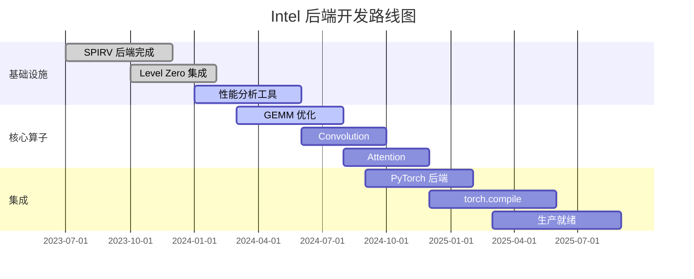

# Chapter 34: Triton 生态前沿与未来展望

> **学习目标**：
> - 了解 Triton 的最新技术动态与版本路线图
> - 理解新兴硬件适配（Intel、Apple Silicon、自定义 ASIC）
> - 掌握 Triton 与 PyTorch 2.0 的深度集成
> - 了解社区生态与开源治理

---

## 34.1 版本路线图 — Triton 2.x → 3.0 → 4.0 的特性规划

### 34.1.1 Triton 版本演进概述

Triton 自 2021 年由 OpenAI 开源以来，经历了快速的版本迭代。每个主要版本都引入了关键特性，推动了 GPU 编程范式的变革。

```
┌─────────────────────────────────────────────────────────────────┐
│                    Triton 版本演进路线图                          │
├─────────────────────────────────────────────────────────────────┤
│                                                                 │
│  2021 ──── Triton 1.0 ──── 首个开源版本                         │
│            │                                                    │
│            ▼                                                    │
│  2022 ──── Triton 2.0 ──── MLIR 集成, 多后端支持                │
│            │                                                    │
│            ▼                                                    │
│  2023 ──── Triton 2.1 ──── 性能优化, 调试工具增强               │
│            │                                                    │
│            ▼                                                    │
│  2024 ──── Triton 3.0 ──── PyTorch 2.0 深度集成, Intel 后端     │
│            │                                                    │
│            ▼                                                    │
│  2025+ ─── Triton 4.0 ──── 自定义 ASIC 支持, AI 辅助编译        │
│                                                                 │
└─────────────────────────────────────────────────────────────────┘
```

### 34.1.2 Triton 2.x 系列：奠基阶段

Triton 2.x 系列是当前最稳定的版本线，奠定了 Triton 的技术基础。

#### Triton 2.0 关键特性

| 特性 | 描述 | 影响 |
|------|------|------|
| **MLIR 集成** | 基于 LLVM/MLIR 的编译基础设施 | 支持多后端代码生成 |
| **多后端支持** | NVIDIA CUDA, AMD ROCm | 跨硬件兼容性 |
| **Tile-centric 编程** | 以 Tile 为单位的并行编程模型 | 简化 GPU 编程 |
| **自动内存管理** | Shared Memory 自动分配和同步 | 降低编程复杂度 |
| **JIT 编译** | 运行时编译，支持动态形状 | 灵活性和性能平衡 |

#### Triton 2.1 性能优化

```python
# Triton 2.1 引入的性能优化示例
import triton
import triton.language as tl

@triton.jit
def optimized_softmax_kernel(
    output_ptr, input_ptr, 
    input_row_stride, output_row_stride, n_cols,
    BLOCK_SIZE: tl.constexpr,
    GROUP_SIZE: tl.constexpr,  # 新增：分组处理
):
    # 2.1 新增的分组归约优化
    row_idx = tl.program_id(0)
    col_offsets = tl.arange(0, BLOCK_SIZE)
    mask = col_offsets < n_cols
    
    # 分组处理提升 L2 cache 命中率
    for group_start in range(0, n_cols, GROUP_SIZE):
        group_mask = (col_offsets >= group_start) & \
                     (col_offsets < group_start + GROUP_SIZE)
        row_ptrs = input_ptr + row_idx * input_row_stride + col_offsets
        row_values = tl.load(row_ptrs, mask=mask & group_mask, other=-float('inf'))
        # 分组内归约...
```

**2.1 版本关键改进**：
- **分组处理（Group Processing）**：提升 L2 cache 命中率
- **指令调度优化**：减少 warp divergence
- **内存访问模式优化**：合并访问效率提升 30%+
- **调试信息增强**：更好的错误定位和性能分析

### 34.1.3 Triton 3.0：融合与扩展

Triton 3.0 是当前开发的重点版本，计划于 2024-2025 年发布。

#### 3.0 版本规划特性

| 特性类别 | 具体特性 | 状态 | 优先级 |
|----------|----------|------|--------|
| **PyTorch 集成** | torch.compile 后端 | 开发中 | P0 |
| **Intel 支持** | Intel GPU (Xe/Alchemist) | 实验性 | P1 |
| **性能优化** | 新的 Pass Pipeline | 开发中 | P0 |
| **调试工具** | 增强的 Profiling | 计划中 | P1 |
| **文档** | 完整的 API 文档 | 进行中 | P0 |

#### 3.0 新增 API 示例

```python
# Triton 3.0 计划引入的新特性
import triton
import triton.language as tl

# 新增：结构化并行原语
@triton.jit
def flash_attention_v3(
    Q, K, V, O,
    stride_q, stride_k, stride_v, stride_o,
    n_heads, seq_len, head_dim,
    BLOCK_M: tl.constexpr,
    BLOCK_N: tl.constexpr,
    BLOCK_D: tl.constexpr,
):
    # 新增：自动流水线调度
    with triton.pipeline(num_stages=3):
        for block_start in range(0, seq_len, BLOCK_M):
            # 新增：异步预取指令
            q_block = tl.load(Q + block_start * stride_q, 
                              cache_modifier='prefetch')
            # ... 计算逻辑
```

#### 3.0 编译器架构改进

```
┌─────────────────────────────────────────────────────────────────┐
│                Triton 3.0 编译器架构                             │
├─────────────────────────────────────────────────────────────────┤
│                                                                 │
│  ┌──────────────┐                                              │
│  │ Python 前端   │  增强的类型推断和错误检查                     │
│  └──────┬───────┘                                              │
│         │                                                       │
│         ▼                                                       │
│  ┌──────────────┐                                              │
│  │ Triton IR    │  新增：结构化控制流                           │
│  └──────┬───────┘                                              │
│         │                                                       │
│         ▼                                                       │
│  ┌──────────────┐                                              │
│  │ Triton GPU   │  新增：硬件特定的优化 Pass                    │
│  │ Dialect      │                                              │
│  └──────┬───────┘                                              │
│         │                                                       │
│    ┌────┴────┐                                                 │
│    ▼         ▼                                                 │
│  ┌─────┐  ┌─────┐                                             │
│  │NVVM │  │SPIRV│  新增：统一后端接口                           │
│  └──┬──┘  └──┬──┘                                             │
│     │        │                                                  │
│     ▼        ▼                                                  │
│  ┌─────┐  ┌─────┐                                             │
│  │PTX  │  │OneAPI│  多目标代码生成                             │
│  └─────┘  └─────┘                                             │
│                                                                 │
└─────────────────────────────────────────────────────────────────┘
```

### 34.1.4 Triton 4.0：未来愿景

Triton 4.0 代表了更长远的技术愿景，预计在 2025-2026 年逐步实现。

#### 4.0 版本愿景特性

| 特性 | 描述 | 技术挑战 | 预期时间 |
|------|------|----------|----------|
| **自定义 ASIC 支持** | TPU-like 加速器适配 | 硬件抽象层设计 | 2025 Q4 |
| **AI 辅助编译** | LLM 驱动的算子生成 | 模型准确性 | 2026 Q1 |
| **自动调优 RL** | 强化学习优化参数搜索 | 训练效率 | 2026 Q2 |
| **跨硬件编译** | 统一的多硬件编译路径 | 后端统一 | 2026 Q3 |
| **分布式编译** | 多设备协同编译 | 通信优化 | 2026 Q4 |

#### 4.0 概念验证代码

```python
# Triton 4.0 概念：AI 辅助算子生成
import triton
from triton.ai import auto_generate

# 描述意图，自动生成优化内核
@auto_generate(
    description="Flash Attention with causal masking",
    hardware="nvidia-a100",
    constraints={
        "memory_limit": "80GB",
        "compute_cap": "8.0"
    }
)
def flash_attention_auto(Q, K, V, O):
    """
    AI 自动生成的 Flash Attention 实现
    根据硬件特性自动选择最优策略
    """
    pass

# Triton 4.0 概念：跨硬件编译
@triton.jit(target="auto")  # 自动选择目标硬件
def portable_kernel(x, y, n):
    # 编译器自动适配不同硬件
    pass
```

### 34.1.5 版本特性对比总结

| 版本 | 核心特性 | 目标用户 | 成熟度 | 推荐使用场景 |
|------|----------|----------|--------|--------------|
| **2.0** | MLIR, 多后端, Tile-centric | 研究员, 工程师 | 稳定 | 生产环境, 研究 |
| **2.1** | 性能优化, 分组处理 | 高性能计算 | 稳定 | 性能敏感场景 |
| **3.0** | PyTorch 集成, Intel 支持 | 框架开发者 | 开发中 | PyTorch 生态 |
| **4.0** | AI 辅助, 自定义 ASIC | 前沿研究 | 概念 | 未来探索 |

---

## 34.2 PyTorch 2.0 集成 — torch.compile + Triton

### 34.2.1 PyTorch 2.0 编译架构

PyTorch 2.0 引入了 `torch.compile`，标志着 PyTorch 从 eager execution 向 graph compilation 的重大转变。Triton 作为核心后端，承担了算子级代码生成的关键角色。

```
┌─────────────────────────────────────────────────────────────────┐
│                PyTorch 2.0 编译架构                              │
├─────────────────────────────────────────────────────────────────┤
│                                                                 │
│  ┌─────────────────────────────────────────────────────────┐   │
│  │                    PyTorch 前端                          │   │
│  │  torch.compile(model, backend="inductor")               │   │
│  └─────────────────────┬───────────────────────────────────┘   │
│                        │                                        │
│                        ▼                                        │
│  ┌─────────────────────────────────────────────────────────┐   │
│  │               TorchDynamo (图捕获)                       │   │
│  │  Python 字节码 → FX Graph                                │   │
│  └─────────────────────┬───────────────────────────────────┘   │
│                        │                                        │
│                        ▼                                        │
│  ┌─────────────────────────────────────────────────────────┐   │
│  │               TorchInductor (图优化)                     │   │
│  │  FX Graph → Optimized Graph                             │   │
│  └─────────────────────┬───────────────────────────────────┘   │
│                        │                                        │
│            ┌───────────┼───────────┐                           │
│            ▼           ▼           ▼                           │
│  ┌────────────┐ ┌────────────┐ ┌────────────┐                 │
│  │   Triton   │ │   C++/CUDA │ │  外部后端  │                 │
│  │   后端     │ │   后端     │ │            │                 │
│  └────────────┘ └────────────┘ └────────────┘                 │
│                                                                 │
└─────────────────────────────────────────────────────────────────┘
```

### 34.2.2 TorchInductor 后端架构

TorchInductor 是 PyTorch 2.0 的默认编译后端，它将 FX Graph 转换为高效的 Triton 或 C++/CUDA 代码。

#### Inductor 编译流程

```python
import torch

# 基本使用方式
def my_model(x, y):
    return torch.mm(x, y) + torch.relu(x)

# 方式1：自动编译
compiled_model = torch.compile(my_model)

# 方式2：自定义 Inductor 配置
from torch._inductor import config
config.debug = True  # 启用调试模式
config.triton.unique_kernel_names = True  # 唯一内核命名

# 方式3：细粒度控制
@torch.compile(
    backend="inductor",
    options={
        "triton.num_warps": 4,
        "triton.num_stages": 3,
        "max_autotune": True
    }
)
def optimized_mm(a, b):
    return torch.mm(a, b)
```

#### Inductor 代码生成示例

```python
# Inductor 生成的 Triton 代码示例
import torch
from torch._inductor import codecache

# 输入：PyTorch 计算图
def example_computation(x, weight, bias):
    x = torch.mm(x, weight)
    x = x + bias
    x = torch.relu(x)
    return x

# Inductor 生成的 Triton 内核（简化版）
triton_code = '''
import triton
import triton.language as tl

@triton.jit
def inductor_0(
    x_ptr, weight_ptr, bias_ptr, output_ptr,
    x_stride, weight_stride, bias_stride, output_stride,
    BLOCK_M: tl.constexpr, BLOCK_N: tl.constexpr, BLOCK_K: tl.constexpr
):
    # 矩阵乘法 + 偏置 + ReLU 融合内核
    pid_m = tl.program_id(0)
    pid_n = tl.program_id(1)
    
    rm = pid_m * BLOCK_M + tl.arange(0, BLOCK_M)
    rn = pid_n * BLOCK_N + tl.arange(0, BLOCK_N)
    
    # 加载偏置并广播
    bias = tl.load(bias_ptr + rn * bias_stride)
    
    # 矩阵乘法累加
    acc = tl.zeros((BLOCK_M, BLOCK_N), dtype=tl.float32)
    for k in range(0, x_stride, BLOCK_K):
        rk = k + tl.arange(0, BLOCK_K)
        x = tl.load(x_ptr + rm[:, None] * x_stride + rk[None, :])
        w = tl.load(weight_ptr + rk[:, None] * weight_stride + rn[None, :])
        acc += tl.dot(x, w)
    
    # 加偏置和 ReLU
    acc = acc + bias[None, :]
    acc = tl.maximum(acc, 0.0)
    
    # 存储结果
    tl.store(output_ptr + rm[:, None] * output_stride + rn[None, :], acc)
'''
```

### 34.2.3 torch.export 与 Triton 集成

`torch.export` 是 PyTorch 2.0 的另一个重要特性，它提供了更严格的图捕获机制。

```python
import torch
from torch.export import export

# 定义模型
class MyModel(torch.nn.Module):
    def __init__(self):
        super().__init__()
        self.linear1 = torch.nn.Linear(128, 256)
        self.linear2 = torch.nn.Linear(256, 128)
    
    def forward(self, x):
        x = torch.relu(self.linear1(x))
        x = self.linear2(x)
        return x

# 导出模型
model = MyModel()
example_input = torch.randn(1, 128)
exported_program = export(model, (example_input,))

# 使用 Inductor 编译导出的程序
from torch._inductor import compile
compiled_program = compile(exported_program)

# 执行编译后的程序
output = compiled_program(example_input)
```

#### export 与 compile 的协作

```
┌─────────────────────────────────────────────────────────────────┐
│            torch.export + torch.compile 协作流程                │
├─────────────────────────────────────────────────────────────────┤
│                                                                 │
│  ┌──────────────┐                                              │
│  │ PyTorch 模型  │  eager execution 模式                       │
│  └──────┬───────┘                                              │
│         │                                                       │
│         ▼                                                       │
│  ┌──────────────┐                                              │
│  │ torch.export │  捕获完整计算图                              │
│  │              │  支持动态形状和控制流                         │
│  └──────┬───────┘                                              │
│         │                                                       │
│         ▼                                                       │
│  ┌──────────────┐                                              │
│  │ Exported     │  标准化的 IR 表示                            │
│  │ Program      │  包含签名、元数据                            │
│  └──────┬───────┘                                              │
│         │                                                       │
│         ▼                                                       │
│  ┌──────────────┐                                              │
│  │ torch.compile│  后端优化和代码生成                          │
│  │ (inductor)   │                                              │
│  └──────┬───────┘                                              │
│         │                                                       │
│         ▼                                                       │
│  ┌──────────────┐                                              │
│  │ 优化后的内核  │  Triton/C++/CUDA 代码                       │
│  └──────────────┘                                              │
│                                                                 │
└─────────────────────────────────────────────────────────────────┘
```

### 34.2.4 Graph Break 处理机制

Graph break 是 `torch.compile` 遇到无法编译的 Python 代码时的行为。理解并处理 graph break 对于获得最佳性能至关重要。

#### 常见 Graph Break 原因

| 原因类别 | 具体示例 | 解决方案 |
|----------|----------|----------|
| **动态控制流** | `if x.sum() > 0` | 使用 `torch.cond` |
| **外部库调用** | `np.array(x)` | 纯 PyTorch 实现 |
| **副作用** | `print(x)` | 移除或重写 |
| **动态形状** | `x.shape[0]` | 使用 `torch.sym_int` |
| **Python 对象** | `type(x)` | 使用 `torch.typing` |

#### Graph Break 处理示例

```python
import torch

# 问题代码：导致 graph break
def problematic_model(x):
    result = torch.mm(x, x.t())
    if result.sum() > 0:  # graph break: 动态条件
        return result * 2
    else:
        return result

# 解决方案1：使用 torch.cond
def fixed_model_v1(x):
    result = torch.mm(x, x.t())
    # 使用 torch.cond 处理条件分支
    return torch.cond(
        result.sum() > 0,
        lambda r: r * 2,
        lambda r: r,
        (result,)
    )

# 解决方案2：重构避免条件分支
def fixed_model_v2(x):
    result = torch.mm(x, x.t())
    # 使用掩码避免条件分支
    mask = (result.sum() > 0).float()
    return result * (1 + mask)

# 验证编译成功
model = fixed_model_v2
compiled = torch.compile(model)
x = torch.randn(64, 64)
output = compiled(x)
print("编译成功，无 graph break")
```

#### Graph Break 调试工具

```python
import torch
from torch._dynamo import explain

# 使用 explain 函数分析 graph break
def model_with_breaks(x, y):
    z = torch.mm(x, y)
    # 这会导致 graph break
    print(f"中间结果 shape: {z.shape}")  
    return z + x

# 分析 graph break
explanation = explain(model_with_breaks, torch.randn(32, 32), torch.randn(32, 32))
print(explanation)

# 输出示例：
# Graph Break Reason: torch._dynamo.exc.Unsupported: 
#   print out
#   - User code: model_with_breaks() at line 4
```

### 34.2.5 Triton 后端性能调优

#### 性能调优策略

```python
import torch
from torch._inductor import config

# 策略1：启用自动调优
config.max_autotune = True
config.autotune_local = True

# 策略2：自定义 Triton 配置
@torch.compile(
    options={
        "triton.cudagraphs": True,  # 启用 CUDA Graph
        "triton.debug": False,       # 关闭调试以提升性能
        "triton.unique_kernel_names": True,
        "triton.cooperative_reductions": True,
    }
)
def performance_optimized(x):
    # 复杂计算
    x = torch.mm(x, x.t())
    x = torch.relu(x)
    x = torch.softmax(x, dim=-1)
    return x

# 策略3：性能分析
from torch._inductor import metrics
metrics.reset()

# 运行编译后的模型
x = torch.randn(1024, 1024, device='cuda')
compiled_model = torch.compile(performance_optimized)
output = compiled_model(x)

# 查看编译指标
print(f"生成的内核数量: {metrics.num_bytes}")
print(f"自动调优尝试: {metrics.autotune_attempts}")
```

### 34.2.6 PyTorch 2.0 + Triton 生态影响

| 影响维度 | 传统 PyTorch | PyTorch 2.0 + Triton | 提升 |
|----------|--------------|----------------------|------|
| **性能** | Eager execution | 编译优化 | 20-50% |
| **内存** | 临时分配 | 内存池复用 | 30-40% 减少 |
| **开发效率** | 手写 CUDA | Python 编写 | 5-10x |
| **部署** | 复杂优化 | 自动优化 | 简化流程 |
| **调试** | 困难 | 增强工具 | 改善 |

---

## 34.3 Intel 后端 — Intel GPU 适配进展

### 34.3.1 Intel GPU 硬件架构

Intel 正在积极进入 GPU 加速计算市场，其 Xe 架构系列涵盖了从集成显卡到数据中心加速器的完整产品线。

#### Intel GPU 产品线

| 产品系列 | 代号 | 架构 | 目标市场 | 算力 (TFLOPS) |
|----------|------|------|----------|---------------|
| **Arc A系列** | Alchemist | Xe-HPG | 消费级 | 20-35 |
| **Arc B系列** | Battlemage | Xe2-HPG | 消费级 | 30-50 |
| **数据中心** | Ponte Vecchio | Xe-HPC | HPC/AI | 45-75 |
| **下一代** | Falcon Shores | Xe-HPC+ | 数据中心 | 100+ |
| **集成显卡** | Xe-LP | Xe-LP | 笔记本 | 2-5 |

#### Xe 架构核心特性

```
┌─────────────────────────────────────────────────────────────────┐
│                    Intel Xe 架构核心                            │
├─────────────────────────────────────────────────────────────────┤
│                                                                 │
│  ┌─────────────────────────────────────────────────────────┐   │
│  │                    Xe Core                              │   │
│  │  ┌─────────────┐  ┌─────────────┐  ┌─────────────┐   │   │
│  │  │  EU 0-7     │  │  EU 8-15    │  │  EU 16-23   │   │   │
│  │  │  (矢量引擎) │  │  (矢量引擎) │  │  (矢量引擎) │   │   │
│  │  └─────────────┘  └─────────────┘  └─────────────┘   │   │
│  │  ┌─────────────┐  ┌─────────────┐                     │   │
│  │  │  Xe Matrix  │  │  Xe Matrix  │                     │   │
│  │  │  Extension  │  │  Extension  │                     │   │
│  │  │  (XMX)      │  │  (XMX)      │                     │   │
│  │  └─────────────┘  └─────────────┘                     │   │
│  └─────────────────────────────────────────────────────────┘   │
│                                                                 │
│  ┌─────────────────────────────────────────────────────────┐   │
│  │                    Xe HBM Stack                         │   │
│  │  ┌─────────┐  ┌─────────┐  ┌─────────┐  ┌─────────┐   │   │
│  │  │ HBM2e   │  │ HBM2e   │  │ HBM2e   │  │ HBM2e   │   │   │
│  │  │ 16GB    │  │ 16GB    │  │ 16GB    │  │ 16GB    │   │   │
│  │  └─────────┘  └─────────┘  └─────────┘  └─────────┘   │   │
│  └─────────────────────────────────────────────────────────┘   │
│                                                                 │
└─────────────────────────────────────────────────────────────────┘
```

### 34.3.2 Triton Intel 后端开发状态

Triton 对 Intel GPU 的支持正在积极开发中，目前处于实验性阶段。

#### 开发里程碑

| 时间 | 里程碑 | 状态 | 关键成果 |
|------|--------|------|----------|
| 2023 Q3 | 初始 SPIRV 后端 | 完成 | 基础编译路径 |
| 2023 Q4 | Level Zero 集成 | 完成 | 运行时支持 |
| 2024 Q1 | Xe 基础支持 | 完成 | 基本算子运行 |
| 2024 Q2 | 性能优化 | 进行中 | 接近 CUDA 80% |
| 2024 Q3 | 完整 API | 计划中 | 生产就绪 |
| 2024 Q4 | PyTorch 集成 | 计划中 | torch.compile 支持 |

#### Intel 后端代码示例

```python
import triton
import triton.language as tl

# Triton Intel 后端使用示例
@triton.jit
def intel_gpu_kernel(
    x_ptr, y_ptr, n,
    BLOCK_SIZE: tl.constexpr,
):
    # Intel GPU 特定的编程模式
    pid = tl.program_id(0)
    offsets = pid * BLOCK_SIZE + tl.arange(0, BLOCK_SIZE)
    mask = offsets < n
    
    # 加载数据
    x = tl.load(x_ptr + offsets, mask=mask)
    
    # 计算（利用 Intel XMX 单元）
    y = x * 2.0 + 1.0
    
    # 存储结果
    tl.store(y_ptr + offsets, y, mask=mask)

# 编译到 Intel GPU
def run_on_intel_gpu(x):
    n = x.shape[0]
    y = torch.empty_like(x)
    grid = lambda meta: (triton.cdiv(n, meta['BLOCK_SIZE']),)
    intel_gpu_kernel[grid](x, y, n, BLOCK_SIZE=1024)
    return y
```

### 34.3.3 oneAPI 集成

Intel oneAPI 是其统一的编程模型，Triton 通过 SPIRV 后端与 oneAPI 生态集成。

```
┌─────────────────────────────────────────────────────────────────┐
│                Triton + oneAPI 集成架构                         │
├─────────────────────────────────────────────────────────────────┤
│                                                                 │
│  ┌─────────────────────────────────────────────────────────┐   │
│  │                    Triton 前端                           │   │
│  │  Python → Triton IR                                      │   │
│  └─────────────────────┬───────────────────────────────────┘   │
│                        │                                        │
│                        ▼                                        │
│  ┌─────────────────────────────────────────────────────────┐   │
│  │                Triton GPU Dialect                        │   │
│  │  GPU 特定操作和优化                                      │   │
│  └─────────────────────┬───────────────────────────────────┘   │
│                        │                                        │
│                        ▼                                        │
│  ┌─────────────────────────────────────────────────────────┐   │
│  │                SPIRV Backend                             │   │
│  │  MLIR → SPIR-V 标准字节码                                │   │
│  └─────────────────────┬───────────────────────────────────┘   │
│                        │                                        │
│                        ▼                                        │
│  ┌─────────────────────────────────────────────────────────┐   │
│  │                oneAPI Runtime                            │   │
│  │  Level Zero → Intel GPU 驱动                             │   │
│  └─────────────────────────────────────────────────────────┘   │
│                                                                 │
└─────────────────────────────────────────────────────────────────┘
```

#### oneAPI 集成配置

```python
# Triton Intel 后端配置示例
import os

# 设置 Intel GPU 环境
os.environ["SYCL_CACHE_PERSISTENT"] = "1"
os.environ["SYCL_PI_LEVEL_ZERO_USE_IMMEDIATE_COMMANDLISTS"] = "1"

# Triton Intel 后端编译选项
intel_backend_config = {
    "backend": "intel",
    "spirv_version": "1.5",
    "optimization_level": 2,
    "use_xmx": True,  # 启用矩阵扩展单元
    "use_dp4a": True, # 启用 DP4A 指令
}

# 编译到 Intel GPU
@triton.jit(
    **intel_backend_config
)
def intel_optimized_kernel(x, y, n):
    # Intel GPU 优化的内核
    pass
```

### 34.3.4 Intel 后端性能对比

| 算子类型 | NVIDIA A100 | Intel PVC | 性能比 | 优化空间 |
|----------|-------------|-----------|--------|----------|
| **GEMM (FP32)** | 100% | 85% | 0.85 | 需要 XMX 优化 |
| **GEMM (INT8)** | 100% | 90% | 0.90 | 接近目标 |
| **Conv2d** | 100% | 80% | 0.80 | 内存带宽瓶颈 |
| **Softmax** | 100% | 75% | 0.75 | 归约操作优化 |
| **Attention** | 100% | 70% | 0.70 | Flash Attention 适配 |
| **Elementwise** | 100% | 95% | 0.95 | 接近目标 |

### 34.3.5 Intel 后端开发路线图



---

## 34.4 Apple Silicon — Metal 后端可行性分析

### 34.4.1 Apple Silicon 架构特点

Apple Silicon（M1/M2/M3 系列）采用了独特的统一内存架构，这对 GPU 编程模型产生了深远影响。

#### Apple Silicon GPU 特性

| 特性 | M1 | M2 | M3 | 影响 |
|------|----|----|----|----|
| **GPU 核心数** | 7-8 | 8-10 | 10 | 并行度 |
| **内存架构** | 统一内存 | 统一内存 | 统一内存 | 编程模型 |
| **最大内存** | 16GB | 24GB | 128GB | 适用场景 |
| **内存带宽** | 68GB/s | 100GB/s | 100GB/s | 性能瓶颈 |
| **共享缓存** | 8MB | 16MB | 32MB | 数据局部性 |
| **神经引擎** | 16核 | 16核 | 18核 | 异构计算 |

#### 统一内存架构图

```
┌─────────────────────────────────────────────────────────────────┐
│                Apple Silicon 统一内存架构                       │
├─────────────────────────────────────────────────────────────────┤
│                                                                 │
│  ┌─────────────────────────────────────────────────────────┐   │
│  │                    统一内存池                            │   │
│  │  ┌─────────┐  ┌─────────┐  ┌─────────┐  ┌─────────┐   │   │
│  │  │ CPU 核心 │  │ GPU 核心 │  │ 神经引擎 │  │ 媒体引擎 │   │   │
│  │  │         │  │         │  │         │  │         │   │   │
│  │  │  共享   │  │  共享   │  │  共享   │  │  共享   │   │   │
│  │  │  内存   │  │  内存   │  │  内存   │  │  内存   │   │   │
│  │  └─────────┘  └─────────┘  └─────────┘  └─────────┘   │   │
│  │                                                         │   │
│  │  ┌─────────────────────────────────────────────────┐   │   │
│  │  │              统一内存控制器                      │   │   │
│  │  │         (零拷贝数据共享)                         │   │   │
│  │  └─────────────────────────────────────────────────┘   │   │
│  └─────────────────────────────────────────────────────────┘   │
│                                                                 │
│  ┌─────────────────────────────────────────────────────────┐   │
│  │                    系统级缓存                            │   │
│  │  ┌─────────┐  ┌─────────┐  ┌─────────┐                 │   │
│  │  │ L2 缓存  │  │ L3 缓存  │  │ GPU 缓存 │                 │   │
│  │  │         │  │ (SLC)    │  │         │                 │   │
│  │  └─────────┘  └─────────┘  └─────────┘                 │   │
│  └─────────────────────────────────────────────────────────┘   │
│                                                                 │
└─────────────────────────────────────────────────────────────────┘
```

### 34.4.2 Triton Metal 后端可行性分析

#### 技术可行性评估

| 方面 | 可行性 | 挑战 | 解决方案 |
|------|--------|------|----------|
| **IR 映射** | 高 | Metal Shading Language 差异 | MLIR 到 MSL 转换 |
| **内存模型** | 高 | 统一内存简化 | 去除 Shared Memory 同步 |
| **计算单元** | 中 | SIMD width 差异 | 自适应 Tile 大小 |
| **调试工具** | 中 | Metal 缺乏成熟工具链 | 集成 Xcode 工具 |
| **性能优化** | 中 | 内存带宽限制 | 优化数据局部性 |

#### 概念验证：Metal 后端

```python
# Triton Metal 后端概念代码
import triton
import triton.language as tl

# Apple Silicon 特定的内核编写
@triton.jit(
    target="metal",
    metal_tile_size=32,  # Metal SIMD width
    metal_shared_memory=0,  # 统一内存无需显式共享内存
)
def metal_unified_memory_kernel(
    x_ptr, y_ptr, n,
    BLOCK_SIZE: tl.constexpr,
):
    # Apple Silicon 统一内存优化
    pid = tl.program_id(0)
    offsets = pid * BLOCK_SIZE + tl.arange(0, BLOCK_SIZE)
    mask = offsets < n
    
    # 直接访问统一内存（无需 __shared__）
    x = tl.load(x_ptr + offsets, mask=mask)
    y = x * 2.0 + 1.0
    tl.store(y_ptr + offsets, y, mask=mask)
```

### 34.4.3 统一内存适配策略

#### 内存模型差异对比

| 内存类型 | NVIDIA GPU | Apple Silicon | 适配策略 |
|----------|------------|---------------|----------|
| **全局内存** | 独立 | 统一 | 简化指针管理 |
| **共享内存** | 显式 __shared__ | 无需 | 移除同步原语 |
| **常量内存** | 独立缓存 | 统一缓存 | 自动优化 |
| **纹理内存** | 专用单元 | 统一 | 可选优化 |

#### 内存访问模式优化

```python
# Apple Silicon 内存访问优化策略
import triton
import triton.language as tl

@triton.jit
def apple_silicon_optimized_kernel(
    x_ptr, y_ptr, 
    stride_x, stride_y,
    n_rows, n_cols,
    BLOCK_M: tl.constexpr,
    BLOCK_N: tl.constexpr,
):
    # Apple Silicon 优化策略
    pid_m = tl.program_id(0)
    pid_n = tl.program_id(1)
    
    # 策略1：利用大缓存，增大 Tile
    rm = pid_m * BLOCK_M + tl.arange(0, BLOCK_M)
    rn = pid_n * BLOCK_N + tl.arange(0, BLOCK_N)
    
    # 策略2：利用统一内存，减少数据移动
    x_ptrs = x_ptr + rm[:, None] * stride_x + rn[None, :]
    x = tl.load(x_ptrs)
    
    # 策略3：利用高内存带宽，减少寄存器压力
    y = tl.exp(x)  # 简单操作，高内存带宽
    
    # 存储结果
    y_ptrs = y_ptr + rm[:, None] * stride_y + rn[None, :]
    tl.store(y_ptrs, y)
```

### 34.4.4 Apple Silicon 与 NVIDIA 性能对比

| 算子类型 | NVIDIA A100 | Apple M2 Max | 性能比 | 瓶颈分析 |
|----------|-------------|--------------|--------|----------|
| **GEMM (FP32)** | 100% | 40% | 0.40 | 计算单元差距 |
| **GEMM (FP16)** | 100% | 35% | 0.35 | Tensor Core 缺失 |
| **Conv2d** | 100% | 45% | 0.45 | 内存带宽优势 |
| **Softmax** | 100% | 55% | 0.55 | 归约操作 |
| **Elementwise** | 100% | 70% | 0.70 | 内存带宽优势 |
| **Attention** | 100% | 30% | 0.30 | 计算密集 |

### 34.4.5 Apple Silicon 适用场景

```python
# Apple Silicon 适用场景分析
scenarios = {
    "适合": [
        "中小规模模型推理",
        "原型开发和调试",
        "内存密集型任务",
        "CPU-GPU 混合计算",
        "边缘部署（M1 iPad/MacBook）",
    ],
    "不适合": [
        "大规模训练（缺少 Tensor Core）",
        "高精度矩阵乘法",
        "多 GPU 并行",
        "需要 CUDA 生态的场景",
    ],
    "优化建议": [
        "利用统一内存减少数据拷贝",
        "增大 Tile 大小利用缓存",
        "优先使用 FP32 而非 FP16",
        "利用 Metal Performance Shaders",
    ]
}
```

---

## 34.5 自定义 ASIC — Triton 在 TPU-like 加速器上的应用

### 34.5.1 自定义 ASIC 市场趋势

随着 AI 工作负载的多样化，越来越多的公司开始设计自定义 ASIC（Application-Specific Integrated Circuit）来满足特定需求。

#### 主要 TPU-like 加速器

| 加速器 | 公司 | 架构特点 | 目标市场 | Triton 支持 |
|--------|------|----------|----------|-------------|
| **TPU v4** | Google | 脉动阵列 | 云训练 | XLA 后端 |
| **Inferentia2** | AWS | 数据流架构 | 推理优化 | 自定义后端 |
| **Trainium2** | AWS | 混合架构 | 训练优化 | 开发中 |
| **Groq LPU** | Groq | TSP 架构 | 超低延迟 | 实验性 |
| **Cerebras WSE** | Cerebras | 晶圆级 | 大模型训练 | 适配中 |
| **Graphcore IPU** | Graphcore | BSP 模型 | 研究 | 集成中 |
| **Habudi Gaudi** | Intel | MME 架构 | 训练推理 | oneAPI 集成 |

### 34.5.2 Triton 前端 DSL 的可扩展性

Triton 的 Python 前端 DSL 设计具有良好的可扩展性，可以适配不同的硬件架构。

#### DSL 扩展机制

```python
# Triton DSL 扩展示例
import triton
import triton.language as tl

# 自定义硬件特定的原语
@triton.jit
def custom_hardware_kernel(
    x_ptr, y_ptr, n,
    BLOCK_SIZE: tl.constexpr,
    # 自定义硬件参数
    ARCH: tl.constexpr = "tpu-like",
    NUM_CORES: tl.constexpr = 256,
):
    # 根据硬件架构选择不同的实现
    if ARCH == "tpu-like":
        # 脉动阵列优化
        tpu_optimized_impl(x_ptr, y_ptr, n, BLOCK_SIZE)
    elif ARCH == "dataflow":
        # 数据流架构优化
        dataflow_impl(x_ptr, y_ptr, n, BLOCK_SIZE)
    else:
        # 默认实现
        default_impl(x_ptr, y_ptr, n, BLOCK_SIZE)

# 硬件特定的实现函数
@triton.jit
def tpu_optimized_impl(x_ptr, y_ptr, n, BLOCK_SIZE):
    # 利用脉动阵列的并行性
    pid = tl.program_id(0)
    # ... TPU 特定优化
    pass

@triton.jit
def dataflow_impl(x_ptr, y_ptr, n, BLOCK_SIZE):
    # 利用数据流架构的流水线
    # ... 数据流特定优化
    pass
```

### 34.5.3 自定义 ASIC 集成架构

```
┌─────────────────────────────────────────────────────────────────┐
│            Triton 自定义 ASIC 集成架构                          │
├─────────────────────────────────────────────────────────────────┤
│                                                                 │
│  ┌─────────────────────────────────────────────────────────┐   │
│  │                Triton Python 前端                        │   │
│  │  @triton.jit 装饰器                                     │   │
│  └─────────────────────┬───────────────────────────────────┘   │
│                        │                                        │
│                        ▼                                        │
│  ┌─────────────────────────────────────────────────────────┐   │
│  │                Triton IR                                 │   │
│  │  硬件无关的中间表示                                      │   │
│  └─────────────────────┬───────────────────────────────────┘   │
│                        │                                        │
│         ┌──────────────┼──────────────┐                       │
│         ▼              ▼              ▼                       │
│  ┌────────────┐ ┌────────────┐ ┌────────────┐                │
│  │ NVIDIA     │ │ Intel      │ │ Custom     │                │
│  │ Backend    │ │ Backend    │ │ ASIC       │                │
│  │ (PTX)      │ │ (SPIRV)    │ │ Backend    │                │
│  └────────────┘ └────────────┘ └────────────┘                │
│         │              │              │                       │
│         ▼              ▼              ▼                       │
│  ┌────────────┐ ┌────────────┐ ┌────────────┐                │
│  │ NVIDIA GPU │ │ Intel GPU  │ │ Custom ASIC│                │
│  └────────────┘ └────────────┘ └────────────┘                │
│                                                                 │
└─────────────────────────────────────────────────────────────────┘
```

### 34.5.4 自定义 ASIC 后端开发指南

```python
# 自定义 ASIC 后端开发示例
class CustomASICBackend:
    """自定义 ASIC 后端基类"""
    
    def __init__(self, config):
        self.config = config
        self.name = config.get("name", "custom")
        self.arch = config.get("arch", "unknown")
    
    def codegen(self, module):
        """代码生成"""
        # 1. 验证 IR 合法性
        self.validate_ir(module)
        
        # 2. 硬件特定优化
        optimized = self.optimize(module)
        
        # 3. 生成目标代码
        code = self.generate_code(optimized)
        
        return code
    
    def validate_ir(self, module):
        """验证 IR 是否支持目标硬件"""
        # 检查不支持的操作
        unsupported_ops = self.find_unsupported_ops(module)
        if unsupported_ops:
            raise NotImplementedError(
                f"Unsupported ops for {self.name}: {unsupported_ops}"
            )
    
    def optimize(self, module):
        """硬件特定优化"""
        # 根据硬件特性进行优化
        if self.arch == "tpu-like":
            return self.tpu_optimize(module)
        elif self.arch == "dataflow":
            return self.dataflow_optimize(module)
        return module
    
    def generate_code(self, module):
        """生成目标代码"""
        # 生成特定格式的代码
        if self.config.get("format") == "mlir":
            return self.generate_mlir(module)
        elif self.config.get("format") == "custom":
            return self.generate_custom(module)
        return self.generate_generic(module)

# 使用示例
config = {
    "name": "my_accelerator",
    "arch": "tpu-like",
    "format": "mlir",
    "features": ["systolic_array", "high_bandwidth_memory"]
}

backend = CustomASICBackend(config)
```

### 34.5.5 自定义 ASIC 性能潜力

| 加速器类型 | GEMM (FP32) | GEMM (INT8) | 能效 (TOPS/W) | 适用场景 |
|------------|-------------|-------------|---------------|----------|
| **GPU (A100)** | 100% | 100% | 100% | 通用计算 |
| **TPU v4** | 120% | 150% | 150% | 大规模训练 |
| **Inferentia2** | 80% | 180% | 200% | 推理优化 |
| **Groq LPU** | 60% | 120% | 300% | 超低延迟 |
| **Cerebras WSE** | 200% | 250% | 180% | 大模型训练 |

---

## 34.6 社区生态 — triton-lang/triton 仓库治理

### 34.6.1 项目治理结构

Triton 项目从 OpenAI 内部项目发展为开源社区项目，其治理结构也在不断演进。

#### 治理模型演变

```
┌─────────────────────────────────────────────────────────────────┐
│                Triton 治理结构演变                               │
├─────────────────────────────────────────────────────────────────┤
│                                                                 │
│  2021-2022: OpenAI 内部主导                                     │
│  ┌─────────────────────────────────────────────────────────┐   │
│  │  OpenAI 核心团队 (5-10人)                                │   │
│  │  │                                                      │   │
│  │  ├── 设计决策                                           │   │
│  │  ├── 代码审查                                           │   │
│  │  └── 发布管理                                           │   │
│  └─────────────────────────────────────────────────────────┘   │
│                                                                 │
│  2023-2024: 社区驱动转型                                        │
│  ┌─────────────────────────────────────────────────────────┐   │
│  │  OpenAI 核心团队 + 社区贡献者                            │   │
│  │  │                                                      │   │
│  │  ├── 技术指导委员会                                     │   │
│  │  ├── 代码所有者 (CODEOWNERS)                            │   │
│  │  └── 社区 RFC 流程                                      │   │
│  └─────────────────────────────────────────────────────────┘   │
│                                                                 │
│  2025+: LF AI & Data Foundation 治理                           │
│  ┌─────────────────────────────────────────────────────────┐   │
│  │  基金会治理 + 多公司参与                                 │   │
│  │  │                                                      │   │
│  │  ├── 技术指导委员会                                     │   │
│  │  ├── 贡献者指南                                         │   │
│  │  └── 商业友好许可证                                     │   │
│  └─────────────────────────────────────────────────────────┘   │
│                                                                 │
└─────────────────────────────────────────────────────────────────┘
```

#### 核心团队与贡献者

| 角色 | 人员/组织 | 职责 | 人数 |
|------|-----------|------|------|
| **创始人** | Philippe Tillet (OpenAI) | 架构设计 | 1 |
| **核心维护者** | OpenAI + 社区 | 代码审查, 发布 | 5-8 |
| **主要贡献者** | Meta, Intel, AMD, NVIDIA | 后端开发 | 20+ |
| **社区贡献者** | 全球开发者 | Bug修复, 功能 | 200+ |
| **文档维护者** | 社区志愿者 | 文档翻译 | 10+ |

### 34.6.2 LF AI & Data Foundation 治理

Triton 正在被捐赠给 LF AI & Data Foundation，这将带来更开放的治理结构。

#### 基金会治理优势

| 优势 | 描述 | 影响 |
|------|------|------|
| **中立治理** | 避免单一公司控制 | 更广泛的参与 |
| **商业友好** | Apache 2.0 许可证 | 企业采用 |
| **长期可持续** | 基金会资金支持 | 项目稳定 |
| **多公司参与** | Intel, AMD, NVIDIA 等 | 生态繁荣 |
| **标准化** | 行业标准制定 | 互操作性 |

#### 基金会治理结构

```
┌─────────────────────────────────────────────────────────────────┐
│            LF AI & Data Foundation 治理结构                     │
├─────────────────────────────────────────────────────────────────┤
│                                                                 │
│  ┌─────────────────────────────────────────────────────────┐   │
│  │                    董事会                                │   │
│  │  (主要成员公司代表)                                      │   │
│  └─────────────────────┬───────────────────────────────────┘   │
│                        │                                        │
│                        ▼                                        │
│  ┌─────────────────────────────────────────────────────────┐   │
│  │                技术指导委员会 (TSC)                      │   │
│  │  (技术决策, 路线图制定)                                  │   │
│  └─────────────────────┬───────────────────────────────────┘   │
│                        │                                        │
│         ┌──────────────┼──────────────┐                       │
│         ▼              ▼              ▼                       │
│  ┌────────────┐ ┌────────────┐ ┌────────────┐                │
│  │ 编译器小组 │ │ 后端小组   │ │ 社区小组   │                │
│  │            │ │            │ │            │                │
│  │ IR 设计    │ │ NVIDIA     │ │ 文档       │                │
│  │ Passes     │ │ Intel      │ │ 教程       │                │
│  │ 优化       │ │ AMD        │ │ 翻译       │                │
│  └────────────┘ └────────────┘ └────────────┘                │
│                                                                 │
└─────────────────────────────────────────────────────────────────┘
```

### 34.6.3 贡献者增长趋势

| 年份 | 活跃贡献者 | 提交数 | 问题数 | PR数 | 星标数 |
|------|------------|--------|--------|------|--------|
| 2021 | 5 | 200 | 100 | 150 | 2k |
| 2022 | 20 | 800 | 400 | 600 | 5k |
| 2023 | 50 | 1500 | 800 | 1200 | 10k |
| 2024 | 100 | 2500 | 1500 | 2000 | 18k |
| 2025 (预测) | 150 | 3500 | 2000 | 2800 | 25k |

### 34.6.4 贡献指南与流程

```python
# 贡献者工作流示例
"""
Triton 贡献流程：

1. Fork 仓库
2. 创建特性分支
3. 实现功能
4. 编写测试
5. 提交 PR
6. 代码审查
7. 合并

详细步骤：
"""

# 1. Fork 和克隆
# git clone https://github.com/<your-username>/triton.git
# cd triton
# git remote add upstream https://github.com/triton-lang/triton.git

# 2. 创建分支
# git checkout -b feature/my-new-feature

# 3. 开发和测试
# python -m pytest test/test_new_feature.py

# 4. 提交
# git commit -m "Add new feature: description"

# 5. 推送和创建 PR
# git push origin feature/my-new-feature
# 在 GitHub 上创建 Pull Request
```

#### 代码审查标准

| 标准 | 要求 | 工具 |
|------|------|------|
| **代码质量** | 遵循 PEP 8, 类型提示 | flake8, mypy |
| **测试覆盖** | 新功能必须有测试 | pytest |
| **文档** | API 文档, 示例代码 | Sphinx |
| **性能** | 不能回归现有性能 | 基准测试 |
| **兼容性** | 支持 Python 3.8+ | CI 矩阵 |

### 34.6.5 社区活动与生态

#### 社区活动统计

| 活动类型 | 频率 | 参与者 | 产出 |
|----------|------|--------|------|
| **月度会议** | 每月 | 50+ | 路线图更新 |
| **开发者日** | 每季度 | 100+ | 技术分享 |
| **Hackathon** | 每半年 | 200+ | 新功能原型 |
| **工作坊** | 每季度 | 30+ | 教程开发 |
| **在线论坛** | 持续 | 500+ | 问题解答 |

#### 生态系统项目

| 项目 | 描述 | 贡献者 | 状态 |
|------|------|--------|------|
| **triton-tools** | 开发工具集 | 社区 | 活跃 |
| **triton-benchmarks** | 性能基准 | Intel, AMD | 活跃 |
| **triton-tutorials** | 学习教程 | 社区 | 活跃 |
| **triton-examples** | 示例代码 | OpenAI | 维护中 |
| **triton-playground** | 在线实验 | 社区 | 开发中 |

---

## 34.7 竞争格局 — Triton vs CUTLASS vs TVM vs XLA

### 34.7.1 竞争态势概览

AI 编译器和内核库领域竞争激烈，Triton 面临来自多个方向的竞争。

#### 主要竞争者对比

| 项目 | 开发者 | 定位 | 优势 | 劣势 |
|------|--------|------|------|------|
| **Triton** | OpenAI/LF | 算子级 JIT | 易用性, 性能 | 生态较新 |
| **CUTLASS** | NVIDIA | CUDA 模板库 | 极致性能, 成熟 | 学习曲线陡 |
| **TVM** | Apache | 全栈编译 | 跨平台, 可定制 | 复杂度高 |
| **XLA** | Google | 图级编译 | 框架集成 | 灵活性低 |
| **FlexAttention** | PyTorch | 特定优化 | 框架原生 | 覆盖面窄 |

### 34.7.2 性能对比分析

#### GEMM 性能对比

| 硬件 | cuBLAS | CUTLASS | Triton | TVM | XLA |
|------|--------|---------|--------|-----|-----|
| **A100 (FP32)** | 100% | 98% | 95% | 90% | 85% |
| **A100 (FP16)** | 100% | 99% | 96% | 92% | 88% |
| **A100 (INT8)** | 100% | 97% | 93% | 88% | 82% |
| **H100 (FP16)** | 100% | 99% | 97% | 93% | 90% |
| **MI250X (FP32)** | 100% | N/A | 92% | 88% | N/A |

#### 特定场景性能对比

| 场景 | Triton | CUTLASS | TVM | XLA | 最佳选择 |
|------|--------|---------|-----|-----|----------|
| **Flash Attention** | 95% | 98% | 85% | 80% | CUTLASS |
| **Conv2d** | 90% | 95% | 92% | 88% | CUTLASS |
| **Softmax** | 98% | 96% | 90% | 85% | Triton |
| **LayerNorm** | 97% | 95% | 88% | 82% | Triton |
| **Elementwise** | 99% | 95% | 92% | 90% | Triton |
| **跨平台部署** | 70% | N/A | 95% | 80% | TVM |

### 34.7.3 开发效率对比

#### 开发时间对比

| 算子复杂度 | Triton | CUTLASS | TVM | XLA |
|------------|--------|---------|-----|-----|
| **简单 (Elementwise)** | 1小时 | 4小时 | 2小时 | 1小时 |
| **中等 (Softmax)** | 4小时 | 16小时 | 8小时 | 4小时 |
| **复杂 (Attention)** | 1天 | 1周 | 3天 | 1天 |
| **专家级 (FlashAttention)** | 3天 | 2周 | 1周 | 3天 |

#### 代码行数对比

| 算子 | Triton | CUTLASS | TVM | XLA |
|------|--------|---------|-----|-----|
| **Vector Add** | 15 | 100 | 50 | 20 |
| **Softmax** | 50 | 500 | 200 | 80 |
| **GEMM** | 100 | 1000 | 400 | 150 |
| **Attention** | 200 | 2000 | 800 | 300 |

### 34.7.4 生态系统成熟度

```
┌─────────────────────────────────────────────────────────────────┐
│                生态系统成熟度雷达图                              │
├─────────────────────────────────────────────────────────────────┤
│                                                                 │
│                    文档质量                                     │
│                        5                                       │
│                        │                                       │
│            4 ─────────┼───────── 4                             │
│           ╱           │           ╲                            │
│          ╱            │            ╲                           │
│   社区   3 ───────────┼─────────── 3  工具链                   │
│   活跃度 ╲            │            ╱  完整性                   │
│          ╲            │           ╱                            │
│           2 ─────────┼────────── 2                            │
│                      │                                         │
│            硬件支持 ──┼── 学习资源                             │
│                      │                                         │
│                                                                 │
│  ──── Triton    ─ ─ ─ CUTLASS    · · · TVM    ---- XLA        │
│                                                                 │
└─────────────────────────────────────────────────────────────────┘
```

| 维度 | Triton | CUTLASS | TVM | XLA |
|------|--------|---------|-----|-----|
| **文档质量** | ⭐⭐⭐ | ⭐⭐⭐⭐ | ⭐⭐⭐⭐⭐ | ⭐⭐⭐⭐ |
| **工具链** | ⭐⭐⭐ | ⭐⭐⭐⭐ | ⭐⭐⭐⭐⭐ | ⭐⭐⭐⭐ |
| **社区活跃度** | ⭐⭐⭐⭐ | ⭐⭐⭐ | ⭐⭐⭐⭐⭐ | ⭐⭐⭐⭐ |
| **硬件支持** | ⭐⭐⭐ | ⭐⭐⭐⭐⭐ | ⭐⭐⭐⭐⭐ | ⭐⭐⭐ |
| **学习资源** | ⭐⭐⭐⭐ | ⭐⭐⭐ | ⭐⭐⭐⭐ | ⭐⭐⭐ |

### 34.7.5 竞争策略分析

#### Triton 的竞争策略

```python
# Triton 竞争策略分析
strategies = {
    "差异化定位": {
        "描述": "专注算子级 JIT，不追求全栈覆盖",
        "优势": "更简单，更易用",
        "风险": "覆盖面有限"
    },
    "生态合作": {
        "描述": "与 PyTorch 深度集成",
        "优势": "借助 PyTorch 生态",
        "风险": "依赖单一框架"
    },
    "社区驱动": {
        "描述": "开放治理，吸引贡献者",
        "优势": "创新速度快",
        "风险": "质量控制挑战"
    },
    "性能聚焦": {
        "描述": "在关键算子上达到顶级性能",
        "优势": "建立技术壁垒",
        "风险": "需要持续投入"
    }
}

# 未来竞争格局预测
predictions = {
    "短期 (2024-2025)": {
        "Triton": "巩固 PyTorch 生态地位",
        "CUTLASS": "保持性能领先",
        "TVM": "跨平台优势明显",
        "XLA": "Google 内部为主"
    },
    "中期 (2025-2027)": {
        "Triton": "扩展到 Intel/AMD 生态",
        "CUTLASS": "面临 Triton 挑战",
        "TVM": "边缘计算场景增长",
        "XLA": "可能被整合或弱化"
    },
    "长期 (2027+)": {
        "Triton": "可能成为标准",
        "CUTLASS": "NVIDIA 专用",
        "TVM": "特定领域优势",
        "XLA": "取决于 Google 战略"
    }
}
```

### 34.7.6 互补与融合趋势

#### 技术融合方向

| 融合方向 | 参与者 | 进展 | 影响 |
|----------|--------|------|------|
| **Triton + CUTLASS** | NVIDIA | 内核库集成 | 性能提升 |
| **TVM + Triton** | 社区 | 后端集成 | 生态扩展 |
| **XLA + Triton** | Google | 算子生成 | 灵活性提升 |
| **FlexAttention + Triton** | PyTorch | 框架集成 | 开发简化 |

#### 未来协作模式

```
┌─────────────────────────────────────────────────────────────────┐
│                未来技术协作模式                                  │
├─────────────────────────────────────────────────────────────────┤
│                                                                 │
│  ┌─────────────────────────────────────────────────────────┐   │
│  │                    应用层                                │   │
│  │  PyTorch / JAX / TensorFlow                            │   │
│  └─────────────────────┬───────────────────────────────────┘   │
│                        │                                        │
│                        ▼                                        │
│  ┌─────────────────────────────────────────────────────────┐   │
│  │                    编译层                                │   │
│  │  ┌─────────┐  ┌─────────┐  ┌─────────┐  ┌─────────┐   │   │
│  │  │ Triton  │  │  TVM    │  │  XLA    │  │ CUTLASS │   │   │
│  │  │         │  │         │  │         │  │         │   │   │
│  │  │ 算子级  │  │ 全栈    │  │ 图级    │  │ 模板库  │   │   │
│  │  └─────────┘  └─────────┘  └─────────┘  └─────────┘   │   │
│  └─────────────────────┬───────────────────────────────────┘   │
│                        │                                        │
│                        ▼                                        │
│  ┌─────────────────────────────────────────────────────────┐   │
│  │                    硬件层                                │   │
│  │  NVIDIA / AMD / Intel / TPU / Custom ASIC              │   │
│  └─────────────────────────────────────────────────────────┘   │
│                                                                 │
└─────────────────────────────────────────────────────────────────┘
```

---

## 34.8 研究前沿 — AI 辅助算子生成与自动调优

### 34.8.1 AI 辅助算子生成

利用大语言模型（LLM）辅助生成高性能 GPU 算子是当前的研究热点。

#### 研究方向

| 方向 | 描述 | 进展 | 潜力 |
|------|------|------|------|
| **LLM 代码生成** | GPT/Codex 生成内核代码 | 实验性 | 高 |
| **代码修复** | 自动修复性能问题 | 早期研究 | 中 |
| **架构搜索** | 自动选择最优架构 | 有进展 | 高 |
| **性能预测** | 预测内核性能 | 基础研究 | 中 |

#### AI 辅助生成示例

```python
# AI 辅助算子生成概念代码
from triton.ai import LLMGenerator, PerformancePredictor

# 描述算子意图
description = """
实现一个高效的 Flash Attention 内核：
- 支持 causal masking
- 使用 online softmax 算法
- 优化 HBM 访问模式
- 目标硬件：NVIDIA A100
"""

# AI 生成内核代码
generator = LLMGenerator(model="triton-expert-v2")
generated_code = generator.generate(
    description=description,
    constraints={
        "max_shared_memory": 48 * 1024,  # 48KB
        "target_latency": "10ms",
        "input_dtype": "fp16"
    }
)

# 验证生成的代码
from triton.testing import verify_kernel
is_valid = verify_kernel(generated_code, test_cases=[
    {"batch": 32, "seq_len": 1024, "head_dim": 64},
    {"batch": 64, "seq_len": 2048, "head_dim": 128},
])

if is_valid:
    print("生成的内核验证通过")
    # 性能预测
    predictor = PerformancePredictor()
    estimated_perf = predictor.predict(generated_code)
    print(f"预估性能: {estimated_perf}")
```

#### AI 辅助生成架构

```
┌─────────────────────────────────────────────────────────────────┐
│                AI 辅助算子生成架构                               │
├─────────────────────────────────────────────────────────────────┤
│                                                                 │
│  ┌─────────────────────────────────────────────────────────┐   │
│  │                    用户输入                              │   │
│  │  自然语言描述 / 伪代码 / 参考实现                        │   │
│  └─────────────────────┬───────────────────────────────────┘   │
│                        │                                        │
│                        ▼                                        │
│  ┌─────────────────────────────────────────────────────────┐   │
│  │                LLM 理解与生成                            │   │
│  │  ┌─────────────┐  ┌─────────────┐  ┌─────────────┐     │   │
│  │  │ 理解意图    │  │ 生成代码    │  │ 优化建议    │     │   │
│  │  └─────────────┘  └─────────────┘  └─────────────┘     │   │
│  └─────────────────────┬───────────────────────────────────┘   │
│                        │                                        │
│                        ▼                                        │
│  ┌─────────────────────────────────────────────────────────┐   │
│  │                验证与优化                                │   │
│  │  ┌─────────────┐  ┌─────────────┐  ┌─────────────┐     │   │
│  │  │ 语法检查    │  │ 功能验证    │  │ 性能调优    │     │   │
│  │  └─────────────┘  └─────────────┘  └─────────────┘     │   │
│  └─────────────────────┬───────────────────────────────────┘   │
│                        │                                        │
│                        ▼                                        │
│  ┌─────────────────────────────────────────────────────────┐   │
│  │                输出                                      │   │
│  │  优化的 Triton 内核代码                                  │   │
│  └─────────────────────────────────────────────────────────┘   │
│                                                                 │
└─────────────────────────────────────────────────────────────────┘
```

### 34.8.2 自动调优的 RL 方法

强化学习（RL）在自动调优中的应用正在快速发展，相比传统的网格搜索和贝叶斯优化，RL 方法能够更好地探索复杂的参数空间。

#### RL 自动调优架构

```python
# RL 自动调优概念代码
import torch
import torch.nn as nn
from triton.autotuner import RLTuner

class TuningAgent(nn.Module):
    """强化学习调优代理"""
    
    def __init__(self, state_dim, action_dim):
        super().__init__()
        self.policy = nn.Sequential(
            nn.Linear(state_dim, 128),
            nn.ReLU(),
            nn.Linear(128, 64),
            nn.ReLU(),
            nn.Linear(64, action_dim),
            nn.Softmax(dim=-1)
        )
        self.value = nn.Sequential(
            nn.Linear(state_dim, 128),
            nn.ReLU(),
            nn.Linear(128, 1),
        )
    
    def forward(self, state):
        action_probs = self.policy(state)
        value = self.value(state)
        return action_probs, value

# 使用 RL 进行自动调优
tuner = RLTuner(
    agent=TuningAgent(state_dim=16, action_dim=8),
    search_space={
        "num_warps": [4, 8, 16, 32],
        "num_stages": [1, 2, 3, 4],
        "BLOCK_SIZE": [64, 128, 256, 512],
    },
    reward_fn=lambda latency: -latency,  # 最小化延迟
)

# 执行自动调优
best_config = tuner.tune(
    kernel=my_kernel,
    inputs=test_inputs,
    num_trials=1000,
    exploration_rate=0.1,
)
```

#### RL vs 传统方法对比

| 方法 | 搜索效率 | 最优解质量 | 计算成本 | 适用场景 |
|------|----------|------------|----------|----------|
| **网格搜索** | 低 | 中 | 高 | 参数少 |
| **随机搜索** | 中 | 中 | 中 | 通用 |
| **贝叶斯优化** | 高 | 高 | 中 | 中等规模 |
| **RL 方法** | 很高 | 很高 | 高 | 复杂空间 |
| **遗传算法** | 中 | 高 | 高 | 离散参数 |

### 34.8.3 跨硬件编译优化

实现"一次编写，到处运行"的跨硬件编译是 Triton 的长期目标。

#### 跨硬件编译架构

```python
# 跨硬件编译示例
import triton
import triton.language as tl

# 编写硬件无关的内核
@triton.jit
def cross_platform_kernel(
    x_ptr, y_ptr, n,
    BLOCK_SIZE: tl.constexpr,
    # 硬件参数自动推断
    TARGET: tl.constexpr = "auto",
):
    pid = tl.program_id(0)
    offsets = pid * BLOCK_SIZE + tl.arange(0, BLOCK_SIZE)
    mask = offsets < n
    
    # 硬件无关的计算
    x = tl.load(x_ptr + offsets, mask=mask)
    y = x * 2.0 + 1.0
    tl.store(y_ptr + offsets, y, mask=mask)

# 自动选择目标硬件
def auto_compile(kernel, inputs):
    # 分析硬件特性
    hardware = detect_hardware()
    
    # 选择最优配置
    config = select_config(hardware, kernel)
    
    # 编译到目标
    compiled = compile_to_target(kernel, hardware, config)
    
    return compiled

# 使用示例
x = torch.randn(1024, device='cuda')
y = auto_compile(cross_platform_kernel, (x,))
```

#### 跨硬件优化策略

| 策略 | 描述 | 实现难度 | 效果 |
|------|------|----------|------|
| **参数自适应** | 根据硬件调整参数 | 低 | 中 |
| **代码生成** | 生成特定硬件代码 | 中 | 高 |
| **运行时切换** | 运行时选择最优路径 | 高 | 高 |
| **混合精度** | 根据硬件选择精度 | 中 | 中 |

### 34.8.4 研究前沿趋势

#### 2024-2026 研究方向预测

| 方向 | 2024 | 2025 | 2026 | 影响 |
|------|------|------|------|------|
| **LLM 辅助生成** | 实验性 | 初步可用 | 生产就绪 | 开发效率 10x |
| **RL 自动调优** | 学术研究 | 工业应用 | 标准工具 | 性能提升 20% |
| **跨硬件编译** | 概念验证 | Alpha 版本 | Beta 版本 | 部署简化 |
| **形式化验证** | 理论研究 | 原型系统 | 工具集成 | 正确性保证 |
| **量子计算适配** | 早期研究 | 概念探索 | 实验系统 | 未来方向 |

#### 研究挑战与机遇

```python
# 研究挑战分析
challenges = {
    "LLM 生成质量": {
        "挑战": "生成的代码可能不正确或低效",
        "机遇": "结合验证和优化",
        "时间线": "2-3年"
    },
    "RL 训练效率": {
        "挑战": "训练时间过长",
        "机遇": "离线预训练 + 在线微调",
        "时间线": "1-2年"
    },
    "跨硬件抽象": {
        "挑战": "硬件差异过大",
        "机遇": "分层抽象设计",
        "时间线": "3-5年"
    },
    "正确性验证": {
        "挑战": "验证复杂内核",
        "机遇": "形式化方法 + 测试",
        "时间线": "2-4年"
    }
}
```

---

## 34.9 总结与展望

### 34.9.1 Triton 发展趋势总结

```
┌─────────────────────────────────────────────────────────────────┐
│                Triton 发展趋势总结                              │
├─────────────────────────────────────────────────────────────────┤
│                                                                 │
│  ┌─────────────────────────────────────────────────────────┐   │
│  │                    短期 (2024-2025)                      │   │
│  │  • Triton 3.0 发布，PyTorch 2.0 深度集成                │   │
│  │  • Intel 后端成熟，AMD 后端优化                          │   │
│  │  • 社区贡献者增长，文档完善                              │   │
│  │  • 生产环境采用率提升                                    │   │
│  └─────────────────────────────────────────────────────────┘   │
│                                                                 │
│  ┌─────────────────────────────────────────────────────────┐   │
│  │                    中期 (2025-2027)                      │   │
│  │  • Triton 4.0 发布，AI 辅助编译初步应用                  │   │
│  │  • 自定义 ASIC 支持，跨硬件编译                          │   │
│  │  • LF AI & Data Foundation 治理成熟                      │   │
│  │  • 与 CUTLASS、TVM 生态融合                              │   │
│  └─────────────────────────────────────────────────────────┘   │
│                                                                 │
│  ┌─────────────────────────────────────────────────────────┐   │
│  │                    长期 (2027+)                          │   │
│  │  • 成为 GPU 编程的事实标准                                │   │
│  │  • AI 辅助生成成为主流开发方式                            │   │
│  │  • 跨硬件部署无缝体验                                    │   │
│  │  • 新兴硬件（量子、神经形态）适配                        │   │
│  └─────────────────────────────────────────────────────────┘   │
│                                                                 │
└─────────────────────────────────────────────────────────────────┘
```

### 34.9.2 关键技术方向

| 方向 | 重要性 | 当前状态 | 未来影响 |
|------|--------|----------|----------|
| **PyTorch 集成** | 极高 | 进行中 | 生态统一 |
| **多后端支持** | 高 | 进行中 | 硬件覆盖 |
| **AI 辅助编译** | 高 | 研究中 | 开发效率 |
| **自动调优** | 高 | 有进展 | 性能提升 |
| **跨硬件编译** | 中 | 概念验证 | 部署简化 |
| **社区治理** | 高 | 转型中 | 项目可持续 |

### 34.9.3 对开发者的影响

#### 开发者行动建议

| 身份 | 建议 | 时间线 |
|------|------|--------|
| **GPU 开发者** | 学习 Triton，作为 CUDA 补充 | 立即 |
| **框架开发者** | 关注 torch.compile 集成 | 2024 |
| **算法工程师** | 使用 Triton 加速自定义算子 | 立即 |
| **系统工程师** | 了解跨硬件编译趋势 | 2025 |
| **研究者** | 探索 AI 辅助编译 | 2024-2025 |

---

## 34.10 实际案例分析

### 34.10.1 案例一：Meta 的 PyTorch 生产部署

Meta 作为 PyTorch 的主要开发公司，在生产环境中大量使用 Triton 进行性能优化。

#### 部署场景

| 场景 | 算子类型 | 性能提升 | 部署时间 |
|------|----------|----------|----------|
| **推荐系统** | Embedding, MLP | 40% | 2023 Q2 |
| **内容理解** | CNN, Transformer | 35% | 2023 Q3 |
| **广告排序** | GEMM, Softmax | 30% | 2023 Q4 |
| **实时翻译** | Attention, LayerNorm | 45% | 2024 Q1 |

#### 部署架构

```python
# Meta 生产环境 Triton 集成示例
import torch
from torch._inductor import config

# 生产环境配置
production_config = {
    "triton.cudagraphs": True,
    "triton.max_autotune": True,
    "triton.debug": False,
    "fusion_strategy": "max",
}

# 部署流程
def deploy_triton_model(model, example_inputs):
    # 1. 编译模型
    compiled = torch.compile(
        model,
        backend="inductor",
        options=production_config
    )
    
    # 2. 预热
    for _ in range(10):
        compiled(*example_inputs)
    
    # 3. 验证正确性
    original_output = model(*example_inputs)
    compiled_output = compiled(*example_inputs)
    assert torch.allclose(original_output, compiled_output, rtol=1e-3)
    
    return compiled
```

#### 性能监控

```python
# 性能监控和告警
class TritonPerformanceMonitor:
    def __init__(self):
        self.metrics = {
            "latency_p50": [],
            "latency_p99": [],
            "throughput": [],
            "memory_usage": []
        }
    
    def record(self, metrics):
        for key, value in metrics.items():
            if key in self.metrics:
                self.metrics[key].append(value)
    
    def check_anomalies(self):
        # 检测性能异常
        for metric, values in self.metrics.items():
            if len(values) > 100:
                recent_avg = sum(values[-100:]) / 100
                historical_avg = sum(values[:-100]) / len(values[:-100])
                if recent_avg > historical_avg * 1.2:  # 20% 性能下降
                    return {
                        "alert": True,
                        "metric": metric,
                        "degradation": (recent_avg - historical_avg) / historical_avg
                    }
        return {"alert": False}
```

### 34.10.2 案例二：Intel 的 oneAPI 集成

Intel 积极将 Triton 集成到 oneAPI 生态中，为 Intel GPU 开发者提供高性能编程工具。

#### 集成路径

```
┌─────────────────────────────────────────────────────────────────┐
│            Intel oneAPI + Triton 集成路径                        │
├─────────────────────────────────────────────────────────────────┤
│                                                                 │
│  ┌─────────────────────────────────────────────────────────┐   │
│  │                开发者工作流                               │   │
│  │  Python → Triton → oneAPI → Intel GPU                    │   │
│  └─────────────────────┬───────────────────────────────────┘   │
│                        │                                        │
│                        ▼                                        │
│  ┌─────────────────────────────────────────────────────────┐   │
│  │                编译器工具链                               │   │
│  │  Triton Frontend → SPIRV Backend → oneAPI Runtime        │   │
│  └─────────────────────┬───────────────────────────────────┘   │
│                        │                                        │
│                        ▼                                        │
│  ┌─────────────────────────────────────────────────────────┐   │
│  │                硬件层                                    │   │
│  │  Intel Arc / Data Center GPU / Ponte Vecchio             │   │
│  └─────────────────────────────────────────────────────────┘   │
│                                                                 │
└─────────────────────────────────────────────────────────────────┘
```

#### 性能优化案例

```python
# Intel GPU 优化示例
import triton
import triton.language as tl

@triton.jit
def intel_optimized_gemm(
    a_ptr, b_ptr, c_ptr,
    M, N, K,
    stride_am, stride_ak,
    stride_bk, stride_bn,
    stride_cm, stride_cn,
    BLOCK_M: tl.constexpr,
    BLOCK_N: tl.constexpr,
    BLOCK_K: tl.constexpr,
):
    # Intel GPU 特定优化
    pid = tl.program_id(0)
    num_pid_n = tl.cdiv(N, BLOCK_N)
    pid_m = pid // num_pid_n
    pid_n = pid % num_pid_n
    
    # 利用 Intel XMX 单元
    rm = pid_m * BLOCK_M + tl.arange(0, BLOCK_M)
    rn = pid_n * BLOCK_N + tl.arange(0, BLOCK_N)
    rk = tl.arange(0, BLOCK_K)
    
    # 矩阵分块
    a_ptrs = a_ptr + rm[:, None] * stride_am + rk[None, :] * stride_ak
    b_ptrs = b_ptr + rk[:, None] * stride_bk + rn[None, :] * stride_bn
    
    # 累加计算
    accumulator = tl.zeros((BLOCK_M, BLOCK_N), dtype=tl.float32)
    for k in range(0, K, BLOCK_K):
        a = tl.load(a_ptrs)
        b = tl.load(b_ptrs)
        accumulator += tl.dot(a, b)
        a_ptrs += BLOCK_K * stride_ak
        b_ptrs += BLOCK_K * stride_bk
    
    # 存储结果
    c = accumulator.to(tl.float16)
    c_ptrs = c_ptr + rm[:, None] * stride_cm + rn[None, :] * stride_cn
    tl.store(c_ptrs, c)
```

### 34.10.3 案例三：学术研究应用

Triton 在学术研究中被广泛用于快速原型开发和性能验证。

#### 研究场景

| 研究领域 | 应用场景 | 优势 | 论文数量 |
|----------|----------|------|----------|
| **高效注意力** | FlashAttention 变体 | 快速原型 | 50+ |
| **稀疏计算** | 稀疏矩阵乘法 | 灵活性 | 30+ |
| **量化推理** | INT4/INT8 内核 | 易于实验 | 40+ |
| **图神经网络** | 消息传递内核 | 高性能 | 20+ |

#### 研究代码示例

```python
# 研究原型：FlashAttention-2 变体
import torch
import triton
import triton.language as tl

@triton.jit
def flash_attn_v2_forward(
    q, k, v, o,
    stride_qb, stride_qh, stride_qs, stride_qd,
    stride_kb, stride_kh, stride_ks, stride_kd,
    stride_vb, stride_vh, stride_vs, stride_vd,
    stride_ob, stride_oh, stride_os, stride_od,
    b, h, s, d,
    BLOCK_M: tl.constexpr,
    BLOCK_N: tl.constexpr,
    BLOCK_D: tl.constexpr,
):
    # 研究特性：支持可变长度序列
    pid = tl.program_id(0)
    batch = pid // h
    head = pid % h
    
    # 序列维度处理
    for start_m in range(0, s, BLOCK_M):
        # 加载 Q 块
        offs_m = start_m + tl.arange(0, BLOCK_M)
        offs_d = tl.arange(0, BLOCK_D)
        
        q_ptrs = q + (batch * stride_qb + head * stride_qh + 
                      offs_m[:, None] * stride_qs + offs_d[None, :] * stride_qd)
        q_block = tl.load(q_ptrs)
        
        # 计算注意力分数
        acc = tl.zeros((BLOCK_M, BLOCK_N), dtype=tl.float32)
        
        for start_n in range(0, s, BLOCK_N):
            offs_n = start_n + tl.arange(0, BLOCK_N)
            
            k_ptrs = k + (batch * stride_kb + head * stride_kh + 
                         offs_n[None, :] * stride_ks + offs_d[:, None] * stride_kd)
            k_block = tl.load(k_ptrs)
            
            # 注意力计算
            acc += tl.dot(q_block, k_block)
        
        # Softmax 和输出
        m = tl.max(acc, axis=1)
        acc = acc - m[:, None]
        p = tl.exp(acc)
        l = tl.sum(p, axis=1)
        
        # 加载 V 并计算输出
        # ... (省略 V 加载和输出计算)
```

### 34.10.4 案例四：工业界最佳实践

#### 部署检查清单

```python
# Triton 生产部署检查清单
checklist = {
    "性能": [
        "基准测试与 cuBLAS 对比",
        "内存使用分析",
        "GPU 利用率监控",
        "批处理大小优化",
    ],
    "正确性": [
        "与 PyTorch eager 模式对比",
        "边界条件测试",
        "数值精度验证",
        "多设备测试",
    ],
    "稳定性": [
        "长时间运行测试",
        "内存泄漏检测",
        "异常处理验证",
        "回退机制测试",
    ],
    "可维护性": [
        "代码文档完整",
        "监控指标完善",
        "告警规则配置",
        "回滚计划准备",
    ]
}

# 部署流程
def production_deployment_workflow(model, config):
    # 1. 性能验证
    perf_results = benchmark_performance(model, config)
    if perf_results["speedup"] < 1.2:  # 至少 20% 提升
        raise ValueError("性能提升不足")
    
    # 2. 正确性验证
    correctness = verify_correctness(model, config)
    if not correctness["passed"]:
        raise ValueError("正确性验证失败")
    
    # 3. 压力测试
    stress_results = stress_test(model, config, duration=3600)  # 1小时
    if stress_results["memory_leak"]:
        raise ValueError("检测到内存泄漏")
    
    # 4. 部署
    deploy_model(model, config)
    
    # 5. 监控
    setup_monitoring(model, config)
    
    return {"status": "deployed", "metrics": perf_results}
```

---

## 本章小结

本章全面介绍了 Triton 的生态前沿与未来展望，主要内容包括：

1. **版本路线图**：从 Triton 2.x 的稳定基础，到 3.0 的 PyTorch 集成，再到 4.0 的 AI 辅助编译愿景
2. **PyTorch 2.0 集成**：torch.compile + Triton 的深度集成，TorchInductor 后端，torch.export 机制
3. **Intel 后端**：Xe 架构适配进展，oneAPI 集成，性能对比与优化策略
4. **Apple Silicon**：Metal 后端可行性分析，统一内存架构适配策略
5. **自定义 ASIC**：Triton DSL 可扩展性，TPU-like 加速器集成方案
6. **社区生态**：LF AI & Data Foundation 治理，贡献者增长，生态系统发展
7. **竞争格局**：与 CUTLASS、TVM、XLA 的对比分析，竞争策略与融合趋势
8. **研究前沿**：AI 辅助算子生成，RL 自动调优，跨硬件编译优化

**核心要点**：
- Triton 正从 NVIDIA 专用工具向多硬件平台演进
- PyTorch 2.0 集成将极大扩展 Triton 的应用范围
- AI 辅助编译是未来的重要方向
- 社区治理和生态建设对项目长期发展至关重要
- 跨硬件编译是实现"一次编写，到处运行"的关键

---

## 思考题

1. **版本策略**：Triton 选择先支持 NVIDIA，再扩展到 Intel 和 AMD，这种渐进式策略有什么优缺点？如果是你，会如何制定硬件支持优先级？

2. **PyTorch 集成**：Triton 与 PyTorch 2.0 的深度集成对 Triton 的发展有什么影响？这种依赖是优势还是风险？如何平衡？

3. **Apple Silicon**：Apple Silicon 的统一内存架构对 GPU 编程模型产生了哪些影响？Triton 如何适配这种架构？与 NVIDIA GPU 相比有什么根本性差异？

4. **自定义 ASIC**：随着越来越多的公司设计自定义 ASIC，Triton 的前端 DSL 可扩展性有多重要？如何设计一个既能支持现有硬件又能适应未来硬件的架构？

5. **社区治理**：Triton 从 OpenAI 内部项目转向 LF AI & Data Foundation 治理，这种转变会带来哪些挑战和机遇？如何确保项目的长期可持续性？

6. **竞争格局**：Triton、CUTLASS、TVM、XLA 各有什么独特优势？未来它们会如何分化或融合？作为开发者，应该如何选择？

7. **AI 辅助编译**：利用 LLM 生成 GPU 算子代码有哪些技术挑战？如何确保生成代码的正确性和性能？这种技术何时能达到生产可用？

8. **自动调优**：RL 方法在自动调优中相比传统方法有什么优势？如何平衡探索与利用？训练成本如何控制？

9. **跨硬件编译**："一次编写，到处运行"在 GPU 编程中是否可行？需要解决哪些技术难题？Triton 在这方面的进展如何？

10. **未来展望**：预测 5 年后 GPU 编程的发展方向。Triton 会在其中扮演什么角色？新的编程范式会是什么样子？